# 📋 ERD v4 — SHP 기반 보행 네트워크, 편의시설 카테고리, 경로 안내 세션 최신화

> **작성일:** 2026-04-23
> **기준 문서:** `docs/erd.md` (원본 OSM 기반)
> **최종 수정일:** 2026-05-18
> **변경 사유:** canonical source를 `busan.osm.pbf`에서 `N3L_A0020000_26` SHP(국토교통부 도로 중심선)로 전환함에 따라 `road_nodes`와 `road_segments`의 source identity 컬럼을 재정의하고, 편의시설 PoC 채택본 기준으로 장소 카테고리를 최신화했으며, 선택된 경로 안내 세션 복구를 위한 `route_sessions`를 추가
> **참조 계획:** `.ai/PLANS/current-sprint/02-osm-schema-and-network-load.md`

---

## 변경 요약

| 테이블 | 변경 전 | 변경 후 |
|--------|----------------------|----------------------|
| `road_nodes` | `osm_node_id BIGINT` | `source_node_key VARCHAR(100)` |
| `road_segments` | `source_way_id`, `source_osm_from_node_id`, `source_osm_to_node_id`, `segment_ordinal` | - |
| `users` | `disability_grade`, `phone_number`, `push_enabled`, `profile_completed`, `nickname`, 온보딩/약관/설정 boolean | 가입 완료 사용자 계정, `selected_primary_user_type`, 조건부 `selected_mobility_subtype`, `role`만 저장 |
| `places` | `BUS_STATION`, `ELEVATOR`, `BARRIER_FREE_FACILITY`, `TOILET`, `RESTAURANT`, `CHARGING_STATION` 카테고리 | `FOOD_CAFE`, `HEALTHCARE`, `WELFARE`, `PUBLIC_OFFICE`, `ETC` 카테고리 |
| `hazard_reports` | 익명 제보, 주소 저장, 8개 제보 유형 | 사용자 계정 연결, 좌표 중심 저장, 6개 제보 유형 |
| `road_segments` | `curb_ramp_state`, `elevator_state`, 넓은 `surface_state` 후보 | `elevator_state` 제거, 단순화한 `surface_state`/`signal_state`, `segment_type` 추가 |
| `route_logs`, `route_log_points` | 실제 이동 로그 수집 | MVP ERD에서 제외 |
| `route_ratings` | - | 도착 직후 별점 평가 저장 |
| `route_sessions` | Redis route cache에만 선택 경로 보관 | 사용자가 실제 안내를 시작한 경로 세션과 최소 복구 가능한 route snapshot 영속 저장 |
| `bookmarks` | `user_id`, `place_id`만 저장하는 내부 장소 전용 구조 | `bookmark_target_id`, 선택적 `place_id`, 외부 snapshot 컬럼을 갖는 hybrid 북마크 구조 |
| `subway_stations`, `subway_timetables` | 지하철 시간표/역 정보 테이블 없음 | ODsay 역 식별자 기반 지하철 역 마스터와 시간표 저장 |
| `odsay_load_lane` | ODsay `loadLane` 응답을 매번 외부 API에서 조회 | `map_obj` 기준 lane 전체 LineString 목록을 DB에 저장 |

장소 카테고리, 장소 접근성 속성, 온보딩 저장 정책, 제보/평가 저장 정책은 2026-04-29 논의 결과를 기준으로 갱신한다. 경로 안내 세션 저장 정책은 2026-05-06 논의 결과를 기준으로 갱신한다. 카카오/공공데이터 원천 카테고리명은 전역 `places` 마스터 컬럼으로는 보존하지 않고, 외부 북마크 snapshot의 `bookmarks.provider_category`에서만 제한적으로 보존한다. 서비스 필터 기준은 항상 `places.category`와 `place_accessibility_features.feature_type`으로 둔다.

---

## 1. 설계 기준

- 기준 문서: `2026-04-10 최종_프로젝트_기획서.md`, `2026-04-11_MVP_화면명세서.md`, `2026-04-09_기능명세서.md`, `2026-04-16_ACCESSIBLE_ROUTING_POC_RESTART_BLUEPRINT.md`
- `created_at`, `updated_at`은 JPA Auditing 기반 `BaseEntity` 공통 컬럼으로 관리하므로 테이블별 상세 명세에서는 생략한다.
- 현재 회원 탈퇴 구현은 사용자 row를 물리 삭제한다. FK 제약을 피하기 위해 사용자 종속 데이터는 명시 삭제 순서로 먼저 정리한다.
- 모든 물리 DB 컬럼 네이밍은 `snake_case`를 사용한다. Java 엔티티 필드와 API 응답 필드는 `camelCase`를 유지한다.
- 숫자 ID를 참조하는 외래키 컬럼은 자동 증가 컬럼이 아니므로 `SERIAL/BIGSERIAL`이 아니라 `INT/BIGINT`로 표기한다.
- `road_nodes.vertex_id`, `road_segments.edge_id`, `segment_features.feature_id`는 기존 CSV 적재 시 명시 ID를 유지하되, 관리자 페이지에서 신규 row를 추가할 때는 DB sequence default로 다음 ID를 발급한다.
- PK는 테이블별 데이터 증가량 기준으로 구분한다. 대량 적재 또는 로그성 테이블은 `BIGINT`, 일반 관리성 테이블은 `INT`를 우선 검토한다.
- 사용자 식별자인 `users.user_id`는 Java/API에서 `userId`로 노출하고 JWT subject에도 동일한 UUID를 사용한다.
- 소셜 OAuth 인증은 서비스 회원가입과 분리한다. `users` row는 필수 약관 동의와 온보딩 선택값이 모두 확정된 뒤 생성하므로, 가입 완료 사용자만 저장한다.
- 시간 데이터는 DB에 표시용 문자열 형식으로 저장하며, `VARCHAR` 컬럼에 ISO 8601 기반 문자열을 저장하는 것을 기본 원칙으로 한다.
- 변경 가능성이 있거나 운영 중 값 집합이 늘어날 수 있는 비즈니스 필드는 DB ENUM 대신 `VARCHAR`를 사용한다.
- `road_segments`의 접근성/보행 상태처럼 라우팅 로직에서 사용하는 고정된 폐쇄 집합 값은 ENUM 사용을 허용하되, `surface_state`처럼 분류 기준이 확장될 수 있는 필드는 `VARCHAR`를 사용한다.
- 지도/장소 검색 API는 MVP 기준 카카오 단일 사용을 전제로 한다.
- 대중교통 경로 후보는 ODsay 같은 외부 대중교통 길찾기 API를 우선 사용하고, 버스/저상버스 정보는 부산광역시_부산버스정보시스템 OpenAPI를 실시간 조회한다.
- 사용자가 실제 선택해 안내를 시작한 route만 `route_sessions`에 영속 저장한다. 검색 후보 묶음은 Redis `routeSearch:{searchId}`에만 저장한다.
- 실시간 도착정보는 DB에 저장하지 않고 Redis TTL cache 또는 외부 API 재조회로 처리한다. 지하철 시간표 기반 도착 예정 계산은 정적 `subway_timetables`를 조회한다.

---

## 2. 도메인 구성

### 사용자 도메인

- `users`
- `bookmarks`
- `favorite_routes`
- `hazard_reports`
- `hazard_report_images`
- `route_ratings`
- `route_sessions`

### 장소 도메인

- `places`
- `place_accessibility_features`

### 보행 네트워크 도메인

- `road_nodes`
- `road_segments`
- `routing_segment_overrides`
- `admin_areas`
- `source_features`
- `segment_features`

### 대중교통 도메인

- `subway_stations`
- `subway_timetables`
- `subway_station_elevators`
- `odsay_load_lane`
- Redis `routeSearch:{searchId}`는 검색 후보 묶음 임시 저장소로 사용
- Redis `bims:arrival:{bstopid}:{lineid}`는 BUS 실시간 도착정보 TTL cache로 사용
- ODsay 등 외부 대중교통 길찾기 API로 경로 후보 조회
- ODsay `loadLane` 결과는 `map_obj` 기준으로 `odsay_load_lane`에 영속 저장하고, DB에 없을 때만 외부 API를 호출
- 부산광역시_부산버스정보시스템 OpenAPI로 버스 실시간 도착/저상버스 여부 조회
- 부산교통공사 공공데이터로 지하철 시간표/역 접근성 정보 보강
- 저상버스 예약은 백엔드 API 없이 프론트에서 부산시버스정보시스템 외부 화면 직접 연결

---

## 3. ERD 다이어그램

```mermaid
erDiagram
    USERS ||--o{ BOOKMARKS : saves
    USERS ||--o{ FAVORITE_ROUTES : saves
    USERS ||--o{ HAZARD_REPORTS : reports
    HAZARD_REPORTS ||--o{ HAZARD_REPORT_ROUTE_REVIEWS : reviewedBy
    HAZARD_REPORT_ROUTE_REVIEWS ||--o{ HAZARD_REPORT_ROUTE_REVIEW_SEGMENT_DRAFTS : drafts
    USERS ||--o{ ROUTE_RATINGS : rates
    USERS ||--o{ ROUTE_SESSIONS : starts
    ROUTE_SESSIONS ||--o| ROUTE_RATINGS : rated

    HAZARD_REPORTS ||--o{ HAZARD_REPORT_IMAGES : has

    PLACES o|--o{ BOOKMARKS : canonicalLink
    PLACES ||--o{ PLACE_ACCESSIBILITY_FEATURES : has

    ROAD_NODES ||--o{ ROAD_SEGMENTS : fromNode
    ROAD_NODES ||--o{ ROAD_SEGMENTS : toNode
    ROAD_SEGMENTS ||--o{ SEGMENT_FEATURES : has
    ROAD_SEGMENTS ||--o| ROUTING_SEGMENT_OVERRIDES : overriddenBy
    SUBWAY_STATIONS ||--o{ SUBWAY_TIMETABLES : has
    SUBWAY_STATIONS ||--o{ SUBWAY_STATION_ELEVATORS : maps

    USERS {
        UUID user_id PK
        VARCHAR social_provider
        VARCHAR social_provider_user_id
        VARCHAR selected_primary_user_type
        VARCHAR selected_mobility_subtype
        VARCHAR role
    }

    BOOKMARKS {
        INT bookmark_id PK
        UUID user_id FK
        VARCHAR bookmark_target_id
        BIGINT place_id FK
        VARCHAR provider
        VARCHAR provider_place_id
        VARCHAR name
        VARCHAR provider_category
        VARCHAR address
        GEOMETRY point
    }

    FAVORITE_ROUTES {
        BIGINT fav_route_id PK
        VARCHAR(511) route_name
        VARCHAR start_label
        VARCHAR end_label
        GEOMETRY start_point
        GEOMETRY end_point
        VARCHAR transport_mode
        VARCHAR route_option
        JSONB route_snapshot_json
        UUID user_id FK
    }

    HAZARD_REPORTS {
        BIGINT report_id PK
        UUID user_id FK
        VARCHAR report_type
        TEXT description
        GEOMETRY report_point
        VARCHAR status
        UUID processed_by_user_id
        TIMESTAMP processed_at
    }

    HAZARD_REPORT_ROUTE_REVIEWS {
        BIGINT review_id PK
        BIGINT report_id FK
        VARCHAR intent
        VARCHAR stage
        UUID reviewer_user_id
        VARCHAR gu
        VARCHAR dong
        TIMESTAMP started_at
        TIMESTAMP completed_at
        BIGINT selected_segment_edge_id
    }

    HAZARD_REPORT_ROUTE_REVIEW_SEGMENT_DRAFTS {
        BIGINT draft_id PK
        BIGINT review_id FK
        BIGINT edge_id FK
        ENUM walk_access
        ENUM braille_block_state
        ENUM audio_signal_state
        ENUM width_state
        VARCHAR surface_state
        ENUM stairs_state
        ENUM signal_state
    }

    HAZARD_REPORT_IMAGES {
        BIGINT report_img_id PK
        TEXT image_url
        SMALLINT display_order
        BIGINT report_id FK
    }

    PLACES {
        BIGINT place_id PK
        VARCHAR name
        VARCHAR category
        VARCHAR address
        GEOMETRY point
        VARCHAR provider_place_id
    }

    PLACE_ACCESSIBILITY_FEATURES {
        INT id PK
        BIGINT place_id FK
        VARCHAR feature_type
        BOOLEAN is_available
    }

    ROAD_NODES {
        BIGINT vertex_id PK
        VARCHAR source_node_key
        GEOMETRY point
    }

    ROAD_SEGMENTS {
        BIGINT edge_id PK
        BIGINT from_node_id FK
        BIGINT to_node_id FK
        GEOMETRY geom
        NUMERIC length_meter
        NUMERIC avg_slope_percent
        NUMERIC width_meter
        ENUM walk_access
        ENUM braille_block_state
        ENUM audio_signal_state
        ENUM width_state
        VARCHAR surface_state
        ENUM stairs_state
        ENUM signal_state
        VARCHAR segment_type
    }

    ROUTING_SEGMENT_OVERRIDES {
        BIGINT edge_id PK, FK
        ENUM walk_access
        ENUM stairs_state
        ENUM width_state
        ENUM braille_block_state
    }

    ADMIN_AREAS {
        BIGINT area_id PK
        VARCHAR gu
        VARCHAR dong
        GEOMETRY geom
    }

    SOURCE_FEATURES {
        BIGINT source_feature_id PK
        VARCHAR feature_type
        GEOMETRY geom
        VARCHAR state
        NUMERIC value_number
        VARCHAR source_file
    }

    SEGMENT_FEATURES {
        BIGINT feature_id PK
        BIGINT edge_id FK
        VARCHAR feature_type
        GEOMETRY geom
    }

    ROUTE_RATINGS {
        BIGINT rating_id PK
        UUID session_id FK
        UUID user_id FK
        VARCHAR route_id
        SMALLINT score
        JSONB route_context_json
    }

    ROUTE_SESSIONS {
        UUID session_id PK
        UUID user_id FK
        VARCHAR route_id
        GEOMETRY start_point
        GEOMETRY end_point
        JSONB route_snapshot_json
        ENUM status
    }

    SUBWAY_STATIONS {
        BIGINT subway_station_id PK
        VARCHAR odsay_station_id
        VARCHAR station_name
        VARCHAR line_name
        GEOMETRY point
    }

    SUBWAY_TIMETABLES {
        BIGINT subway_timetable_id PK
        VARCHAR odsay_station_id
        ENUM service_day_type
        SMALLINT way_code
        VARCHAR departure_time_text
        INT departure_second_of_day
        VARCHAR end_station_name
    }

    SUBWAY_STATION_ELEVATORS {
        INT elevator_id PK
        VARCHAR station_id
        VARCHAR odsay_station_id
        VARCHAR station_name
        VARCHAR line_name
        VARCHAR entrance_no
        GEOMETRY point
    }

    ODSAY_LOAD_LANE {
        BIGINT odsay_load_lane_id PK
        VARCHAR map_obj
        JSONB lane_geometries
    }
```

---

## 4. 테이블별 명세

---

## 1) users

### 역할

서비스 가입이 완료된 사용자의 계정 식별 정보와 사용자 유형을 저장한다.

### 컬럼 명세

| 한글명 | 영어명 | 타입 | NULL | DEFAULT |
| --- | --- | --- | --- | --- |
| 사용자 PK | user_id | UUID | NOT NULL |  |
| 소셜 제공자 | social_provider | VARCHAR(30) | NOT NULL |  |
| 소셜 사용자 ID | social_provider_user_id | VARCHAR(100) | NOT NULL |  |
| 1차 사용자 유형 | selected_primary_user_type | VARCHAR(30) | NOT NULL |  |
| 보행약자 세부 유형 | selected_mobility_subtype | VARCHAR(30) | NULL |  |
| 사용자 권한 | role | VARCHAR(30) | NOT NULL | USER |

### 제약

- `UNIQUE (social_provider, social_provider_user_id)`

### 비고

- 소셜 OAuth 인증만 완료된 상태는 아직 서비스 회원이 아니다. 필수 약관 동의와 온보딩 선택값을 받은 뒤 `users` row를 생성한다.
- 따라서 `selected_primary_user_type`은 `NOT NULL`이다. 온보딩 미완료 상태를 나타내는 별도 완료 필드는 두지 않는다.
- `nickname`은 MVP 사용자 테이블에 저장하지 않는다. 마이페이지 표시명이 필요하면 소셜 프로필 응답 또는 후속 프로필 정책에서 별도로 정한다.
- `selected_primary_user_type` 후보값은 `LOW_VISION`, `MOBILITY_IMPAIRED`다.
- `selected_primary_user_type=LOW_VISION`이면 `selected_mobility_subtype`은 `NULL`이어야 한다.
- `selected_primary_user_type=MOBILITY_IMPAIRED`이면 `selected_mobility_subtype`은 한 개만 저장한다.
- `selected_mobility_subtype` 후보값은 `POWER_WHEELCHAIR`, `MANUAL_WHEELCHAIR`, `OTHER_MOBILITY`다.
- `role` 후보값은 `USER`, `ADMIN`이다. 가입 시 기본값은 `USER`이며, 백엔드는 `users.role=ADMIN`인 사용자에게 Spring Security `ROLE_ADMIN`을 부여한다.
- 필수 약관 동의는 가입 완료 조건으로 검증하지만, `users` 테이블에 별도 동의 여부 필드를 저장하지 않는다.
- 푸시 알림, 진동 알림, TTS, 경로 데이터 수집 설정은 서버에 저장하지 않고 앱 내부 설정 또는 후순위 정책으로 관리한다.
- 현재 회원 탈퇴는 `users` row 물리 삭제 기준이다. 동일 사용자 재가입은 신규 계정 생성으로 처리하며, 기존 계정 복구 또는 재활성화 정책은 별도 soft delete 도입 시 재정의한다.
- `user_id`는 외부 응답과 JWT subject에서 `userId`로 노출되는 UUID다.

---

## 2) bookmarks

### 역할

사용자가 찜한 장소를 저장한다.

내부 장소는 `places`와 canonical link를 연결하고, 내부 매칭되지 않은 외부 대상은 사용자별 snapshot으로 저장한다.

### 컬럼 명세

| 한글명 | 영어명 | 타입 | NULL | DEFAULT |
| --- | --- | --- | --- | --- |
| 북마크 ID | bookmark_id | INT | NOT NULL |  |
| 사용자 PK | user_id | UUID | NOT NULL |  |
| 북마크 대상 식별자 | bookmark_target_id | VARCHAR(32) | NULL |  |
| 장소 ID | place_id | BIGINT | NULL |  |
| 외부 제공자 | provider | VARCHAR(30) | NULL |  |
| 외부 제공자 장소 ID | provider_place_id | VARCHAR(100) | NULL |  |
| 표시명 | name | VARCHAR(255) | NULL |  |
| 외부 원본 카테고리 | provider_category | VARCHAR(255) | NULL |  |
| 표시 주소 | address | VARCHAR(255) | NULL |  |
| 표시 좌표 | point | GEOMETRY(POINT, 4326) | NULL |  |

### 비고

- `UNIQUE (user_id, bookmark_target_id)` 제약을 둔다.
- 신규 생성 row는 `bookmark_target_id`를 항상 채운다. 다만 기존 내부 북마크 legacy row를 흡수하는 전환 구간을 고려해 현재 스키마 자체는 nullable로 둔다.
- 내부 장소 북마크는 `place_id`를 채우고, 목록 응답 시에는 `places` canonical 데이터를 우선 사용한다. 따라서 `name`, `address`, `point` snapshot은 비워둘 수 있다.
- 내부 매칭되지 않은 외부 북마크는 `place_id=NULL`이며 `provider`, `provider_place_id`, `name`, `provider_category`, `address`, `point` snapshot만 가진다.
- `bookmark_target_id`는 서버가 생성하는 opaque 식별자다. 삭제 API와 중복 방지 기준으로 사용한다.
- 외부 snapshot row는 사용자 북마크 데이터일 뿐, 전역 `places` 마스터 데이터로 승격하지 않는다.

---

## 3) favorite_routes

### 역할

사용자가 저장한 자주 가는 길 데이터를 관리한다.

안내 종료 후 사용자가 자주 가는 길 저장을 선택하면 `route_sessions`의 좌표와 route snapshot을 복사해 장기 저장한다.

북마크는 route session row를 직접 참조하지 않는다. 세션 정리, 상태 변경, 재탐색 정책과 독립적으로 유지하기 위해 저장 시점의 필요한 값을 복사한다.

### 컬럼 명세

| 한글명 | 영어명 | 타입 | NULL | DEFAULT |
| --- | --- | --- | --- | --- |
| 자주 가는 길 ID | fav_route_id | BIGINT | NOT NULL |  |
| 경로명 | route_name | VARCHAR(511) | NOT NULL |  |
| 출발지명 | start_label | VARCHAR(255) | NOT NULL |  |
| 도착지명 | end_label | VARCHAR(255) | NOT NULL |  |
| 출발지 좌표 | start_point | GEOMETRY(POINT, 4326) | NOT NULL |  |
| 도착지 좌표 | end_point | GEOMETRY(POINT, 4326) | NOT NULL |  |
| 이동 수단 | transport_mode | VARCHAR(30) | NOT NULL |  |
| 경로 종류 | route_option | VARCHAR(30) | NOT NULL | SAFE |
| 경로 스냅샷 JSON | route_snapshot_json | JSONB | NOT NULL |  |
| 사용자 PK | user_id | UUID | NOT NULL |  |

### route_option 후보값

- `SAFE`
- `SHORTEST`
- `RECOMMENDED`
- `MIN_TRANSFER`
- `MIN_WALK`

### transport_mode 후보값

- `WALK`
- `PUBLIC_TRANSIT`

### 비고

- `route_name`은 사용자가 직접 입력하지 않고 `start_label`과 `end_label`을 기준으로 자동 생성한다.
- Java/API의 `startLabel`, `endLabel`은 화면 표시명이다. 프론트는 장소명, 도로명주소, 지번주소 순으로 값을 정해 저장 요청에 전달한다.
- `start_point`, `end_point`, `transport_mode`, `route_option`, `route_snapshot_json`은 저장 요청의 `routeId`로 찾은 `route_sessions`에서 복사한다.
- `route_snapshot_json`은 저장 당시 선택 경로 상세를 다시 보여주기 위한 route payload다.
- 저장된 경로를 최신 조건으로 다시 탐색할 때는 `start_point`, `end_point`, `route_option`을 재탐색 입력값으로 사용할 수 있다.
- 목록 정렬은 최신 저장순을 기본으로 한다.

---

## 4) hazard_reports

### 역할

사용자가 등록한 도로 위험 요소 제보 데이터를 저장한다.

도로 상태 제보는 로그인 사용자 계정과 연결한다. 현재 회원 탈퇴 구현에서는 FK 정합성을 위해 제보 이미지와 제보 내역도 함께 삭제한다.

### 컬럼 명세

| 한글명 | 영어명 | 타입 | NULL | DEFAULT |
| --- | --- | --- | --- | --- |
| 사용자 제보 ID | report_id | BIGINT | NOT NULL |  |
| 사용자 PK | user_id | UUID | NOT NULL |  |
| 제보 유형 | report_type | VARCHAR(30) | NOT NULL |  |
| 설명 | description | TEXT | NULL |  |
| 주소 | address | VARCHAR(255) | NULL |  |
| 멱등성 키 | idempotency_key | VARCHAR(255) | NULL |  |
| 멱등성 요청 해시 | idempotency_request_hash | VARCHAR(64) | NULL |  |
| 멱등성 만료 시각 | idempotency_expires_at | TIMESTAMP | NULL |  |
| 제보 위치 | report_point | GEOMETRY(POINT, 4326) | NOT NULL |  |
| 상태 | status | VARCHAR(30) | NOT NULL | PENDING |
| 마지막 처리 관리자 | processed_by_user_id | UUID | NULL |  |
| 마지막 처리 시각 | processed_at | TIMESTAMP | NULL |  |

### 후보값

- `report_type`: `STAIRS_STEP`, `BRAILLE_BLOCK`, `SIDEWALK_MISSING`, `RAMP`, `SIDEWALK_WIDTH`, `OTHER_OBSTACLE`
- `status`: `PENDING`, `APPROVED`, `REJECTED`

### 비고

- 신규 제보는 기본적으로 `PENDING` 상태로 생성한다.
- `APPROVED`, `REJECTED` 상태 변경은 `/admin/hazard-reports/{reportId}/approve`, `/admin/hazard-reports/{reportId}/reject`, `/admin/hazard-reports/{reportId}/route-review/complete`에서 처리한다.
- 사용자 화면에는 처리 상태를 노출하지 않지만, 서버는 운영 검토를 위해 `status`를 관리한다.
- `processed_by_user_id`, `processed_at`은 마지막 승인/반려/원상복구 검수 완료 담당자와 시각을 저장한다.
- 제보 위치의 기준 데이터는 `report_point`다. `address`는 사용자 목록 카드 표시용 역지오코딩 snapshot이며, 주소 보강 실패 또는 기존 데이터는 `NULL`일 수 있다.
- `idempotency_key`, `idempotency_request_hash`, `idempotency_expires_at`은 `POST /hazard-reports` 재시도 중복 방지용 메타데이터다.
- `(user_id, idempotency_key)`는 unique 제약이다. `idempotency_key`가 `NULL`인 일반 생성 요청은 중복 제한을 받지 않는다.
- 멱등성 메타데이터는 24시간 보관 후 cleanup job이 `NULL`로 정리해 키 재사용을 허용한다.
- 사용자별 제보 목록은 최신순으로 제공한다.

---

## 5) hazard_report_images

### 역할

사용자 제보에 첨부된 이미지 정보를 저장한다.

이미지 파일 자체는 S3 같은 외부 스토리지에 저장하고, DB에는 객체 key와 순서만 관리한다.

### 컬럼 명세

| 한글명 | 영어명 | 타입 | NULL | DEFAULT |
| --- | --- | --- | --- | --- |
| 제보 이미지 ID | report_img_id | BIGINT | NOT NULL |  |
| 이미지 object key | image_url | TEXT | NOT NULL | 기존 컬럼명은 유지하되 값은 `hazard-reports/{userId}/{yyyyMMdd}/{uuid}.{ext}` object key |
| 표시 순서 | display_order | SMALLINT | NOT NULL | 0 |
| 사용자 제보 ID | report_id | BIGINT | NOT NULL |  |

### 비고

- `UNIQUE (report_id, display_order)` 제약을 둔다.
- 제보 사진은 선택 입력이며 최대 5장까지 허용한다.
- 목록 응답에서는 DB `display_order=0` 이미지를 대표 사진으로 사용하고, API에서는 조회 시점에 presigned GET URL로 변환해 노출한다.
- 기존 데이터에 공개 URL이 저장된 경우에도 조회 시 URL path를 object key로 정규화해 presigned GET URL을 발급한다.

---

## 5-1) hazard_report_route_reviews

### 역할

관리자 불편신고 검수 플로우의 진행 상태와 draft 메타데이터를 저장한다.

승인 검수와 원상복구 검수를 별도 row로 남기며, 실제 세그먼트 변경 반영 전까지 작업을 이어서 할 수 있는 기준 데이터가 된다.

### 컬럼 명세

| 한글명 | 영어명 | 타입 | NULL | DEFAULT |
| --- | --- | --- | --- | --- |
| 검수 ID | review_id | BIGINT | NOT NULL |  |
| 제보 ID | report_id | BIGINT | NOT NULL |  |
| 검수 유형 | intent | VARCHAR(30) | NOT NULL |  |
| 검수 단계 | stage | VARCHAR(30) | NOT NULL | IN_PROGRESS |
| 검수 관리자 | reviewer_user_id | UUID | NOT NULL |  |
| 검수 구 | gu | VARCHAR(40) | NOT NULL |  |
| 검수 동 | dong | VARCHAR(80) | NOT NULL |  |
| 검수 시작 시각 | started_at | TIMESTAMP | NOT NULL |  |
| 검수 완료 시각 | completed_at | TIMESTAMP | NULL |  |
| 현재 선택 세그먼트 | selected_segment_edge_id | BIGINT | NULL |  |

### 후보값

- `intent`: `APPROVE`, `RESTORE`
- `stage`: `IN_PROGRESS`, `COMPLETED`

### 비고

- 같은 제보는 동시에 하나의 `IN_PROGRESS` 검수만 가질 수 있다.
- 승인 검수는 `PENDING`, `REJECTED` 제보에서 시작할 수 있다.
- 원상복구 검수는 `APPROVED` 제보에서만 시작할 수 있다.
- 실제 `road_segments` 반영 전까지 검수 draft를 보관하는 용도이며, DB 반영 job은 후속 단계에서 연결한다.

---

## 5-2) hazard_report_route_review_segment_drafts

### 역할

경로 검수 중 관리자가 선택한 `road_segments` 속성 변경 draft를 저장한다.

### 컬럼 명세

| 한글명 | 영어명 | 타입 | NULL | DEFAULT |
| --- | --- | --- | --- | --- |
| draft ID | draft_id | BIGINT | NOT NULL |  |
| 검수 ID | review_id | BIGINT | NOT NULL |  |
| 세그먼트 ID | edge_id | BIGINT | NOT NULL |  |
| 통행 가능 여부 | walk_access | VARCHAR(30) | NULL |  |
| 점자블록 상태 | braille_block_state | VARCHAR(30) | NULL |  |
| 음향신호 상태 | audio_signal_state | VARCHAR(30) | NULL |  |
| 보도폭 상태 | width_state | VARCHAR(30) | NULL |  |
| 노면 상태 | surface_state | VARCHAR(30) | NULL |  |
| 계단 상태 | stairs_state | VARCHAR(30) | NULL |  |
| 신호기 상태 | signal_state | VARCHAR(30) | NULL |  |

### 비고

- `(review_id, edge_id)` unique 제약으로 같은 검수 내 중복 draft를 막는다.
- draft는 검수 범위 `gu/dong`에 포함되는 `road_segments.edge_id`만 저장할 수 있다.
- 경로 검수 완료 시 draft 값은 batch로 `road_segments` 원본 truth에 반영된다.
- overlay 대상인 `walk_access`, `stairs_state`, `width_state`, `braille_block_state` 값이 포함된 draft는 `routing_segment_overrides` current-state도 함께 patch한다.
- 검수 완료 시 GraphHopper reload는 직접 호출하지 않고 `routing_apply_states.dirty=true`로 마킹한 뒤 운영자가 별도 `경로 반영`을 실행한다.

---

## 6) places

### 역할

지도에 노출되는 장소 마스터 데이터를 저장한다.

우리 서비스가 관리하는 보행약자 접근성 장소 마스터다. 카카오 검색 결과는 외부 검색 응답으로 우선 사용하고, 내부 장소와 매칭되는 경우에만 접근성 정보를 보강한다.

### 컬럼 명세

| 한글명 | 영어명 | 타입 | NULL | DEFAULT |
| --- | --- | --- | --- | --- |
| 장소 ID | place_id | BIGINT | NOT NULL |  |
| 장소명 | name | VARCHAR(255) | NOT NULL |  |
| 카테고리 | category | VARCHAR(50) | NOT NULL |  |
| 주소 | address | VARCHAR(255) | NULL |  |
| 좌표 | point | GEOMETRY(POINT, 4326) | NOT NULL |  |
| 제공자 장소 ID | provider_place_id | VARCHAR(100) | NULL |  |

### category 후보값

- `FOOD_CAFE`
- `TOURIST_SPOT`
- `ACCOMMODATION`
- `HEALTHCARE`
- `WELFARE`
- `PUBLIC_OFFICE`
- `ETC`

### category 표시 기준

| category | 표시명 | 기준 |
| --- | --- | --- |
| `FOOD_CAFE` | 음식·카페 | 음식점, 카페, 제과점 등 식음 목적지 |
| `TOURIST_SPOT` | 관광지 | 관광지, 공원, 해변 등 방문 목적지 |
| `ACCOMMODATION` | 숙박 | 관광숙박, 일반숙박, 생활숙박 |
| `HEALTHCARE` | 의료·보건 | 병원, 의원, 치과, 한의원, 보건소, 종합병원 |
| `WELFARE` | 복지·돌봄 | 노인/장애인/아동/사회복지시설, 경로당, 요양시설 |
| `PUBLIC_OFFICE` | 공공기관 | 주민센터, 지자체 청사, 공단, 우체국, 파출소, 지구대 |
| `ETC` | 기타 편의시설 | 보행약자 편의시설 원천 근거는 있으나 대표 서비스 카테고리로 단정하기 어려운 장소 |

### 비고

- 카카오 장소 ID를 내부 장소와 매칭 근거로 채택한 경우에만 `provider_place_id`에 저장한다. DB 기본키인 `place_id`는 내부 자동 증가 ID로 유지한다.
- Java/API에서는 `providerPlaceId`로 노출하지만 DB 물리 컬럼은 `provider_place_id`다.
- `provider_place_id`에는 유니크 제약을 둔다. 단, 카카오 검색 결과를 북마크했다는 이유만으로 `places`를 자동 생성하지 않는다.
- 카카오 `category_name`과 공공데이터 원천 분류명은 MVP 장소 테이블 컬럼으로 저장하지 않는다. 서비스 필터 기준은 항상 `category`다.
- `BARRIER_FREE_FACILITY`는 최종 카테고리로 사용하지 않는다. 원천 장애인편의시설 데이터는 실제 시설 성격에 따라 `FOOD_CAFE`, `TOURIST_SPOT`, `ACCOMMODATION`, `HEALTHCARE`, `WELFARE`, `PUBLIC_OFFICE`, `ETC` 중 하나로 분류한다.
- `BUS_STATION`은 장소 도메인 최종 카테고리에서 제외한다. 대중교통 정류소는 대중교통 도메인에서 별도로 관리한다.
- `ELEVATOR`는 장소 카테고리로 사용하지 않는다. 도시철도 엘리베이터는 `subway_station_elevators`, 일반 장소의 엘리베이터 보유 여부는 `place_accessibility_features.feature_type = elevator`로 관리한다.
- `TOILET`은 장소 카테고리로 사용하지 않는다. 장애인 이용 가능 화장실은 `place_accessibility_features.feature_type = accessibleToilet`로 관리한다.
- `CHARGING_STATION`은 장소 카테고리로 사용하지 않는다. 전동보장구 충전소 장소는 `category=ETC`로 저장하고 반드시 `feature_type=chargingStation`, `is_available=true`를 가진다.
- 최종 정제 산출물은 `places_erd.csv` 기준 12,309개 장소이며, `TOILET`, `CHARGING_STATION`, `MOBILITY`, `FOOD`, `PUBLIC`, `MEDICAL_WELFARE` 구 카테고리는 남기지 않는다.

---

## 7) place_accessibility_features

### 역할

장소별 접근성 속성을 개별 row로 분리 저장한다.

### 컬럼 명세

| 한글명 | 영어명 | 타입 | NULL | DEFAULT |
| --- | --- | --- | --- | --- |
| 접근성 속성 ID | id | INT | NOT NULL |  |
| 장소 ID | place_id | BIGINT | NOT NULL |  |
| 속성 유형 | feature_type | VARCHAR(50) | NOT NULL |  |
| 제공 여부 | is_available | BOOLEAN | NOT NULL | false |

### feature_type 후보값

- `accessibleEntrance`
- `elevator`
- `accessibleToilet`
- `accessibleParking`
- `chargingStation`
- `accessibleRoom`
- `guidanceFacility`

### 비고

- `UNIQUE (place_id, feature_type)` 제약을 둔다.
- `accessibleEntrance`는 주출입구 접근 가능, 무단차 진입, 경사로형 접근로를 통합한 접근성 속성이다. 기존 `ramp`, `stepFree`는 별도 featureType으로 분리하지 않는다.
- `place_accessibility_features_erd.csv` 원천은 42,565개 feature row이며, DB 적재 시 `ramp`, `stepFree`를 `accessibleEntrance`로 통합하고 `(place_id, feature_type)` 단위로 병합한다.
- 지도 홈 상단 빠른 필터는 장소 카테고리가 아니라 `accessibleToilet`, `elevator`, `chargingStation` 접근성 속성을 기준으로 조회한다.
- `chargingStation`은 전동보장구 충전 가능 여부를 뜻한다. 전동보장구 충전소 원천 장소는 `places.category=ETC`와 `chargingStation=true`를 함께 가져야 한다.

---

## 8) road_nodes *(v4 변경)*

### 역할

보행 네트워크 그래프의 정점(Vertex)을 저장한다.

SHP 선형의 시작/종료점에서 파생된 anchor node만 관리한다. source-agnostic 설계로 OSM, SHP 등 다양한 소스를 지원한다.

### 컬럼 명세

| 한글명 | 영어명 | 타입 | NULL | DEFAULT |
| --- | --- | --- | --- | --- |
| 정점 ID | vertex_id | BIGINT | NOT NULL | `nextval('road_nodes_vertex_id_seq')` |
| 소스 노드 키 | source_node_key | VARCHAR(100) | NOT NULL |  |
| 노드 좌표 | point | GEOMETRY(POINT, 4326) | NOT NULL |  |

### 제약

- `UNIQUE (source_node_key)`

### 비고

- `source_node_key`는 endpoint 좌표를 tolerance-normalized한 결정론적 키다.
  - 생성 규칙: `f"{round(lng, 6)}:{round(lat, 6)}"` (EPSG:4326 변환 후, 0.00001° tolerance snap 적용)
  - 예시: `"129.083214:35.179032"`
- OSM 전용 `osm_node_id`는 이 버전에서 제거됐다. `vertex_id`가 유일한 PK이며 `source_node_key`가 natural key 역할을 한다.
- `road_segments`의 시작/종료점으로 사용된 anchor node만 저장한다.
- 관리자 페이지에서 새 segment를 추가할 때 1.0m 이내 기존 node가 있으면 해당 node를 재사용하고, 없으면 `road_nodes_vertex_id_seq`로 신규 node를 생성한다.

---

## 9) road_segments *(v4 변경)*

### 역할

보행 네트워크 그래프의 간선(Edge)을 저장한다.

보행자 경로 기준으로 설계된 테이블로, 길찾기 비용 계산·위험도 판단·지도 선형 표시의 기준이 된다. 도로 속성(차선 수, 도로명, 일방통행 등)은 보행 라우팅과 무관하므로 포함하지 않는다. canonical source는 `N3L_A0020000_26` SHP(국토교통부 도로 중심선)다.

### 컬럼 명세

| 한글명 | 영어명 | 타입 | NULL | DEFAULT |
| --- | --- | --- | --- | --- |
| 간선 ID | edge_id | BIGINT | NOT NULL | `nextval('road_segments_edge_id_seq')` |
| 시작 노드 ID | from_node_id | BIGINT | NOT NULL |  |
| 종료 노드 ID | to_node_id | BIGINT | NOT NULL |  |
| 선형 좌표 | geom | GEOMETRY(LINESTRING, 4326) | NOT NULL |  |
| 길이(미터) | length_meter | NUMERIC(10,2) | NOT NULL |  |
| 보행 가능 상태 | walk_access | ENUM | NOT NULL | UNKNOWN |
| 평균 경사도(%) | avg_slope_percent | NUMERIC(6,2) | NULL |  |
| 보행 폭(미터) | width_meter | NUMERIC(6,2) | NULL |  |
| 점자블록 상태 | braille_block_state | ENUM | NOT NULL | UNKNOWN |
| 음향신호기 상태 | audio_signal_state | ENUM | NOT NULL | UNKNOWN |
| 폭 상태 | width_state | ENUM | NOT NULL | UNKNOWN |
| 노면 상태 | surface_state | VARCHAR(30) | NOT NULL | UNKNOWN |
| 계단 상태 | stairs_state | ENUM | NOT NULL | UNKNOWN |
| 신호 상태 | signal_state | ENUM | NOT NULL | UNKNOWN |
| 구간 유형 | segment_type | VARCHAR(30) | NOT NULL | SIDE_LINE |

### enum 값

- `walk_access`, `braille_block_state`, `audio_signal_state`, `stairs_state`, `signal_state`: `YES`, `NO`, `UNKNOWN`
- `width_state`: `ADEQUATE_150`, `ADEQUATE_120`, `NARROW`, `UNKNOWN`
- `surface_state` 후보값: `PAVED`, `UNPAVED`, `UNKNOWN`
- `segment_type` 후보값: `CROSS_WALK`, `SIDE_LINE`

### 비고

- `edge_id`가 downstream(CSV ETL, GraphHopper)에서 사용하는 유일한 surrogate key다.
- 관리자 페이지에서 새 segment를 추가할 때 `road_segments_edge_id_seq`로 신규 `edge_id`를 발급한다. CSV 적재 스크립트는 명시 ID를 그대로 넣고 적재 후 sequence를 현재 최대 ID 다음으로 보정한다.
- `walk_access` 기본값은 SHP 소스에서 보행 전용 의미를 확정할 수 없으므로 `UNKNOWN`으로 시작한다. `NO`는 모든 프로필에서 통행 차단, `UNKNOWN`은 차단하지 않고 penalty로 처리한다.
- `avg_slope_percent`, `width_meter`는 CSV ETL(`slope_analysis_staging.csv`) 보강값으로 채워진다.
- 경사 난이도는 단일 파생 상태 컬럼으로 저장하지 않는다. `avg_slope_percent` 원천 수치를 기준으로 GraphHopper profile 또는 backend 정책에서 사용자 유형별 threshold를 적용한다.
- `surface_state`는 분류 기준이 확장될 수 있으므로 ENUM 대신 `VARCHAR`로 관리한다.
- `crossing_state`는 별도 저장 컬럼으로 두지 않고 `segment_type`과 `signal_state`에서 파생한다.
  - `segment_type != CROSS_WALK`이면 `crossing_state=NONE`
  - `segment_type = CROSS_WALK`이고 `signal_state=YES`이면 `crossing_state=SIGNALIZED`
  - `segment_type = CROSS_WALK`이고 `signal_state=NO`이면 `crossing_state=UNSIGNALIZED`
  - `segment_type = CROSS_WALK`이고 `signal_state=UNKNOWN`이면 `crossing_state=UNKNOWN`
- 엘리베이터는 보행 segment 상태값으로 두지 않는다. 도시철도 엘리베이터는 `subway_station_elevators`, 장소 내부 엘리베이터는 `place_accessibility_features.feature_type=elevator`로 관리한다.

## routing_segment_overrides

GraphHopper runtime overlay current-state 테이블이다. 원본 truth는 `road_segments`에 저장하고, 관리자 저장/검수 완료 시 이 테이블을 즉시 동기화한 뒤 runtime 반영은 별도 수동 `경로 반영`에서 처리한다.

| 컬럼 | 물리명 | 타입 | Null | 비고 |
| --- | --- | --- | --- | --- |
| GraphHopper DB edge ID | edge_id | BIGINT | PK/FK | `road_segments.edge_id` 참조, 삭제 cascade |
| 보행 가능 override | walk_access | ENUM | NULL | `YES`, `NO`, `UNKNOWN`; NULL이면 base graph EV 사용 |
| 계단 override | stairs_state | ENUM | NULL | `YES`, `NO`, `UNKNOWN`; NULL이면 base graph EV 사용 |
| 폭 상태 override | width_state | ENUM | NULL | `ADEQUATE_150`, `ADEQUATE_120`, `NARROW`, `UNKNOWN`; NULL이면 base graph EV 사용 |
| 점자블록 override | braille_block_state | ENUM | NULL | `YES`, `NO`, `UNKNOWN`; NULL이면 base graph EV 사용 |
| optimistic lock version | version | BIGINT | NOT NULL | JPA `@Version` 동시 수정 충돌 감지용 |

- row 없음은 overlay 없음이다.
- row가 있어도 컬럼값이 `NULL`이면 해당 EV는 base graph 값을 그대로 쓴다.
- 관리자 저장 요청은 요청에 포함된 overlay 대상 필드만 current-state row에 patch한다. 미포함 필드는 기존 overlay 값을 유지한다.
- 요청에 포함된 overlay 대상 필드를 patch한 결과 네 컬럼이 모두 `NULL`이면 row를 삭제한다.
- overlay 대상 필드가 하나도 포함되지 않으면 기존 overlay row를 유지한다.
- migration은 신규 create뿐 아니라 기존 테이블의 `walk_access DROP NOT NULL`, `stairs_state`, `width_state`, `braille_block_state`, `version` `ADD COLUMN IF NOT EXISTS`를 포함한다.
- GraphHopper custom model JSON은 계속 source of truth다. Runtime overlay는 final weight 보정이 아니라 delegate/custom model이 읽는 `EdgeIteratorState` effective EV를 프로필 정책에 맞게 바꿔치기한다.
- 프로필별 overlay 해석은 GraphHopper custom model이 읽는 EV와 맞춘다. `pedestrian_*`, `visual_*`, `wheelchair_*`는 `walk_access`, `stairs_state`, `width_state`를 반영하고, `visual_*`는 추가로 `braille_block_state`를 반영한다.
- Route calculation은 overlay effective EV를 반영하지만 GraphHopper response details/guidance가 base graph EV를 읽을 수 있다.
- 따라서 BE는 `details.walk_access`를 route availability 판정에 사용하지 않고, GraphHopper가 반환한 path 존재 여부를 source of truth로 사용한다.
- 시연에서 배지/안내 문구까지 overlay와 일치해야 하면 별도 response detail overlay 설계가 필요하다.
- 원천 feature 객체는 `source_features`에 저장하고, `road_segments`에는 최종 집계 상태값만 반영한다. `segment_features`는 라우팅/안내에 필요한 edge 매칭 결과만 저장한다.

## routing_apply_states

수동 경로 반영 상태 singleton 메타데이터 테이블이다. DB에 저장된 override 변경이 runtime에 아직 반영되지 않았는지와 마지막 반영 결과를 추적한다.

| 컬럼 | 물리명 | 타입 | Null | 비고 |
| --- | --- | --- | --- | --- |
| 상태 키 | state_key | VARCHAR(100) | PK | singleton key, 현재 `ROUTING_OVERRIDES` 1행 사용 |
| 미반영 dirty 여부 | dirty | BOOLEAN | NOT NULL | runtime 미반영 변경 존재 여부 |
| 반영 실행 중 여부 | applying | BOOLEAN | NOT NULL | 중복 실행 방지용 상태 |
| 반영 시작 시각 | applying_started_at | TIMESTAMP | NULL | stale lock 복구 기준 시각 |
| dirty 표시 시각 | dirty_marked_at | TIMESTAMP | NULL | 마지막으로 dirty=true가 된 시각 |
| 마지막 반영 시각 | last_applied_at | TIMESTAMP | NULL | 마지막 reload 완료 시각 |
| 마지막 결과 상태 | last_result_status | VARCHAR(30) | NOT NULL | `SKIPPED`, `APPLIED`, `APPLIED_WITH_WARNING`, `FAILED` |
| 마지막 결과 메시지 | last_result_message | TEXT | NULL | GraphHopper reload 결과 메시지 |
| 갱신 시각 | updated_at | TIMESTAMP | NOT NULL | 상태 row 변경 시각 |

- route review 완료 또는 segment 저장에서 overlay 대상 변경이 있으면 `dirty=true`로 마킹한다.
- `applying=true` stale lock 복구 기준은 고정 10분이 아니라 GraphHopper admin reload client의 최대 timeout window(기본 `connect 5s + read 5s`, 최대 `2 endpoints x 2 attempts`)에 buffer를 더한 값이다.
- 따라서 정상 reload가 아직 client timeout window 안에 있으면 그대로 `경로 반영 중`으로 유지하고, 그 window를 넘긴 경우에만 `applying_started_at` 기준 stale lock을 회수한다.
- 수동 `경로 반영` 성공 시 `dirty=false`로 내리고 `last_applied_at`을 갱신한다.
- 수동 `경로 반영` 실패 시 DB 저장 내용은 유지하고 `dirty=true`를 유지한다.

---

## 10) admin_areas *(관리자 운영용)*

### 역할

관리자 보행 네트워크 검수 화면에서 사용할 구/동 경계를 저장한다.

`road_segments`에 구/동 컬럼을 중복 저장하지 않고, `admin_areas.geom`과 `road_segments.geom`의 공간 관계로 특정 구/동의 보행 네트워크를 조회한다.

### 컬럼 명세

| 한글명 | 영어명 | 타입 | NULL | DEFAULT |
| --- | --- | --- | --- | --- |
| 행정구역 ID | area_id | BIGINT | NOT NULL |  |
| 구 | gu | VARCHAR(50) | NOT NULL |  |
| 동 | dong | VARCHAR(50) | NOT NULL |  |
| 행정동 경계 | geom | GEOMETRY(GEOMETRY, 4326) | NOT NULL |  |

### 비고

- `gu`, `dong`은 관리자 화면 selector와 검수용 공간 필터에만 사용한다.
- 보행 네트워크 라우팅 계약은 `road_segments`의 그래프 구조와 상태값을 기준으로 유지한다.
- `road_segments`와의 연결은 FK가 아니라 `ST_Intersects` 같은 공간 연산으로 처리한다.

---

## 11) source_features *(v4 변경)*

### 역할

접근성 원천 CSV에서 읽은 feature를 영속 저장한다.

관리자페이지에서 보행 네트워크 `road_segments`를 add/delete 할 때 CSV를 다시 순회하지 않고, `source_features.geom` 공간 인덱스로 새 segment 주변 feature만 빠르게 조회해 `segment_features`와 `road_segments` 접근성 집계 컬럼을 재계산한다.

### 컬럼 명세

| 한글명 | 영어명 | 타입 | NULL | DEFAULT |
| --- | --- | --- | --- | --- |
| 원천 feature ID | source_feature_id | BIGINT | NOT NULL | DB sequence |
| feature 종류 | feature_type | VARCHAR(50) | NOT NULL |  |
| 원천 위치/구간 | geom | GEOMETRY(GEOMETRY, 4326) | NOT NULL |  |
| 문자 상태값 | state | VARCHAR(50) | NULL |  |
| 수치값 | value_number | NUMERIC(10,2) | NULL |  |
| 원천 파일명 | source_file | VARCHAR(255) | NOT NULL |  |

### 제약과 인덱스

- `source_feature_id` PK
- `idx_source_features_geom`: `GIST (geom)`
- `idx_source_features_type_file`: `(feature_type, source_file)`

### feature_type 후보값

| feature_type | state 정책 | value_number 정책 | 설명 |
| --- | --- | --- | --- |
| `CROSSWALK` | `YES`, `NO` | NULL | 횡단보도 |
| `SIGNAL` | `YES`, `NO` | NULL | 횡단보도 신호기 |
| `AUDIO_SIGNAL` | `YES`, `NO` | NULL | 음향신호기 |
| `BRAILLE_BLOCK` | `YES`, `NO` | NULL | 점자블록 |
| `STAIRS` | `YES`, `NO` | NULL | 계단 |
| `WALK_ACCESS` | `YES`, `NO` | NULL | 도보 가능 여부 보강 |
| `SLOPE` | NULL | 필수, 경사도 % | 경사 원천 수치 |
| `WIDTH` | 필수, `ADEQUATE_150`, `ADEQUATE_120`, `NARROW`, `UNKNOWN` | 필수, 폭 m | 보행 폭 원천 수치와 등급 |
| `SURFACE` | `PAVED`, `UNPAVED`, `UNKNOWN` | NULL | 노면 상태 |

### 비고

- `source_features`는 일회성 staging table이 아니라 dev/prod에 모두 존재하는 영속 원천 테이블이다.
- `source_feature_id`는 DB sequence로 부여한다. CSV row 기반 deterministic id를 사용하지 않는다.
- `feature_type`은 DB enum이 아니라 `VARCHAR(50)`로 저장하고, loader/application에서 허용값을 검증한다.
- `state`와 `value_number`는 컬럼 자체로는 nullable이다. 다만 feature type별 필수 여부는 loader/application 정책으로 검증한다.
- `SLOPE.state`는 항상 `NULL`로 둔다. 경사 판단은 `value_number` 또는 `road_segments.avg_slope_percent`를 기준으로 사용자 유형별 정책에서 수행한다.
- `WIDTH.state`는 필수로 저장한다. 폭 등급을 재계산하지 않고 원천 적재 시 확정한 값을 `road_segments.width_state`에 반영한다.
- `source_features`는 `road_segments`와 FK 관계를 갖지 않는다. 연결은 `ST_DWithin`, `ST_Equals`, `ST_Intersects` 같은 공간 연산으로 수행한다.

---

## 12) segment_features

### 역할

`road_segments`에 매칭된 개별 feature 객체를 저장한다.

횡단보도, 점자블록, 음향신호기, 계단처럼 특정 edge에 귀속된 위치 이벤트 feature를 추적하거나 지도에 표시할 때 사용한다.

### 컬럼 명세

| 한글명 | 영어명 | 타입 | NULL | DEFAULT |
| --- | --- | --- | --- | --- |
| feature 식별자 | feature_id | BIGINT | NOT NULL | `nextval('segment_features_feature_id_seq')` |
| 소속 edge | edge_id | BIGINT | NOT NULL |  |
| feature 종류 | feature_type | VARCHAR(50) | NOT NULL |  |
| 표시 위치/구간 | geom | GEOMETRY(GEOMETRY, 4326) | NOT NULL |  |

### 비고

- `road_segments 1 : N segment_features` 관계를 가진다.
- `geom`은 feature 성격에 따라 `POINT`, `LINESTRING` 등으로 저장할 수 있도록 범용 geometry 타입을 사용한다.
- `feature_type` 후보값: `CROSSWALK`, `AUDIO_SIGNAL`, `BRAILLE_BLOCK`, `STAIRS`.
- 경사, 폭, 노면, 도보 가능 여부, 신호기 같은 원천/집계 feature는 `source_features`와 `road_segments`에서 관리한다.
- 관리자 페이지에서 새 segment를 추가하면 `source_features`와 공간 매칭한 위치성 feature만 `segment_features_feature_id_seq`로 생성한다.

---

## 13) route_ratings

### 역할

도착 직후 사용자가 방금 안내받은 경로에 남긴 별점 평가를 저장한다.

저장한 경로(`favorite_routes`) 평가가 아니며, 의견 텍스트는 저장하지 않는다.

### 컬럼 명세

| 한글명 | 영어명 | 타입 | NULL | DEFAULT |
| --- | --- | --- | --- | --- |
| 경로 평가 ID | rating_id | BIGINT | NOT NULL |  |
| 세션 ID | session_id | UUID | NOT NULL |  |
| 사용자 PK | user_id | UUID | NOT NULL |  |
| 경로 ID | route_id | VARCHAR(120) | NOT NULL |  |
| 별점 | score | SMALLINT | NOT NULL |  |
| 경로 문맥 JSON | route_context_json | JSONB | NOT NULL |  |

### 후보값

- `score`: 1~5

### 제약

- `rating_id` PK
- `session_id` FK -> `route_sessions.session_id`
- `UNIQUE (session_id)`

### 비고

- 경로 평가에는 별점만 저장한다.
- 평가 대상은 사용자가 방금 안내받은 경로다.
- `session_id`는 평가 대상 route session이다. route session 하나는 평가가 없거나 최대 하나만 가진다.
- `route_id`는 평가 대상 route session의 대표 경로 ID이며, 조회와 운영 확인을 위해 중복 저장한다. `POST /route-ratings` 요청은 정확한 평가 대상을 위해 `sessionId`를 받는다.
- `route_context_json`은 평가 시점에 같은 사용자의 `route_sessions.route_snapshot_json`을 복사해 저장한다.
- 같은 사용자의 route session이 없으면 평가를 저장하지 않는다.
- 평가 생성 시각은 DB `created_at` 공통 감사 컬럼으로 관리하고, Java/API에서는 `createdAt`으로 노출할 수 있다.
- 회원 탈퇴 시 경로 평가는 삭제한다.

---

## 14) route_sessions

### 역할

사용자가 선택한 경로 안내 세션을 저장한다.

검색 후보 전체가 아니라, 사용자가 실제로 선택해 안내를 시작한 route만 영속 저장한다. reroute, rating, 장애 분석, CS 대응이 가능하도록 최소 복구 가능한 경로 snapshot을 보관한다.

실시간 도착정보는 저장하지 않는다. BUS 도착정보는 `bims:arrival:{bstopid}:{lineid}` Redis TTL cache 또는 외부 API 재조회로 처리한다.

### 컬럼 명세

| 한글명 | 영어명 | 타입 | NULL | DEFAULT |
| --- | --- | --- | --- | --- |
| 세션 ID | session_id | UUID | NOT NULL |  |
| 사용자 ID | user_id | UUID | NOT NULL |  |
| 대표 경로 ID | route_id | VARCHAR(120) | NOT NULL |  |
| 활성 경로 중복 방지 키 | active_route_key | VARCHAR(120) | NULL |  |
| 출발지 좌표 | start_point | GEOMETRY(POINT, 4326) | NOT NULL |  |
| 도착지 좌표 | end_point | GEOMETRY(POINT, 4326) | NOT NULL |  |
| 경로 스냅샷 JSON | route_snapshot_json | JSONB | NOT NULL |  |
| 세션 상태 | status | ENUM | NOT NULL | ACTIVE |

### enum 값

- `status`: `ACTIVE`, `COMPLETED`

### 비고

- `session_id`는 실제 안내 세션의 식별자다.
- `route_id`는 프론트와 API에서 참조하는 대표 경로 ID다.
- `active_route_key`는 같은 사용자의 같은 route가 동시에 여러 ACTIVE session으로 저장되는 것을 막는 내부 키다. `ACTIVE` 상태에서는 `route_id`와 같은 값을 저장하고, `COMPLETED`로 전환할 때 `NULL`로 비운다.
- DB는 `(user_id, active_route_key)` unique 제약으로 ACTIVE 중복 선택을 최종 방어한다. PostgreSQL unique 제약은 `NULL`을 서로 다른 값으로 취급하므로 완료된 과거 session은 같은 route라도 여러 건 보관할 수 있다.
- 별도 DB migration을 사용하지 않는 배포에서는 select/end 애플리케이션 경계에서 기존 `ACTIVE` row의 `active_route_key`를 `route_id`로 보정한다. 같은 사용자/route에 중복 ACTIVE row가 있으면 최신 row만 ACTIVE로 유지하고 나머지는 `COMPLETED`로 정리한다.
- `route_snapshot_json`은 선택 당시 경로를 복구하기 위한 JSON이다.
- `route_snapshot_json`에는 프론트 응답용 route payload를 그대로 복구할 수 있는 값을 저장한다.
  - route 단위: `routeId`, `transportMode`, `routeOption`, `routeOptions`, `title`, `distanceMeter`, `estimatedTimeMinute`, `transferCount`, `badges`, `geometry`
  - leg 단위: `sequence`, `type`, `role`, `instruction`, `distanceMeter`, `estimatedTimeMinute`, `geometry`, `routeNo`, `laneOptions`, `boardingStop`, `arrivingStop`, `isLowFloor`
  - guidanceEvents 단위: `sequence`, `type`, `instruction`, `distanceMeter`, `geometry`, `alert`, `slopePercent`, `widthState`
  - alert 단위: `type`, `distanceMeter`
- 접근성 요약은 route 단위 `badges`에 저장하고, leg 단위 상세 안내는 `guidanceEvents`를 기준으로 복구한다. `RouteLegResponse.badges`는 API 응답과 snapshot JSON에 노출하지 않는다.
- `route_snapshot_json`에는 후속 API 복구용 backend-only metadata를 함께 저장한다.
  - 공통 transit metadata: `type`, `lanes`, `passStops`
  - BUS metadata: `lanes[].busNo`, `lanes[].busLocalBlID`, `passStops[].localStationID`
  - SUBWAY metadata: ODsay `odsayStationId`, `endOdsayStationId`, `lineName`, `wayCode`, 선택된 승차/하차 엘리베이터 좌표, `nextDeparture`
  - reroute/refresh 판단용 metadata: BUS/SUBWAY leg의 탑승 지점 좌표, 하차 지점 좌표, 원본 대중교통 path metadata
- `route_snapshot_json`에는 실시간 도착분 `remainingMinute`을 저장하지 않는다.
- BUS 실시간 도착정보는 BIMS 외부 API 또는 Redis `bims:arrival:{bstopid}:{lineid}` TTL 1분 cache에서만 관리한다.
- SUBWAY 도착정보는 refresh 시점에 `subway_timetables` 시간표를 조회해 계산하며, 1차 구현에서는 지하철 외부 API를 직접 호출하지 않는다.
- `status=ACTIVE`는 현재 안내 중이거나 재탐색 가능한 세션이다.
- `status=COMPLETED`는 사용자가 도착 또는 안내 종료를 명시한 세션이다.
- `EXPIRED`는 `status`로 두지 않는다. 만료는 JPA auditing의 수정일시 또는 별도 정책으로 판단한다.
- 생성/수정/삭제 시간은 공통 JPA auditing 필드에서 관리하므로 이 테이블 명세에는 포함하지 않는다.
- route search 후보 묶음은 이 테이블에 저장하지 않는다. 검색 후보는 Redis `routeSearch:{searchId}`에만 저장한다.
- `user_id + route_id` 또는 `session_id` 기준으로 소유권을 검증한다.
- 운영에서는 `ACTIVE` 세션이 무한히 남지 않도록 보관 정책이 필요하다. 예: 마지막 수정 후 24시간이 지나면 재탐색 불가 처리 또는 배치 정리.

---

## 15) subway_stations

### 역할

ODsay 역 식별자와 내부 지하철/엘리베이터 데이터를 연결하기 위한 역 마스터다.

대중교통 경로 검색의 SUBWAY leg, 지하철 시간표, 지하철 엘리베이터 정보를 같은 ODsay 역 기준으로 묶는 데 사용한다.

### 컬럼 명세

| 한글명 | 영어명 | 타입 | NULL | DEFAULT |
| --- | --- | --- | --- | --- |
| 지하철역 ID | subway_station_id | BIGSERIAL | NOT NULL |  |
| ODsay 역 식별자 | odsay_station_id | VARCHAR(30) | NOT NULL |  |
| 역명 | station_name | VARCHAR(100) | NOT NULL |  |
| 호선명 | line_name | VARCHAR(50) | NOT NULL |  |
| 역 중심 좌표 | point | GEOMETRY(POINT, 4326) | NULL |  |

### 제약

- `subway_station_id` PK
- `UNIQUE (odsay_station_id)`
- `INDEX (station_name, line_name)`

### 비고

- `odsay_station_id`는 ODsay `stationID`를 문자열로 저장한다.
- `point`는 ODsay 역 좌표다. 시간표 응답만으로 생성해 좌표를 알 수 없는 경우 NULL을 허용한다.
- 역 제외/검수 정책은 적재 대상 CSV 또는 배치 검증에서 처리하고, MVP DB 컬럼으로 활성 여부를 따로 저장하지 않는다.

### 관계

- `subway_stations 1 : N subway_timetables` (`odsay_station_id` 기준)
- `subway_stations 1 : N subway_station_elevators` (`odsay_station_id` 기준 논리 관계)

---

## 16) subway_timetables

### 역할

지하철역별 시간표를 저장한다.

`transit-refresh`에서 현재 시각 이후 가장 가까운 지하철 출발시각을 찾는 데 사용한다.

### 컬럼 명세

| 한글명 | 영어명 | 타입 | NULL | DEFAULT |
| --- | --- | --- | --- | --- |
| 지하철 시간표 ID | subway_timetable_id | BIGSERIAL | NOT NULL |  |
| ODsay 역 식별자 | odsay_station_id | VARCHAR(30) | NOT NULL |  |
| 운행일 유형 | service_day_type | ENUM | NOT NULL |  |
| 방면 코드 | way_code | SMALLINT | NOT NULL |  |
| 출발시각 원문 | departure_time_text | VARCHAR(10) | NOT NULL |  |
| 출발시각 초 환산값 | departure_second_of_day | INT | NOT NULL |  |
| 종착역명 | end_station_name | VARCHAR(100) | NOT NULL |  |

### enum 값

- `service_day_type`: `WEEKDAY`, `SATURDAY`, `HOLIDAY`

### 코드 값

- `way_code`: `1=상행`, `2=하행`

### 제약

- `subway_timetable_id` PK
- `INDEX (odsay_station_id, service_day_type, way_code, departure_second_of_day)`
- `UNIQUE (odsay_station_id, service_day_type, way_code, departure_second_of_day, end_station_name)`

### 비고

- `departure_time_text`는 ODsay `departureTime` 원문 보존용이다.
- `departure_second_of_day`는 조회용 정규화 값이다. 24시 이후 표현도 허용한다.
- `transit-refresh`는 선택된 SUBWAY leg snapshot의 `odsay_station_id`, `way_code`와 현재 날짜의 `service_day_type`으로 시간표를 조회한다.
- 현재 시각 이후 `departure_second_of_day`가 가장 작은 row를 다음 열차로 본다.
- 현재 날짜에 남은 출발 row가 없으면 다음 날짜의 `service_day_type`으로 가장 이른 row를 조회하고, 자정 경계를 넘어선 남은 분을 계산한다.
- 공휴일 판정 테이블이 없으면 MVP에서는 일요일을 `HOLIDAY`, 토요일을 `SATURDAY`, 나머지를 `WEEKDAY`로 처리한다.

### 관계

- `subway_timetables N : 1 subway_stations` (`odsay_station_id` 기준)

---

## 17) subway_station_elevators

### 역할

지하철역별 엘리베이터 입구 위치를 저장한다.

교통약자 대중교통 경로에서 ODsay가 주는 역 중심 좌표 대신 실제 엘리베이터 입구 GPS 좌표로 도보 구간을 재계산하는 데 사용한다.

### 컬럼 명세

| 한글명 | 영어명 | 타입 | NULL | DEFAULT |
| --- | --- | --- | --- | --- |
| 엘리베이터 ID | elevator_id | INT | NOT NULL |  |
| 역 식별자 (부산교통공사 기준) | station_id | VARCHAR(20) | NOT NULL |  |
| ODsay 역 식별자 | odsay_station_id | VARCHAR(30) | NULL |  |
| 역명 | station_name | VARCHAR(100) | NOT NULL |  |
| 호선명 | line_name | VARCHAR(50) | NOT NULL |  |
| 출입구 번호 | entrance_no | VARCHAR(10) | NULL |  |
| 엘리베이터 위치 좌표 | point | GEOMETRY(POINT, 4326) | NOT NULL |  |

### 제약

- `elevator_id` PK
- `INDEX (station_id)`
- `INDEX (odsay_station_id)`

### 비고

- 하나의 역에 여러 레코드가 존재할 수 있다 (출입구별).
- ODsay SUBWAY leg의 `startID`, `endID`는 `odsay_station_id`로 매핑한다.
- WALK leg 목적지 override 시 `odsay_station_id`로 우선 조회하고, 없으면 `station_name + line_name`으로 fallback 조회한다.
- 같은 역에 엘리베이터가 여러 개면 origin 또는 직전 WALK endpoint에서 가장 가까운 엘리베이터를 선택한다.
- 환승역의 경우 환승 동선 엘리베이터도 동일 테이블에 `entrance_no`로 구분하여 저장한다.
- 초기값은 한국승강기안전공단 공공데이터와 부산교통공사 역 시설 현황을 기반으로 적재한다.

### 관계

- `subway_stations`와 물리 FK는 두지 않고, `odsay_station_id` 기준 논리 관계로 연결한다.
- `station_id`는 부산교통공사 기준 같은 역의 엘리베이터를 묶고 조회하기 위한 grouping/index 컬럼이다.

---

## 18) odsay_load_lane

### 역할

ODsay `loadLane` 호출 결과를 `map_obj` 기준으로 영속 저장한다.

대중교통 경로 검색 시 ODSay `searchPubTransPathT` 결과의 `info.mapObj`를 기준으로 먼저 DB를 조회하고, 없을 때만 ODSay `loadLane?mapObject=0:0@{mapObj}`를 호출한다. 저장 단위는 segment가 아니라 ODSay lane 1개당 전체 LineString 1개다.

### 컬럼 명세

| 한글명 | 영어명 | 타입 | NULL | DEFAULT |
| --- | --- | --- | --- | --- |
| ODsay loadLane ID | odsay_load_lane_id | BIGSERIAL | NOT NULL |  |
| ODsay mapObj | map_obj | VARCHAR(255) | NOT NULL |  |
| lane geometry 목록 | lane_geometries | JSONB | NOT NULL |  |

### 제약

- `odsay_load_lane_id` PK
- `UNIQUE (map_obj)`

### 비고

- `map_obj`는 ODSay `searchPubTransPathT` 응답의 `info.mapObj`를 그대로 저장한다.
- 실제 ODSay `loadLane` 호출 파라미터는 `mapObject=0:0@{map_obj}`다.
- `0:0@` prefix는 호출 시 조립하므로 DB에 별도 저장하지 않는다.
- `lane_geometries`는 ODSay `result.lane[]` 순서를 보존한다.
- `lane_geometries`의 각 원소는 `order`, `transportMode`, `geometry`를 가진다.
- `geometry`는 lane 전체를 하나의 `LINESTRING(lng lat, ...)` 문자열로 저장한다.
- `order`는 segment 분해 목적이 아니라 transit leg geometry 매칭 순서 보존 목적이다.
- 조회 시 shortlist의 `map_obj`를 `IN` 조건으로 batch 조회하고, miss 난 `map_obj`만 ODSay API로 보강한다.

### 관계

- 물리 FK 관계가 없다.
- `TransitRouteSearchService`가 ODSay `searchPubTransPathT` 응답의 `map_obj`와 `odsay_load_lane.map_obj`를 문자열 계약으로 매칭한다.

---

## 12) admin_area_assignments *(관리자 운영용)*

### 역할

관리자 페이지에서 구/동별 담당자와 작업 상태를 관리한다.

보행 네트워크 편집과 장소/접근성 수정은 이 테이블에 담당자로 지정된 관리자만 수행할 수 있다.

### 컬럼 명세

| 한글명 | 영어명 | 타입 | NULL | DEFAULT |
| --- | --- | --- | --- | --- |
| 담당 ID | assignment_id | BIGINT | NOT NULL | DB sequence |
| 구 | gu | VARCHAR(50) | NOT NULL |  |
| 동 | dong | VARCHAR(50) | NOT NULL |  |
| 담당 관리자 | assignee_user_id | UUID | NULL |  |
| 작업 상태 | status | VARCHAR(30) | NOT NULL | NOT_STARTED |
| 생성 시각 | created_at | TIMESTAMP | NOT NULL | now() |
| 수정 시각 | updated_at | TIMESTAMP | NOT NULL | now() |

### 제약과 인덱스

- `assignment_id` PK
- `(gu, dong)` UNIQUE
- `assignee_user_id`는 `users.user_id`를 참조한다.
- `idx_admin_area_assignments_assignee`: `(assignee_user_id)`
- `idx_admin_area_assignments_status`: `(status)`

### status 후보값

| 값 | 의미 |
| --- | --- |
| `NOT_STARTED` | 미시작 |
| `IN_PROGRESS` | 진행중 |
| `COMPLETED` | 완료 |
| `HOLD` | 보류 |

### 비고

- 담당자는 `users.role=ADMIN`인 사용자만 지정할 수 있다.
- `gu`, `dong`은 `admin_areas`의 선택 가능한 구/동과 맞춰 사용한다.
- 물리 FK는 `users`에만 둔다. `admin_areas`와는 구/동 문자열 계약으로 맞춘다.

---

## 5. 관계 명세

### users - bookmarks

- `users 1 : N bookmarks`

### users - favorite_routes

- `users 1 : N favorite_routes`

### users - hazard_reports

- `users 1 : N hazard_reports`
- 현재 회원 탈퇴 구현에서는 제보 이미지와 제보 내역도 삭제한다. 제보 보관/익명화가 필요하면 `hazard_reports.user_id` nullable 또는 별도 익명 사용자 정책을 먼저 정의한다.

### users - route_ratings

- `users 1 : N route_ratings`
- 회원 탈퇴 시 별점 평가 내역은 삭제한다.

### route_sessions - route_ratings

- `route_sessions 1 : 0..1 route_ratings`
- 하나의 안내 세션은 평가가 없을 수 있고, 평가가 있다면 최대 1개만 가진다.
- `route_ratings.session_id`는 `route_sessions.session_id`를 참조하며 `UNIQUE` 제약으로 같은 세션 중복 평가를 막는다.

### users - route_sessions

- `users 1 : N route_sessions`
- `route_sessions.user_id`와 `route_sessions.route_id` 또는 `route_sessions.session_id` 기준으로 경로 세션 소유권을 검증한다.
- 회원 탈퇴 시 route session은 route rating 삭제 후 삭제한다.

### users - admin_area_assignments

- `users 1 : N admin_area_assignments`
- `admin_area_assignments.assignee_user_id`는 담당 관리자 userId를 참조한다.
- 담당자는 `users.role=ADMIN`인 사용자만 지정한다.

### hazard_reports - hazard_report_images

- `hazard_reports 1 : N hazard_report_images`

### hazard_reports - hazard_report_route_reviews

- `hazard_reports 1 : N hazard_report_route_reviews`
- 하나의 제보는 승인 검수, 원상복구 검수를 시간순으로 여러 번 가질 수 있다.

### hazard_report_route_reviews - hazard_report_route_review_segment_drafts

- `hazard_report_route_reviews 1 : N hazard_report_route_review_segment_drafts`
- 하나의 검수는 여러 보행 세그먼트 draft를 가질 수 있다.
- 검수 완료 시 segment draft는 `road_segments.edge_id`를 통해 원본 세그먼트와 `routing_segment_overrides.edge_id` current-state에 적용된다. `audio_signal_state`, `surface_state`, `signal_state`는 `road_segments`에만 반영되고 현재 GraphHopper overlay 대상은 아니다.

### places - bookmarks

- `places 0..1 : N bookmarks`
- `bookmarks.place_id`는 내부 장소와 연결된 경우에만 채운다. 외부 snapshot 북마크는 `place_id=NULL`이다.

### places - place_accessibility_features

- `places 1 : N place_accessibility_features`

### road_nodes - road_segments

- `road_nodes 1 : N road_segments`
- 시작 노드(`from_node_id`)와 종료 노드(`to_node_id`)를 기준으로 간선이 연결된다.

### road_segments - segment_features

- `road_segments 1 : N segment_features`
- 하나의 보행 segment는 0개 이상의 개별 feature를 가질 수 있다.

### source_features - road_segments

- FK 관계가 아니다.
- `source_features`는 접근성 원천 feature 저장소이며, `road_segments`와의 연결은 `ST_DWithin`, `ST_Equals`, `ST_Intersects` 같은 공간 연산으로 계산한다.
- 관리자페이지에서 segment가 추가되면 추가된 `road_segments.geom` 주변 `source_features`만 조회해 `segment_features`와 `road_segments` 집계 컬럼을 갱신한다.

### subway_stations - subway_timetables

- `subway_stations 1 : N subway_timetables`
- `odsay_station_id` 기준 논리 관계로 연결한다.

### subway_stations - subway_station_elevators

- `subway_stations 1 : N subway_station_elevators`
- `odsay_station_id` 기준 논리 관계로 연결한다.

### admin_areas - road_segments

- FK 관계가 아니다.
- 관리자 검수 화면에서 `admin_areas.geom`과 `road_segments.geom`의 공간 교차 여부로 구/동별 보행 네트워크를 조회한다.

### admin_areas - admin_area_assignments

- 물리 FK 관계가 아니다.
- `gu`, `dong` 문자열 계약으로 관리자 화면의 선택 가능한 구/동과 담당자 row를 맞춘다.
