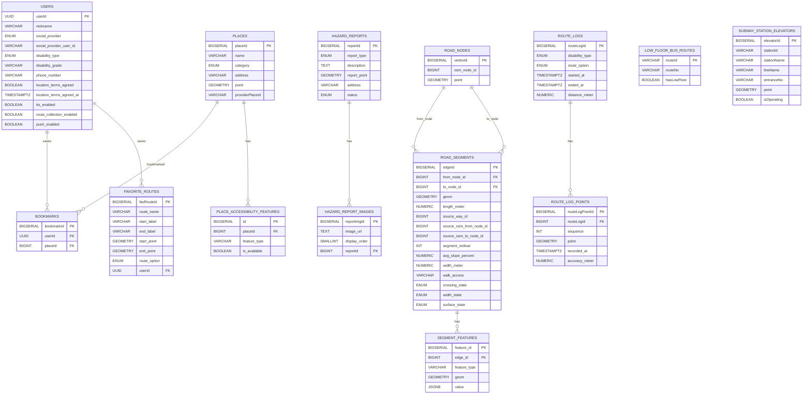

# 📋 ERD 초안

> **작성일:** 2026-04-12  
> **작성자:** 김응서  
> **최종 수정일:** 2026-04-16

---

## 1. 설계 기준

- 기준 문서: `2026-04-10 최종_프로젝트_기획서.md`, `2026-04-11_MVP_화면명세서.md`, `2026-04-09_기능명세서.md`, `2026-04-16_ACCESSIBLE_ROUTING_POC_RESTART_BLUEPRINT.md`
- `created_at`, `updated_at`은 JPA Auditing 기반 `BaseEntity` 공통 컬럼으로 관리하므로 테이블별 상세 명세에서는 생략한다.
- soft delete가 필요하면 `deleted_at`도 공통 컬럼으로 관리한다.
- 숫자 ID를 참조하는 외래키 컬럼은 자동 증가 컬럼이 아니므로 `BIGSERIAL`이 아니라 `BIGINT`로 표기한다.
- 사용자 식별자인 `users.userId`는 API 응답, JWT subject, FK에서 모두 UUID를 사용한다. 순차 ID 노출과 IDOR 위험을 줄이기 위해 별도 내부 숫자 PK를 두지 않는다.
- 지도/장소 검색 API는 MVP 기준 카카오 단일 사용을 전제로 한다. 외부 장소 ID는 `places.providerPlaceId`로 관리한다.
- 대중교통 경로 후보는 ODsay 같은 외부 대중교통 길찾기 API를 우선 사용하고, 버스/저상버스 정보는 부산광역시_부산버스정보시스템 OpenAPI를 실시간 조회한다. 저상버스 예약은 백엔드 API로 제공하지 않고, 필요하면 프론트에서 부산시버스정보시스템 외부 화면으로 직접 연결하므로 MVP 기준 별도 DB 테이블을 두지 않는다.

---

## 2. 도메인 구성

### 사용자 도메인

- `users`
- `bookmarks`
- `favorite_routes`
- `hazard_reports`
- `hazard_report_images`

### 장소 도메인

- `places`
- `place_accessibility_features`

### 보행 네트워크 도메인

- `road_nodes`
- `road_segments`
- `segment_features`
- `route_logs`
- `route_log_points`

### 대중교통 도메인

- `low_floor_bus_routes`
- `subway_station_elevators`
- ODsay 등 외부 대중교통 길찾기 API로 경로 후보 조회
- 부산광역시_부산버스정보시스템 OpenAPI로 버스 실시간 도착/저상버스 여부 조회
- 부산교통공사 공공데이터로 지하철 시간표/역 접근성 정보 보강
- 저상버스 예약은 백엔드 API 없이 프론트에서 부산시버스정보시스템 외부 화면 직접 연결

---

## 3. ERD 다이어그램

---

## 4. 테이블별 명세

---

## 1) users

### 역할

서비스 로그인 사용자의 계정 정보와 앱 설정 정보를 저장한다.

소셜 로그인 정보, 장애 유형/등급, 약관 동의 여부, 음성 안내 및 경로 데이터 수집 설정을 함께 관리한다.

### 컬럼 명세

| 한글명 | 영어명 | 타입 | NULL | DEFAULT |
| --- | --- | --- | --- | --- |
| 사용자 PK | userId | UUID | NOT NULL |  |
| 닉네임 | nickname | VARCHAR(50) | NULL |  |
| 소셜 제공자 | social_provider | ENUM | NOT NULL |  |
| 소셜 사용자 ID | social_provider_user_id | VARCHAR(100) | NOT NULL |  |
| 장애 유형 | disability_type | ENUM | NULL |  |
| 장애 등급 | disability_grade | VARCHAR(20) | NULL |  |
| 전화번호 | phone_number | VARCHAR(20) | NOT NULL | 119 |
| 위치 약관 동의 여부 | location_terms_agreed | BOOLEAN | NOT NULL | false |
| 위치 약관 동의 일시 | location_terms_agreed_at | TIMESTAMPTZ | NULL |  |
| 음성 안내 여부 | tts_enabled | BOOLEAN | NOT NULL | true |
| 경로 데이터 수집 동의 여부 | route_collection_enabled | BOOLEAN | NOT NULL | false |
| 푸시 알림 여부 | push_enabled | BOOLEAN | NOT NULL | true |

### enum 값

- `social_provider`: `KAKAO`, `NAVER`, `GOOGLE`
- `disability_type`: `VISUAL`, `MOBILITY`

### 제약

- `UNIQUE (social_provider, social_provider_user_id)`

### 비고

- `nickname`은 실명 대신 사용하는 표시용 이름이며 중복을 허용한다.
- 최초 소셜 로그인 직후에는 프로필 입력이 완료되지 않았을 수 있으므로 `nickname`과 `disability_type`은 `NULL`을 허용한다.
- 회원가입 완료 상태는 `nickname IS NOT NULL`이고 `disability_type IS NOT NULL`인 경우로 판단한다.
- `disability_type IS NULL`인 사용자는 프로필 미완료 상태이며, 서비스 핵심 기능을 이용할 수 없다.
- `userId`는 외부 응답과 JWT subject에도 사용되는 UUID다. 사용자 조회/수정 API는 임의의 `userId`를 요청값으로 받지 않고 `/users/me`와 토큰 subject를 기준으로 처리한다.

---

## 2) bookmarks

### 역할

사용자가 찜한 장소를 저장한다.

로그인 사용자 기준으로 장소 북마크 데이터를 관리한다.

### 컬럼 명세

| 한글명 | 영어명 | 타입 | NULL | DEFAULT |
| --- | --- | --- | --- | --- |
| 북마크 ID | bookmarkId | BIGSERIAL | NOT NULL |  |
| 사용자 PK | userId | UUID | NOT NULL |  |
| 장소 ID | placeId | BIGINT | NOT NULL |  |

### 비고

- 한 사용자는 여러 장소를 찜할 수 있다.
- 한 장소는 여러 사용자에게 찜될 수 있다.
- `UNIQUE (userId, placeId)` 제약을 둔다.

---

## 3) favorite_routes

### 역할

사용자가 저장한 자주 가는 길 데이터를 관리한다.

실제 edge 목록을 저장하는 구조가 아니라, 출발지/도착지/경로 옵션을 기반으로 재탐색 가능한 입력값 저장 구조다.

### 컬럼 명세

| 한글명 | 영어명 | 타입 | NULL | DEFAULT |
| --- | --- | --- | --- | --- |
| 자주 가는 길 ID | favRouteId | BIGSERIAL | NOT NULL |  |
| 경로명 | route_name | VARCHAR(100) | NOT NULL |  |
| 출발지명 | start_label | VARCHAR(255) | NOT NULL |  |
| 도착지명 | end_label | VARCHAR(255) | NOT NULL |  |
| 출발지 좌표 | start_point | GEOMETRY(POINT, 4326) | NOT NULL |  |
| 도착지 좌표 | end_point | GEOMETRY(POINT, 4326) | NOT NULL |  |
| 경로 종류 | route_option | ENUM | NOT NULL | SAFE_WALK |
| 사용자 PK | userId | UUID | NOT NULL |  |

### enum 값

- `route_option`: `SAFE_WALK`, `FAST_WALK`, `ACCESSIBLE_TRANSIT`

---

## 4) hazard_reports

### 역할

사용자가 등록한 도로 위험 요소 제보 데이터를 저장한다.

공사, 장애물, 손상 등의 현장 제보 원본 데이터를 관리한다.

도로 상태 제보는 익명 제보로 처리하며 사용자 계정과 연결하지 않는다.

### 컬럼 명세

| 한글명 | 영어명 | 타입 | NULL | DEFAULT |
| --- | --- | --- | --- | --- |
| 사용자 제보 ID | reportId | BIGSERIAL | NOT NULL |  |
| 제보 유형 | report_type | ENUM | NOT NULL |  |
| 설명 | description | TEXT | NULL |  |
| 제보 위치 | report_point | GEOMETRY(POINT, 4326) | NOT NULL |  |
| 주소 | address | VARCHAR(255) | NULL |  |
| 상태 | status | ENUM | NOT NULL | PENDING |

### enum 값

- `report_type`: `CONSTRUCTION`, `OBSTACLE`, `DAMAGE`, `OTHER`
- `status`: `PENDING`, `APPROVED`, `REJECTED`

### 비고

- 신규 제보는 기본적으로 `PENDING` 상태로 생성한다.
- `APPROVED`, `REJECTED` 상태 변경은 사용자 API가 아니라 Slack 제보 검토 콜백 API에서 처리한다.
- 제보 작성자 식별을 저장하지 않으므로 사용자별 제보 목록/상세/수정/삭제 기능을 제공하지 않는다.

---

## 5) hazard_report_images

### 역할

사용자 제보에 첨부된 이미지 정보를 저장한다.

이미지 파일 자체는 S3 같은 외부 스토리지에 저장하고, DB에는 URL과 순서만 관리한다.

### 컬럼 명세

| 한글명 | 영어명 | 타입 | NULL | DEFAULT |
| --- | --- | --- | --- | --- |
| 제보 이미지 ID | reportImgId | BIGSERIAL | NOT NULL |  |
| 이미지 URL | image_url | TEXT | NOT NULL |  |
| 표시 순서 | display_order | SMALLINT | NOT NULL | 0 |
| 사용자 제보 ID | reportId | BIGINT | NOT NULL |  |

### 비고

- 하나의 제보는 여러 이미지를 가질 수 있다.
- 표시 순서 기준으로 이미지 노출 순서를 제어한다.
- `UNIQUE (reportId, display_order)` 제약을 둔다.

---

## 6) places

### 역할

지도에 노출되는 장소 마스터 데이터를 저장한다.

음식점, 관광지, 화장실, 버스정류장, 무장애 시설, 숙박 등 내부 장소 정보를 관리한다.

또한 외부 제공자 장소 ID를 함께 저장하여 검색 결과와 내부 장소를 연결하는 기준으로 사용한다.

### 컬럼 명세

| 한글명 | 영어명 | 타입 | NULL | DEFAULT |
| --- | --- | --- | --- | --- |
| 장소 ID | placeId | BIGSERIAL | NOT NULL |  |
| 장소명 | name | VARCHAR(255) | NOT NULL |  |
| 카테고리 | category | ENUM | NOT NULL |  |
| 주소 | address | VARCHAR(255) | NULL |  |
| 좌표 | point | GEOMETRY(POINT, 4326) | NOT NULL |  |
| 제공자 장소 ID | providerPlaceId | VARCHAR(100) | NULL |  |

### enum 값

- `category`: `RESTAURANT`, `TOURIST_SPOT`, `TOILET`, `BUS_STATION`, `ELEVATOR`, `CHARGING_STATION`, `BARRIER_FREE_FACILITY`, `ACCOMMODATION`

### 비고

- 외부 검색 API를 하나로 고정해서 사용하기에 `providerPlaceId`를 통해 내부 장소와 외부 검색 결과를 연결한다.
- `ELEVATOR`는 지도에 단독 시설 마커로 표시되는 엘리베이터 장소를 의미한다.
- `CHARGING_STATION`은 MVP 필수 시설 유형인 전동휠체어 충전소 표시를 위해 유지한다.

---

## 7) place_accessibility_features

### 역할

장소별 접근성 속성을 개별 row로 분리 저장한다.

즉, 한 장소에 대해 경사로, 자동문, 엘리베이터, 장애인 화장실 등 여러 접근성 항목을 유연하게 추가할 수 있다.

### 컬럼 명세

| 한글명 | 영어명 | 타입 | NULL | DEFAULT |
| --- | --- | --- | --- | --- |
| 접근성 속성 ID | id | BIGSERIAL | NOT NULL |  |
| 장소 ID | placeId | BIGINT | NOT NULL |  |
| 속성 유형 | feature_type | VARCHAR(50) | NOT NULL |  |
| 제공 여부 | is_available | BOOLEAN | NOT NULL | false |

### feature_type 후보값

- `ramp`
- `auto_door`
- `elevator`
- `accessible_toilet`
- `charging_station`
- `step_free`

### 비고

- `RESTAURANT`, `TOURIST_SPOT`, `ACCOMMODATION` 같은 장소는 여러 접근성 속성을 가질 수 있으므로 **1:N 관계**로 설계되어 있다.
- 장소 자체가 `ELEVATOR`, `CHARGING_STATION` 같은 시설인 경우 같은 feature를 중복 저장하지 않는다.
- `elevator`는 음식점, 관광지, 숙박 등 다른 장소의 부가 접근성 속성으로도 관리할 수 있다.
- `UNIQUE (placeId, feature_type)` 제약을 둔다.

---

## 8) road_nodes

### 역할

보행 네트워크 그래프의 정점(Vertex)을 저장한다.

`OSM way` 전체 node를 저장하지 않고, 실제 세그먼트 연결에 사용된 `anchor node`만 관리한다.

### 컬럼 명세

| 한글명 | 영어명 | 타입 | NULL | DEFAULT |
| --- | --- | --- | --- | --- |
| 정점 ID | vertexId | BIGSERIAL | NOT NULL |  |
| OSM 노드 ID | osm_node_id | BIGINT | NOT NULL |  |
| 노드 좌표 | point | GEOMETRY(POINT, 4326) | NOT NULL |  |

### 비고

- `road_nodes`에는 모든 OSM node를 적재하지 않는다.
- `road_segments`의 시작/종료점으로 실제 사용된 anchor node만 저장한다.

---

## 9) road_segments

### 역할

보행 네트워크 그래프의 간선(Edge)을 저장한다.

길찾기 비용 계산, 위험도 판단, 지도 선형 표시의 기준이 되는 핵심 테이블이다.

`OSM way` 원본을 그대로 저장하지 않고, `anchor node` 사이로 분해된 segment를 저장한다.

### 컬럼 명세

| 한글명 | 영어명 | 타입 | NULL | DEFAULT |
| --- | --- | --- | --- | --- |
| 간선 ID | edgeId | BIGSERIAL | NOT NULL |  |
| 시작 노드 ID | from_node_id | BIGINT | NOT NULL |  |
| 종료 노드 ID | to_node_id | BIGINT | NOT NULL |  |
| 선형 좌표 | geom | GEOMETRY(LINESTRING, 4326) | NOT NULL |  |
| 길이(미터) | length_meter | NUMERIC(10,2) | NOT NULL |  |
| 원천 OSM way ID | source_way_id | BIGINT | NOT NULL |  |
| 원천 시작 OSM node ID | source_osm_from_node_id | BIGINT | NOT NULL |  |
| 원천 종료 OSM node ID | source_osm_to_node_id | BIGINT | NOT NULL |  |
| 세그먼트 순번 | segment_ordinal | INT | NOT NULL |  |
| 보행 가능 상태 | walk_access | VARCHAR(30) | NOT NULL | UNKNOWN |
| 평균 경사도(%) | avg_slope_percent | NUMERIC(6,2) | NULL |  |
| 보행 폭(미터) | width_meter | NUMERIC(6,2) | NULL |  |
| 점자블록 상태 | braille_block_state | ENUM | NOT NULL | UNKNOWN |
| 음향신호기 상태 | audio_signal_state | ENUM | NOT NULL | UNKNOWN |
| 경사로 상태 | curb_ramp_state | ENUM | NOT NULL | UNKNOWN |
| 폭 상태 | width_state | ENUM | NOT NULL | UNKNOWN |
| 노면 상태 | surface_state | ENUM | NOT NULL | UNKNOWN |
| 계단 상태 | stairs_state | ENUM | NOT NULL | UNKNOWN |
| 엘리베이터 상태 | elevator_state | ENUM | NOT NULL | UNKNOWN |
| 횡단 상태 | crossing_state | ENUM | NOT NULL | UNKNOWN |

### enum 값

- `braille_block_state`, `audio_signal_state`, `curb_ramp_state`, `stairs_state`, `elevator_state`: `YES`, `NO`, `UNKNOWN`
- `width_state`: `ADEQUATE_150`, `ADEQUATE_120`, `NARROW`, `UNKNOWN`
- `surface_state`: `PAVED`, `GRAVEL`, `UNPAVED`, `OTHER`, `UNKNOWN`
- `crossing_state`: `TRAFFIC_SIGNALS`, `UNCONTROLLED`, `UNMARKED`, `NO`, `UNKNOWN`

### 비고

- 이 테이블은 보행 네트워크의 실제 길 구간을 표현하며, 여러 간선을 조합해 최종 경로를 계산한다.
- 안정 식별 기준은 `source_way_id + source_osm_from_node_id + source_osm_to_node_id`이며 `segment_ordinal`은 보조 검증용이다.
- 기존 boolean 중심 컬럼(`has_stairs`, `has_curb_gap`, `has_elevator`, `has_crosswalk`, `has_signal`, `has_audio_signal`, `has_braille_block`, `surface_type`)은 블루프린트 기준 상태 enum 컬럼으로 대체한다.
- `avg_slope_percent`, `width_meter`는 ETL 계산값으로 유지한다.
- 프로필별 경사 통과 여부(`visual_safe`, `visual_fast`, `wheelchair_safe`, `wheelchair_fast`)는 `road_segments` 컬럼으로 저장하지 않고 GraphHopper import 또는 EV 채움 단계에서 `avg_slope_percent`를 해석해 파생값으로 계산한다.
- 상세 feature 매칭 결과나 표시용 개별 객체는 `segment_features`에 저장하고, `road_segments`에는 최종 해석 결과만 반영한다.
- `UNIQUE (source_way_id, source_osm_from_node_id, source_osm_to_node_id)` 제약을 둔다.

---

## 10) segment_features

### 역할

`road_segments`에 매칭된 개별 feature 객체를 저장한다.

횡단보도, 점자블록, 음향신호기, 경사도 측정값 같은 원천 feature를 edge 단위로 추적하거나 지도에 표시할 때 사용한다.

### 컬럼 명세

| 한글명 | 영어명 | 타입 | NULL | DEFAULT |
| --- | --- | --- | --- | --- |
| feature 식별자 | feature_id | BIGSERIAL | NOT NULL |  |
| 소속 edge | edge_id | BIGINT | NOT NULL |  |
| feature 종류 | feature_type | VARCHAR(50) | NOT NULL |  |
| 표시 위치/구간 | geom | GEOMETRY(GEOMETRY, 4326) | NOT NULL |  |
| 세부 값 | value | JSONB | NULL |  |

### 비고

- `road_segments 1 : N segment_features` 관계를 가진다.
- `geom`은 feature 성격에 따라 `POINT`, `LINESTRING` 등으로 저장할 수 있도록 범용 geometry 타입을 사용한다.
- `value`는 `3.0`, `true`, 추가 메타데이터 등을 함께 담을 수 있도록 `JSONB`로 둔다.
- `feature_type` 예시는 `CROSSWALK`, `AUDIO_SIGNAL`, `BRAILLE_BLOCK`, `CURB_RAMP`, `ELEVATOR`, `SLOPE`, `WIDTH`다.

---

## 11) route_logs

### 역할

내비게이션 종료 시점에 사용자가 실제 이동한 경로 로그의 메타데이터를 저장한다.

추천 기능 활용은 후순위로 두고, MVP에서는 경로 품질 개선/분석용 원천 데이터로만 수집한다.

### 컬럼 명세

| 한글명 | 영어명 | 타입 | NULL | DEFAULT |
| --- | --- | --- | --- | --- |
| 경로 로그 ID | routeLogId | BIGSERIAL | NOT NULL |  |
| 장애 유형 | disability_type | ENUM | NOT NULL |  |
| 경로 종류 | route_option | ENUM | NOT NULL | SAFE_WALK |
| 시작 시각 | started_at | TIMESTAMPTZ | NOT NULL |  |
| 종료 시각 | ended_at | TIMESTAMPTZ | NOT NULL |  |
| 실제 이동 거리(미터) | distance_meter | NUMERIC(10,2) | NULL |  |

### enum 값

- `disability_type`: `VISUAL`, `MOBILITY`
- `route_option`: `SAFE_WALK`, `FAST_WALK`, `ACCESSIBLE_TRANSIT`

### 비고

- 사용자 또는 기기 단위 식별자를 저장하지 않는다.
- 사용자가 경로 데이터 수집에 동의하지 않은 경우 저장하지 않는다.
- 실제 GPS 좌표 목록은 `route_log_points`에 저장한다.

---

## 12) route_log_points

### 역할

`route_logs`에 속한 실제 이동 GPS 좌표 목록을 저장한다.

### 컬럼 명세

| 한글명 | 영어명 | 타입 | NULL | DEFAULT |
| --- | --- | --- | --- | --- |
| 경로 로그 포인트 ID | routeLogPointId | BIGSERIAL | NOT NULL |  |
| 경로 로그 ID | routeLogId | BIGINT | NOT NULL |  |
| 좌표 순서 | sequence | INT | NOT NULL |  |
| GPS 좌표 | point | GEOMETRY(POINT, 4326) | NOT NULL |  |
| 기록 시각 | recorded_at | TIMESTAMPTZ | NOT NULL |  |
| GPS 정확도(미터) | accuracy_meter | NUMERIC(8,2) | NULL |  |

### 비고

- 하나의 경로 로그는 여러 GPS 포인트를 가질 수 있다.
- 좌표 순서 중복을 막기 위해 `UNIQUE (routeLogId, sequence)` 제약을 둔다.

---

## 5. 관계 명세

### users - bookmarks

- `users 1 : N bookmarks`
- 한 사용자는 여러 북마크를 가질 수 있다.

### users - favorite_routes

- `users 1 : N favorite_routes`
- 한 사용자는 여러 자주 가는 길을 저장할 수 있다.

### hazard_reports - hazard_report_images

- `hazard_reports 1 : N hazard_report_images`
- 하나의 제보는 여러 이미지를 가질 수 있다.

### places - bookmarks

- `places 1 : N bookmarks`
- 하나의 장소는 여러 사용자에게 찜될 수 있다.

### places - place_accessibility_features

- `places 1 : N place_accessibility_features`
- 하나의 장소는 0개 이상의 접근성 속성을 가질 수 있다.

### road_nodes - road_segments

- `road_nodes 1 : N road_segments`
- 시작 노드와 종료 노드를 기준으로 간선이 연결된다.

### road_segments - segment_features

- `road_segments 1 : N segment_features`
- 하나의 보행 segment는 0개 이상의 개별 feature를 가질 수 있다.

### route_logs - route_log_points

- `route_logs 1 : N route_log_points`
- 하나의 실제 이동 경로 로그는 여러 GPS 포인트를 가진다.

---

## 13) low_floor_bus_routes

### 역할

MOBILITY 사용자의 ACCESSIBLE_TRANSIT 경로 제공 시, 버스 노선이 저상버스를 운행하는지 사전 검증하기 위한 정적 카탈로그다.

BIMS 실시간 도착 API는 현재 오고 있는 차량의 저상 여부만 알 수 있고, 노선 단위 운행 여부는 이 테이블로 관리한다.

### 컬럼 명세

| 한글명 | 영어명 | 타입 | NULL | DEFAULT |
| --- | --- | --- | --- | --- |
| 노선 ID (BIMS 기준) | routeId | VARCHAR(20) | NOT NULL |  |
| 버스 번호 | routeNo | VARCHAR(20) | NOT NULL |  |
| 저상버스 운행 여부 | hasLowFloor | BOOLEAN | NOT NULL | false |

### 제약

- `routeId` PK

### 비고

- 초기값은 부산시 저상버스 도입 현황 공공데이터로 적재하고 월 1회 이상 갱신한다.
- BIMS 실시간 도착 API의 `lowplate1`, `lowplate2` 값으로 trip 단위 override 가능하다.
- MOBILITY 경로에서 `hasLowFloor == false` 이거나 테이블에 없는 노선은 ACCESSIBLE_TRANSIT 후보에서 즉시 탈락한다.

---

## 14) subway_station_elevators

### 역할

지하철역별 엘리베이터 입구 위치를 저장한다.

MOBILITY 사용자의 ACCESSIBLE_TRANSIT 경로에서 ODsay가 주는 역 중심 좌표 대신 실제 엘리베이터 입구 GPS 좌표로 WALK leg를 재계산하는 데 사용한다.

하나의 역에 엘리베이터가 여러 개일 수 있으므로, 엘리베이터 1개당 레코드 1개로 관리한다.

### 컬럼 명세

| 한글명 | 영어명 | 타입 | NULL | DEFAULT |
| --- | --- | --- | --- | --- |
| 엘리베이터 ID | elevatorId | BIGSERIAL | NOT NULL |  |
| 역 식별자 (부산교통공사 기준) | stationId | VARCHAR(20) | NOT NULL |  |
| 역명 | stationName | VARCHAR(100) | NOT NULL |  |
| 호선명 | lineName | VARCHAR(50) | NOT NULL |  |
| 출입구 번호 | entranceNo | VARCHAR(10) | NULL |  |
| 엘리베이터 위치 좌표 | point | GEOMETRY(POINT, 4326) | NOT NULL |  |
| 현재 운행 여부 | isOperating | BOOLEAN | NOT NULL | true |

### 제약

- `elevatorId` PK
- `INDEX (stationId)`

### 비고

- 하나의 역에 여러 레코드가 존재할 수 있다 (출입구별).
- WALK leg 목적지 override 시 `stationId`로 조회 후 ODsay가 준 WALK leg 종점과 가장 가까운 엘리베이터를 선택한다.
- 환승역의 경우 환승 동선 엘리베이터도 동일 테이블에 `entranceNo`로 구분하여 저장한다.
- MOBILITY 경로에서 승차역 또는 하차역에 `isOperating == true`인 레코드가 없으면 해당 후보를 탈락시킨다.
- 초기값은 한국승강기안전공단 공공데이터와 부산교통공사 역 시설 현황을 기반으로 적재한다.

### 관계

- `subway_station_elevators N : 1 station` (stationId 기준, 별도 station 테이블 없이 stationId로 grouping)
