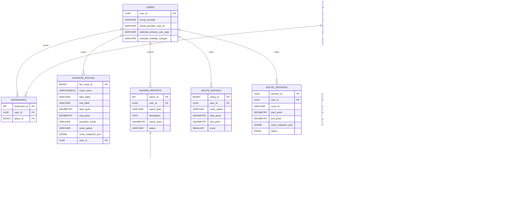

# 📋 ERD v3 — SHP 기반 보행 네트워크, 편의시설 카테고리, 경로 안내 세션 최신화

> **작성일:** 2026-04-23
> **기준 문서:** `docs/erd.md` (원본 OSM 기반)
> **최종 수정일:** 2026-05-06
> **변경 사유:** canonical source를 `busan.osm.pbf`에서 `N3L_A0020000_26` SHP(국토교통부 도로 중심선)로 전환함에 따라 `road_nodes`와 `road_segments`의 source identity 컬럼을 재정의하고, 편의시설 PoC 채택본 기준으로 장소 카테고리를 최신화했으며, 선택된 경로 안내 세션 복구를 위한 `route_sessions`를 추가
> **참조 계획:** `.ai/PLANS/current-sprint/02-osm-schema-and-network-load.md`

---

## 변경 요약

| 테이블 | 변경 전 | 변경 후 |
|--------|----------------------|----------------------|
| `road_nodes` | `osm_node_id BIGINT` | `source_node_key VARCHAR(100)` |
| `road_segments` | `source_way_id`, `source_osm_from_node_id`, `source_osm_to_node_id`, `segment_ordinal` | - |
| `users` | `disability_grade`, `phone_number`, `push_enabled`, `profile_completed`, `nickname`, 온보딩/약관/설정 boolean | 가입 완료 사용자 계정과 `selected_primary_user_type`, 조건부 `selected_mobility_subtype`만 저장 |
| `places` | `BUS_STATION`, `ELEVATOR`, `BARRIER_FREE_FACILITY`, `TOILET`, `RESTAURANT`, `CHARGING_STATION` 카테고리 | `FOOD_CAFE`, `HEALTHCARE`, `WELFARE`, `PUBLIC_OFFICE`, `ETC` 카테고리 |
| `hazard_reports` | 익명 제보, 주소 저장, 8개 제보 유형 | 사용자 계정 연결, 좌표 중심 저장, 6개 제보 유형 |
| `road_segments` | `curb_ramp_state`, `elevator_state`, 넓은 `surface_state` 후보 | `slope_state`, `elevator_state` 제거, 단순화한 `surface_state`/`crossing_state` |
| `route_logs`, `route_log_points` | 실제 이동 로그 수집 | MVP ERD에서 제외 |
| `route_ratings` | - | 도착 직후 별점 평가 저장 |
| `route_sessions` | Redis route cache에만 선택 경로 보관 | 사용자가 실제 안내를 시작한 경로 세션과 최소 복구 가능한 route snapshot 영속 저장 |

장소 카테고리, 장소 접근성 속성, 온보딩 저장 정책, 제보/평가 저장 정책은 2026-04-29 논의 결과를 기준으로 갱신한다. 경로 안내 세션 저장 정책은 2026-05-06 논의 결과를 기준으로 갱신한다. 카카오/공공데이터 원천 카테고리명은 MVP DB 컬럼으로 보존하지 않고, 서비스 필터 기준은 항상 `places.category`와 `place_accessibility_features.feature_type`으로 둔다.

---

## 1. 설계 기준

- 기준 문서: `2026-04-10 최종_프로젝트_기획서.md`, `2026-04-11_MVP_화면명세서.md`, `2026-04-09_기능명세서.md`, `2026-04-16_ACCESSIBLE_ROUTING_POC_RESTART_BLUEPRINT.md`
- `created_at`, `updated_at`은 JPA Auditing 기반 `BaseEntity` 공통 컬럼으로 관리하므로 테이블별 상세 명세에서는 생략한다.
- 회원 탈퇴는 물리 삭제 대신 soft delete를 기본으로 하며, 필요 시 `deletedAt`을 공통 컬럼으로 관리한다.
- 모든 물리 DB 컬럼 네이밍은 `snake_case`를 사용한다. Java 엔티티 필드와 API 응답 필드는 `camelCase`를 유지한다.
- 숫자 ID를 참조하는 외래키 컬럼은 자동 증가 컬럼이 아니므로 `SERIAL/BIGSERIAL`이 아니라 `INT/BIGINT`로 표기한다.
- PK는 테이블별 데이터 증가량 기준으로 구분한다. 대량 적재 또는 로그성 테이블은 `BIGINT`, 일반 관리성 테이블은 `INT`를 우선 검토한다.
- 사용자 식별자인 `users.user_id`는 Java/API에서 `userId`로 노출하고 JWT subject에도 동일한 UUID를 사용한다.
- 소셜 OAuth 인증은 서비스 회원가입과 분리한다. `users` row는 필수 약관 동의와 온보딩 선택값이 모두 확정된 뒤 생성하므로, 가입 완료 사용자만 저장한다.
- 시간 데이터는 DB에 표시용 문자열 형식으로 저장하며, `VARCHAR` 컬럼에 ISO 8601 기반 문자열을 저장하는 것을 기본 원칙으로 한다.
- 변경 가능성이 있거나 운영 중 값 집합이 늘어날 수 있는 비즈니스 필드는 DB ENUM 대신 `VARCHAR`를 사용한다.
- `road_segments`의 접근성/보행 상태처럼 라우팅 로직에서 사용하는 고정된 폐쇄 집합 값은 ENUM 사용을 허용하되, `surface_state`처럼 분류 기준이 확장될 수 있는 필드는 `VARCHAR`를 사용한다.
- 지도/장소 검색 API는 MVP 기준 카카오 단일 사용을 전제로 한다.
- 대중교통 경로 후보는 ODsay 같은 외부 대중교통 길찾기 API를 우선 사용하고, 버스/저상버스 정보는 부산광역시_부산버스정보시스템 OpenAPI를 실시간 조회한다.
- 사용자가 실제 선택해 안내를 시작한 route만 `route_sessions`에 영속 저장한다. 검색 후보 묶음은 Redis `routeSearch:{searchId}`에만 저장한다.
- 실시간 도착정보는 DB에 저장하지 않고 Redis TTL cache 또는 외부 API 재조회로 처리한다.

---

## 2. 도메인 구성

### 사용자 도메인

- `users`
- `bookmarks`
- `favorite_routes`
- `hazard_reports`
- `hazard_report_images`
- `route_ratings`
- `route_sessions`

### 장소 도메인

- `places`
- `place_accessibility_features`

### 보행 네트워크 도메인

- `road_nodes`
- `road_segments`
- `segment_features`

### 대중교통 도메인

- `subway_station_elevators`
- Redis `routeSearch:{searchId}`는 검색 후보 묶음 임시 저장소로 사용
- Redis `route:{routeId}`는 선택 경로 hot cache로 사용
- Redis `arrival:{stopId}:{transitRouteId}`는 실시간 도착정보 TTL cache로 사용
- ODsay 등 외부 대중교통 길찾기 API로 경로 후보 조회
- 부산광역시_부산버스정보시스템 OpenAPI로 버스 실시간 도착/저상버스 여부 조회
- 부산교통공사 공공데이터로 지하철 시간표/역 접근성 정보 보강
- 저상버스 예약은 백엔드 API 없이 프론트에서 부산시버스정보시스템 외부 화면 직접 연결

---

## 3. ERD 다이어그램

---

## 4. 테이블별 명세

---

## 1) users

### 역할

서비스 가입이 완료된 사용자의 계정 식별 정보와 사용자 유형을 저장한다.

### 컬럼 명세

| 한글명 | 영어명 | 타입 | NULL | DEFAULT |
| --- | --- | --- | --- | --- |
| 사용자 PK | user_id | UUID | NOT NULL |  |
| 소셜 제공자 | social_provider | VARCHAR(30) | NOT NULL |  |
| 소셜 사용자 ID | social_provider_user_id | VARCHAR(100) | NOT NULL |  |
| 1차 사용자 유형 | selected_primary_user_type | VARCHAR(30) | NOT NULL |  |
| 보행약자 세부 유형 | selected_mobility_subtype | VARCHAR(30) | NULL |  |

### 제약

- `UNIQUE (social_provider, social_provider_user_id)`

### 비고

- 소셜 OAuth 인증만 완료된 상태는 아직 서비스 회원이 아니다. 필수 약관 동의와 온보딩 선택값을 받은 뒤 `users` row를 생성한다.
- 따라서 `selected_primary_user_type`은 `NOT NULL`이다. 온보딩 미완료 상태를 나타내는 별도 완료 필드는 두지 않는다.
- `nickname`은 MVP 사용자 테이블에 저장하지 않는다. 마이페이지 표시명이 필요하면 소셜 프로필 응답 또는 후속 프로필 정책에서 별도로 정한다.
- `selected_primary_user_type` 후보값은 `LOW_VISION`, `MOBILITY_IMPAIRED`다.
- `selected_primary_user_type=LOW_VISION`이면 `selected_mobility_subtype`은 `NULL`이어야 한다.
- `selected_primary_user_type=MOBILITY_IMPAIRED`이면 `selected_mobility_subtype`은 한 개만 저장한다.
- `selected_mobility_subtype` 후보값은 `POWER_WHEELCHAIR`, `MANUAL_WHEELCHAIR`, `OTHER_MOBILITY`다.
- 필수 약관 동의는 가입 완료 조건으로 검증하지만, `users` 테이블에 별도 동의 여부 필드를 저장하지 않는다.
- 푸시 알림, 진동 알림, TTS, 경로 데이터 수집 설정은 서버에 저장하지 않고 앱 내부 설정 또는 후순위 정책으로 관리한다.
- 회원 탈퇴는 물리 삭제 대신 soft delete를 기본으로 하며, 동일 사용자 재가입 시 기존 계정 복구 또는 재활성화 정책을 별도로 둔다.
- `user_id`는 외부 응답과 JWT subject에서 `userId`로 노출되는 UUID다.

---

## 2) bookmarks

### 역할

사용자가 찜한 장소를 저장한다.

### 컬럼 명세

| 한글명 | 영어명 | 타입 | NULL | DEFAULT |
| --- | --- | --- | --- | --- |
| 북마크 ID | bookmark_id | INT | NOT NULL |  |
| 사용자 PK | user_id | UUID | NOT NULL |  |
| 장소 ID | place_id | BIGINT | NOT NULL |  |

### 비고

- `UNIQUE (user_id, place_id)` 제약을 둔다.

---

## 3) favorite_routes

### 역할

사용자가 저장한 자주 가는 길 데이터를 관리한다.

출발지/도착지/경로 옵션을 기반으로 재탐색 가능한 입력값 저장 구조다.

실제 edge 목록이나 안내 경로 상세를 저장하지 않는다.

### 컬럼 명세

| 한글명 | 영어명 | 타입 | NULL | DEFAULT |
| --- | --- | --- | --- | --- |
| 자주 가는 길 ID | fav_route_id | BIGINT | NOT NULL |  |
| 경로명 | route_name | VARCHAR(511) | NOT NULL |  |
| 출발지명 | start_label | VARCHAR(255) | NOT NULL |  |
| 도착지명 | end_label | VARCHAR(255) | NOT NULL |  |
| 출발지 좌표 | start_point | GEOMETRY(POINT, 4326) | NOT NULL |  |
| 도착지 좌표 | end_point | GEOMETRY(POINT, 4326) | NOT NULL |  |
| 이동 수단 | transport_mode | VARCHAR(30) | NOT NULL |  |
| 경로 종류 | route_option | VARCHAR(30) | NOT NULL | SAFE |
| 경로 스냅샷 JSON | route_snapshot_json | JSONB | NOT NULL |  |
| 사용자 PK | user_id | UUID | NOT NULL |  |

### route_option 후보값

- `SAFE`
- `SHORTEST`
- `RECOMMENDED`
- `MIN_TRANSFER`
- `MIN_WALK`

### transport_mode 후보값

- `WALK`
- `PUBLIC_TRANSIT`

### 비고

- `route_name`은 사용자가 직접 입력하지 않고 `start_label`과 `end_label`을 기준으로 자동 생성한다.
- Java/API의 `startLabel`, `endLabel`은 화면 표시명이다. 프론트는 장소명, 도로명주소, 지번주소 순으로 값을 정해 저장 요청에 전달한다.
- `start_point`, `end_point`, `transport_mode`, `route_option`, `route_snapshot_json`은 저장 요청의 `routeId`로 찾은 `route_sessions`에서 복사한다.
- `route_snapshot_json`은 저장 당시 선택 경로 상세를 다시 보여주기 위한 route payload다.
- 저장된 경로를 최신 조건으로 다시 탐색할 때는 `start_point`, `end_point`, `route_option`을 재탐색 입력값으로 사용할 수 있다.
- 목록 정렬은 최신 저장순을 기본으로 한다.

---

## 4) hazard_reports

### 역할

사용자가 등록한 도로 위험 요소 제보 데이터를 저장한다.

도로 상태 제보는 로그인 사용자 계정과 연결한다. 회원 탈퇴 후에도 제보 내역은 운영 검토 기록으로 보관한다.

### 컬럼 명세

| 한글명 | 영어명 | 타입 | NULL | DEFAULT |
| --- | --- | --- | --- | --- |
| 사용자 제보 ID | report_id | INT | NOT NULL |  |
| 사용자 PK | user_id | UUID | NOT NULL |  |
| 제보 유형 | report_type | VARCHAR(30) | NOT NULL |  |
| 설명 | description | TEXT | NULL |  |
| 제보 위치 | report_point | GEOMETRY(POINT, 4326) | NOT NULL |  |
| 상태 | status | VARCHAR(30) | NOT NULL | PENDING |

### 후보값

- `report_type`: `STAIRS_STEP`, `BRAILLE_BLOCK`, `SIDEWALK_MISSING`, `RAMP`, `SIDEWALK_WIDTH`, `OTHER_OBSTACLE`
- `status`: `PENDING`, `APPROVED`, `REJECTED`

### 비고

- 신규 제보는 기본적으로 `PENDING` 상태로 생성한다.
- `APPROVED`, `REJECTED` 상태 변경은 Slack 제보 검토 콜백 API에서 처리한다.
- 사용자 화면에는 처리 상태를 노출하지 않지만, 서버는 운영 검토를 위해 `status`를 관리한다.
- 제보 위치의 기준 데이터는 `report_point`다. 주소 문자열은 역지오코딩 표시값으로 볼 수 있으므로 MVP DB 컬럼으로 저장하지 않는다.
- 사용자별 제보 목록은 최신순으로 제공한다.

---

## 5) hazard_report_images

### 역할

사용자 제보에 첨부된 이미지 정보를 저장한다.

이미지 파일 자체는 S3 같은 외부 스토리지에 저장하고, DB에는 URL과 순서만 관리한다.

### 컬럼 명세

| 한글명 | 영어명 | 타입 | NULL | DEFAULT |
| --- | --- | --- | --- | --- |
| 제보 이미지 ID | report_img_id | INT | NOT NULL |  |
| 이미지 URL | image_url | TEXT | NOT NULL |  |
| 표시 순서 | display_order | SMALLINT | NOT NULL | 0 |
| 사용자 제보 ID | report_id | INT | NOT NULL |  |

### 비고

- `UNIQUE (report_id, display_order)` 제약을 둔다.
- 제보 사진은 선택 입력이며 최대 5장까지 허용한다.
- 목록 응답에서는 DB `display_order=0` 이미지를 대표 사진으로 사용하고, API에서는 `displayOrder`로 노출한다.

---

## 6) places

### 역할

지도에 노출되는 장소 마스터 데이터를 저장한다.

우리 서비스가 관리하는 보행약자 접근성 장소 마스터다. 카카오 검색 결과는 외부 검색 응답으로 우선 사용하고, 내부 장소와 매칭되는 경우에만 접근성 정보를 보강한다.

### 컬럼 명세

| 한글명 | 영어명 | 타입 | NULL | DEFAULT |
| --- | --- | --- | --- | --- |
| 장소 ID | place_id | BIGINT | NOT NULL |  |
| 장소명 | name | VARCHAR(255) | NOT NULL |  |
| 카테고리 | category | VARCHAR(50) | NOT NULL |  |
| 주소 | address | VARCHAR(255) | NULL |  |
| 좌표 | point | GEOMETRY(POINT, 4326) | NOT NULL |  |
| 제공자 장소 ID | provider_place_id | VARCHAR(100) | NULL |  |

### category 후보값

- `FOOD_CAFE`
- `TOURIST_SPOT`
- `ACCOMMODATION`
- `HEALTHCARE`
- `WELFARE`
- `PUBLIC_OFFICE`
- `ETC`

### category 표시 기준

| category | 표시명 | 기준 |
| --- | --- | --- |
| `FOOD_CAFE` | 음식·카페 | 음식점, 카페, 제과점 등 식음 목적지 |
| `TOURIST_SPOT` | 관광지 | 관광지, 공원, 해변 등 방문 목적지 |
| `ACCOMMODATION` | 숙박 | 관광숙박, 일반숙박, 생활숙박 |
| `HEALTHCARE` | 의료·보건 | 병원, 의원, 치과, 한의원, 보건소, 종합병원 |
| `WELFARE` | 복지·돌봄 | 노인/장애인/아동/사회복지시설, 경로당, 요양시설 |
| `PUBLIC_OFFICE` | 공공기관 | 주민센터, 지자체 청사, 공단, 우체국, 파출소, 지구대 |
| `ETC` | 기타 편의시설 | 보행약자 편의시설 원천 근거는 있으나 대표 서비스 카테고리로 단정하기 어려운 장소 |

### 비고

- 카카오 장소 ID를 내부 장소와 매칭 근거로 채택한 경우에만 `provider_place_id`에 저장한다. DB 기본키인 `place_id`는 내부 자동 증가 ID로 유지한다.
- Java/API에서는 `providerPlaceId`로 노출하지만 DB 물리 컬럼은 `provider_place_id`다.
- `provider_place_id`에는 유니크 제약을 둔다. 단, 카카오 검색 결과를 북마크했다는 이유만으로 `places`를 자동 생성하지 않는다.
- 카카오 `category_name`과 공공데이터 원천 분류명은 MVP 장소 테이블 컬럼으로 저장하지 않는다. 서비스 필터 기준은 항상 `category`다.
- `BARRIER_FREE_FACILITY`는 최종 카테고리로 사용하지 않는다. 원천 장애인편의시설 데이터는 실제 시설 성격에 따라 `FOOD_CAFE`, `TOURIST_SPOT`, `ACCOMMODATION`, `HEALTHCARE`, `WELFARE`, `PUBLIC_OFFICE`, `ETC` 중 하나로 분류한다.
- `BUS_STATION`은 장소 도메인 최종 카테고리에서 제외한다. 대중교통 정류소는 대중교통 도메인에서 별도로 관리한다.
- `ELEVATOR`는 장소 카테고리로 사용하지 않는다. 도시철도 엘리베이터는 `subway_station_elevators`, 일반 장소의 엘리베이터 보유 여부는 `place_accessibility_features.feature_type = elevator`로 관리한다.
- `TOILET`은 장소 카테고리로 사용하지 않는다. 장애인 이용 가능 화장실은 `place_accessibility_features.feature_type = accessibleToilet`로 관리한다.
- `CHARGING_STATION`은 장소 카테고리로 사용하지 않는다. 전동보장구 충전소 장소는 `category=ETC`로 저장하고 반드시 `feature_type=chargingStation`, `is_available=true`를 가진다.
- 최종 정제 산출물은 `place/erd_ready/place_merged_broad_category_final.csv` 기준 13,564개 장소이며, `TOILET`, `CHARGING_STATION`, `MOBILITY`, `FOOD`, `PUBLIC`, `MEDICAL_WELFARE` 구 카테고리는 남기지 않는다.

---

## 7) place_accessibility_features

### 역할

장소별 접근성 속성을 개별 row로 분리 저장한다.

### 컬럼 명세

| 한글명 | 영어명 | 타입 | NULL | DEFAULT |
| --- | --- | --- | --- | --- |
| 접근성 속성 ID | id | INT | NOT NULL |  |
| 장소 ID | place_id | BIGINT | NOT NULL |  |
| 속성 유형 | feature_type | VARCHAR(50) | NOT NULL |  |
| 제공 여부 | is_available | BOOLEAN | NOT NULL | false |

### feature_type 후보값

- `accessibleEntrance`
- `elevator`
- `accessibleToilet`
- `accessibleParking`
- `chargingStation`
- `accessibleRoom`
- `guidanceFacility`

### 비고

- `UNIQUE (place_id, feature_type)` 제약을 둔다.
- `accessibleEntrance`는 주출입구 접근 가능, 무단차 진입, 경사로형 접근로를 통합한 접근성 속성이다. 기존 `ramp`, `stepFree`는 별도 featureType으로 분리하지 않는다.
- 지도 홈 상단 빠른 필터는 장소 카테고리가 아니라 `accessibleToilet`, `elevator`, `chargingStation` 접근성 속성을 기준으로 조회한다.
- `chargingStation`은 전동보장구 충전 가능 여부를 뜻한다. 전동보장구 충전소 원천 장소는 `places.category=ETC`와 `chargingStation=true`를 함께 가져야 한다.

---

## 8) road_nodes *(v3 변경)*

### 역할

보행 네트워크 그래프의 정점(Vertex)을 저장한다.

SHP 선형의 시작/종료점에서 파생된 anchor node만 관리한다. source-agnostic 설계로 OSM, SHP 등 다양한 소스를 지원한다.

### 컬럼 명세

| 한글명 | 영어명 | 타입 | NULL | DEFAULT |
| --- | --- | --- | --- | --- |
| 정점 ID | vertex_id | BIGINT | NOT NULL |  |
| 소스 노드 키 | source_node_key | VARCHAR(100) | NOT NULL |  |
| 노드 좌표 | point | GEOMETRY(POINT, 4326) | NOT NULL |  |

### 제약

- `UNIQUE (source_node_key)`

### 비고

- `source_node_key`는 endpoint 좌표를 tolerance-normalized한 결정론적 키다.
  - 생성 규칙: `f"{round(lng, 6)}:{round(lat, 6)}"` (EPSG:4326 변환 후, 0.00001° tolerance snap 적용)
  - 예시: `"129.083214:35.179032"`
- OSM 전용 `osm_node_id`는 이 버전에서 제거됐다. `vertex_id`가 유일한 PK이며 `source_node_key`가 natural key 역할을 한다.
- `road_segments`의 시작/종료점으로 사용된 anchor node만 저장한다.

---

## 9) road_segments *(v3 변경)*

### 역할

보행 네트워크 그래프의 간선(Edge)을 저장한다.

보행자 경로 기준으로 설계된 테이블로, 길찾기 비용 계산·위험도 판단·지도 선형 표시의 기준이 된다. 도로 속성(차선 수, 도로명, 일방통행 등)은 보행 라우팅과 무관하므로 포함하지 않는다. canonical source는 `N3L_A0020000_26` SHP(국토교통부 도로 중심선)다.

### 컬럼 명세

| 한글명 | 영어명 | 타입 | NULL | DEFAULT |
| --- | --- | --- | --- | --- |
| 간선 ID | edge_id | BIGINT | NOT NULL |  |
| 시작 노드 ID | from_node_id | BIGINT | NOT NULL |  |
| 종료 노드 ID | to_node_id | BIGINT | NOT NULL |  |
| 선형 좌표 | geom | GEOMETRY(LINESTRING, 4326) | NOT NULL |  |
| 길이(미터) | length_meter | NUMERIC(10,2) | NOT NULL |  |
| 보행 가능 상태 | walk_access | VARCHAR(30) | NOT NULL | UNKNOWN |
| 평균 경사도(%) | avg_slope_percent | NUMERIC(6,2) | NULL |  |
| 보행 폭(미터) | width_meter | NUMERIC(6,2) | NULL |  |
| 점자블록 상태 | braille_block_state | ENUM | NOT NULL | UNKNOWN |
| 음향신호기 상태 | audio_signal_state | ENUM | NOT NULL | UNKNOWN |
| 경사 상태 | slope_state | ENUM | NOT NULL | UNKNOWN |
| 폭 상태 | width_state | ENUM | NOT NULL | UNKNOWN |
| 노면 상태 | surface_state | VARCHAR(30) | NOT NULL | UNKNOWN |
| 계단 상태 | stairs_state | ENUM | NOT NULL | UNKNOWN |
| 횡단 상태 | crossing_state | ENUM | NOT NULL | UNKNOWN |

### enum 값

- `braille_block_state`, `audio_signal_state`, `stairs_state`: `YES`, `NO`, `UNKNOWN`
- `slope_state`: `FLAT`, `MODERATE`, `STEEP`, `IMPASSABLE`, `UNKNOWN`
- `width_state`: `ADEQUATE_150`, `ADEQUATE_120`, `NARROW`, `UNKNOWN`
- `surface_state` 후보값: `PAVED`, `UNPAVED`, `UNKNOWN`
- `crossing_state`: `SIGNALIZED`, `UNSIGNALIZED`, `NONE`, `UNKNOWN`

### 비고

- `edge_id`가 downstream(CSV ETL, GraphHopper)에서 사용하는 유일한 surrogate key다.
- `walk_access` 기본값은 SHP 소스에서 보행 전용 의미를 확정할 수 없으므로 `UNKNOWN`으로 시작한다.
- `avg_slope_percent`, `width_meter`는 CSV ETL(`slope_analysis_staging.csv`) 보강값으로 채워진다.
- `slope_state`는 경사 난이도 기반 경로 비용 계산에 사용하며, `avg_slope_percent` 또는 경사 관련 보강 데이터에서 파생한다.
- `surface_state`는 분류 기준이 확장될 수 있으므로 ENUM 대신 `VARCHAR`로 관리한다.
- 엘리베이터는 보행 segment 상태값으로 두지 않는다. 도시철도 엘리베이터는 `subway_station_elevators`, 장소 내부 엘리베이터는 `place_accessibility_features.feature_type=elevator`로 관리한다.
- 상세 feature 객체(음향신호기, 횡단보도 등)는 `segment_features`에 저장하고, `road_segments`에는 최종 상태값만 반영한다.

---

## 10) segment_features

### 역할

`road_segments`에 매칭된 개별 feature 객체를 저장한다.

횡단보도, 점자블록, 음향신호기, 경사 구간, 계단처럼 특정 edge에 귀속되는 원천 feature를 추적하거나 지도에 표시할 때 사용한다.

### 컬럼 명세

| 한글명 | 영어명 | 타입 | NULL | DEFAULT |
| --- | --- | --- | --- | --- |
| feature 식별자 | feature_id | BIGINT | NOT NULL |  |
| 소속 edge | edge_id | BIGINT | NOT NULL |  |
| feature 종류 | feature_type | VARCHAR(50) | NOT NULL |  |
| 표시 위치/구간 | geom | GEOMETRY(GEOMETRY, 4326) | NOT NULL |  |

### 비고

- `road_segments 1 : N segment_features` 관계를 가진다.
- `geom`은 feature 성격에 따라 `POINT`, `LINESTRING` 등으로 저장할 수 있도록 범용 geometry 타입을 사용한다.
- `feature_type` 후보값: `CROSSWALK`, `AUDIO_SIGNAL`, `BRAILLE_BLOCK`, `SLOPE`, `STAIRS`.

---

## 11) route_ratings

### 역할

도착 직후 사용자가 방금 안내받은 경로에 남긴 별점 평가를 저장한다.

저장한 경로(`favorite_routes`) 평가가 아니며, 의견 텍스트는 저장하지 않는다.

### 컬럼 명세

| 한글명 | 영어명 | 타입 | NULL | DEFAULT |
| --- | --- | --- | --- | --- |
| 경로 평가 ID | rating_id | BIGINT | NOT NULL |  |
| 사용자 PK | user_id | UUID | NOT NULL |  |
| 경로 종류 | route_option | VARCHAR(30) | NOT NULL | SAFE |
| 출발지 좌표 | start_point | GEOMETRY(POINT, 4326) | NOT NULL |  |
| 도착지 좌표 | end_point | GEOMETRY(POINT, 4326) | NOT NULL |  |
| 별점 | score | SMALLINT | NOT NULL |  |

### 후보값

- `route_option`: `SAFE`, `SHORTEST`
- `score`: 1~5

### 비고

- 경로 평가에는 별점만 저장한다.
- 평가 대상은 사용자가 방금 안내받은 경로다.
- 평가 생성 시각은 DB `created_at` 공통 감사 컬럼으로 관리하고, Java/API에서는 `createdAt`으로 노출할 수 있다.
- 회원 탈퇴 시 경로 평가는 삭제한다.

---

## 12) route_sessions

### 역할

사용자가 선택한 경로 안내 세션을 저장한다.

검색 후보 전체가 아니라, 사용자가 실제로 선택해 안내를 시작한 route만 영속 저장한다. Redis route cache가 만료되거나 유실되어도 reroute, rating, 장애 분석, CS 대응이 가능하도록 최소 복구 가능한 경로 snapshot을 보관한다.

실시간 도착정보는 저장하지 않는다. 버스/지하철 도착정보는 `arrival:{stopId}:{transitRouteId}` Redis TTL cache 또는 외부 API 재조회로 처리한다.

### 컬럼 명세

| 한글명 | 영어명 | 타입 | NULL | DEFAULT |
| --- | --- | --- | --- | --- |
| 세션 ID | session_id | UUID | NOT NULL |  |
| 사용자 ID | user_id | UUID | NOT NULL |  |
| 대표 경로 ID | route_id | VARCHAR(80) | NOT NULL |  |
| 출발지 좌표 | start_point | GEOMETRY(POINT, 4326) | NOT NULL |  |
| 도착지 좌표 | end_point | GEOMETRY(POINT, 4326) | NOT NULL |  |
| 경로 스냅샷 JSON | route_snapshot_json | JSONB | NOT NULL |  |
| 세션 상태 | status | ENUM | NOT NULL | ACTIVE |

### enum 값

- `status`: `ACTIVE`, `COMPLETED`

### 비고

- `session_id`는 실제 안내 세션의 식별자다.
- `route_id`는 프론트와 API에서 참조하는 대표 경로 ID다.
- `route_snapshot_json`은 선택 당시 경로를 복구하기 위한 JSON이다.
- `route_snapshot_json`에는 프론트 응답용 route/leg/step 정보와 백엔드 전용 transit 식별자를 함께 저장한다.
- 백엔드 전용 transit 식별자는 `transitRouteId`, `boardingStopId`, `alightingStopId`, `odsayRouteId`, `odsayStationId` 등을 포함할 수 있다.
- `route_snapshot_json`에는 실시간 도착분 `remainingMinute`을 저장하지 않는다.
- 실시간 도착정보는 외부 API 또는 Redis TTL cache에서만 관리한다.
- `status=ACTIVE`는 현재 안내 중이거나 재탐색 가능한 세션이다.
- `status=COMPLETED`는 사용자가 도착 또는 안내 종료를 명시한 세션이다.
- `EXPIRED`는 `status`로 두지 않는다. 만료는 JPA auditing의 수정일시 또는 별도 정책으로 판단한다.
- 생성/수정/삭제 시간은 공통 JPA auditing 필드에서 관리하므로 이 테이블 명세에는 포함하지 않는다.
- route search 후보 묶음은 이 테이블에 저장하지 않는다. 검색 후보는 Redis `routeSearch:{searchId}`에만 저장한다.
- Redis `route:{routeId}`는 이 테이블의 hot cache 역할을 한다.
- Redis route cache miss가 발생하면 `route_sessions.route_snapshot_json`에서 복구해 Redis에 다시 적재할 수 있다.
- `user_id + route_id` 또는 `session_id` 기준으로 소유권을 검증한다.
- 운영에서는 `ACTIVE` 세션이 무한히 남지 않도록 보관 정책이 필요하다. 예: 마지막 수정 후 24시간이 지나면 재탐색 불가 처리 또는 배치 정리.

---

## 13) subway_station_elevators

### 역할

지하철역별 엘리베이터 입구 위치를 저장한다.

교통약자 대중교통 경로에서 ODsay가 주는 역 중심 좌표 대신 실제 엘리베이터 입구 GPS 좌표로 도보 구간을 재계산하는 데 사용한다.

### 컬럼 명세

| 한글명 | 영어명 | 타입 | NULL | DEFAULT |
| --- | --- | --- | --- | --- |
| 엘리베이터 ID | elevator_id | INT | NOT NULL |  |
| 역 식별자 (부산교통공사 기준) | station_id | VARCHAR(20) | NOT NULL |  |
| 역명 | station_name | VARCHAR(100) | NOT NULL |  |
| 호선명 | line_name | VARCHAR(50) | NOT NULL |  |
| 출입구 번호 | entrance_no | VARCHAR(10) | NULL |  |
| 엘리베이터 위치 좌표 | point | GEOMETRY(POINT, 4326) | NOT NULL |  |

### 제약

- `elevator_id` PK
- `INDEX (station_id)`

### 비고

- 하나의 역에 여러 레코드가 존재할 수 있다 (출입구별).
- WALK leg 목적지 override 시 `station_id`로 조회 후 ODsay가 준 WALK leg 종점과 가장 가까운 엘리베이터를 선택한다.
- 환승역의 경우 환승 동선 엘리베이터도 동일 테이블에 `entrance_no`로 구분하여 저장한다.
- 초기값은 한국승강기안전공단 공공데이터와 부산교통공사 역 시설 현황을 기반으로 적재한다.

### 관계

- 별도 `station` 테이블과 FK 관계를 두지 않는다.
- `station_id`는 같은 역의 엘리베이터를 묶고 조회하기 위한 grouping/index 컬럼이다.

---

## 5. 관계 명세

### users - bookmarks

- `users 1 : N bookmarks`

### users - favorite_routes

- `users 1 : N favorite_routes`

### users - hazard_reports

- `users 1 : N hazard_reports`
- 회원 탈퇴 후에도 제보 내역은 보관하되 사용자 식별 처리 정책은 별도 운영 정책을 따른다.

### users - route_ratings

- `users 1 : N route_ratings`
- 회원 탈퇴 시 별점 평가 내역은 삭제한다.

### users - route_sessions

- `users 1 : N route_sessions`
- `route_sessions.user_id`와 `route_sessions.route_id` 또는 `route_sessions.session_id` 기준으로 경로 세션 소유권을 검증한다.

### hazard_reports - hazard_report_images

- `hazard_reports 1 : N hazard_report_images`

### places - bookmarks

- `places 1 : N bookmarks`

### places - place_accessibility_features

- `places 1 : N place_accessibility_features`

### road_nodes - road_segments

- `road_nodes 1 : N road_segments`
- 시작 노드(`from_node_id`)와 종료 노드(`to_node_id`)를 기준으로 간선이 연결된다.

### road_segments - segment_features

- `road_segments 1 : N segment_features`
- 하나의 보행 segment는 0개 이상의 개별 feature를 가질 수 있다.
