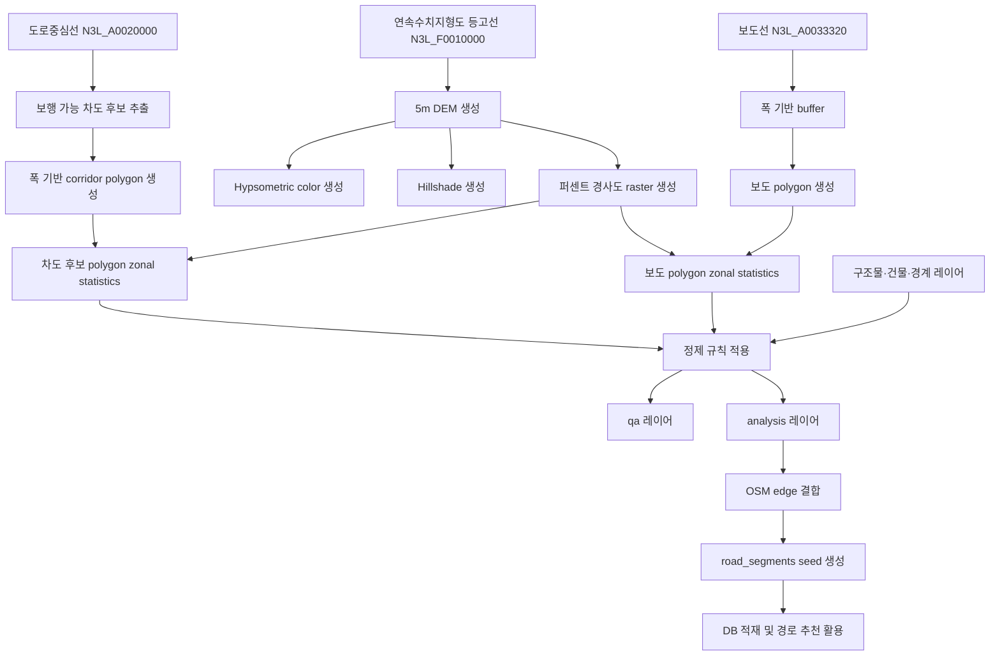
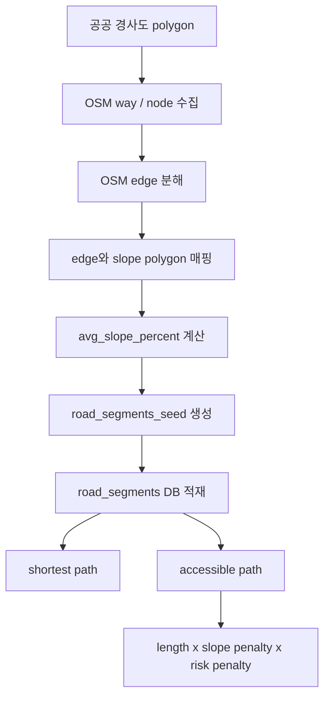

# 📋 부산 경사도 추출 · 정제 · OSM 연계 통합 PoC 보고서

> **작성일:** 2026-04-21  
> **작성자:** 유준호
> **최종 수정일:** 2026-04-29

---

## 1. 개요

본 문서는 부산이음길 프로젝트에서 수행한 `경사도 기반 보행 경로 PoC`의 전체 흐름을 통합 정리한 보고서다.  
정리 범위는 다음과 같다.

- 부산 전역 경사도 데이터가 필요한 배경
- 입력 데이터와 좌표계
- DEM 및 경사도 raster 생성 절차
- 보도 경사도와 보행 가능 차도 후보 경사도 산출 절차
- 값 보정과 정제 규칙
- QA용 DB 적재 방식
- OSM과의 결합 방식 및 경로 추천 활용 구조
- `v1 ~ v4` 버전별 목적, 변경 사항, 해석
- 현재 한계와 후속 과제

본 문서는 `실험 기록`, `팀 공유 자료`, `후속 구현 기준 문서`의 역할을 함께 수행한다.

---

## 2. 핵심 결론

본 PoC를 통해 확인된 핵심 결론은 다음과 같다.

1. 부산 전역에 대해 `5m DEM` 기반 경사도 데이터를 생성할 수 있다.
2. 공식 보도선만으로는 부산의 실제 보행 환경을 충분히 설명할 수 없다.
3. 보도 부재 생활권을 반영하려면 `보행 가능 차도 후보`를 별도 레이어로 관리해야 한다.
4. raw 경사도를 그대로 사용할 경우 구조물, 건물 경계, 보간 노이즈에 따른 오탐이 많다.
5. 운영 판단에는 `raw / analysis / qa`를 분리하고, 최종적으로는 OSM edge 단위에 slope를 부착하는 방향이 적절하다.

요약하면 다음과 같다.

> 부산 경사도 PoC는 “경사도 기반 접근성 경로 추천이 가능하다”는 점을 검증하였으며, 현재 단계의 핵심 과제는 “실제 보행 환경에 맞게 데이터를 얼마나 안정적으로 정제할 것인가”에 있다.

---

## 3. 전체 처리 흐름



---

## 4. 추진 배경

부산은 언덕, 산복도로, 계단, 단차, 절개지 인접 구간이 많은 도시다. 일반 보행자 기준 최단 경로는 부산의 이동약자에게 곧바로 유효하지 않다. 이동약자 관점에서는 다음 요소가 우선적으로 고려되어야 한다.

- 계단 존재 여부
- 급경사 존재 여부
- 엘리베이터·경사로를 통한 우회 가능성
- 보도 존재 여부
- 보도 부재 시 실제 차도로 보행 가능한 생활도로인지 여부

따라서 부산이음길의 경로 탐색은 단순 거리 기반이 아니라 `경사도 + 구조물 + 실제 보행 가능성`을 함께 반영해야 한다.

핵심 원칙은 다음과 같다.

> 보도 우선이 기본이나, 부산의 실제 생활권을 반영하려면 `보도 없는 골목길·생활도로`도 함께 다루어야 한다.

---

## 5. 입력 데이터

### 5.1 입력 경로

- `C:\Users\SSAFY\Desktop\data\수치지도`

### 5.2 주요 레이어

| 용도 | 코드 | 설명 |
| --- | --- | --- |
| 등고선 | `N3L_F0010000` | 연속수치지형도 등고선 |
| 보도선 | `N3L_A0033320` | 연속수치지형도 보도선 |
| 도로중심선 | `N3L_A0020000` | 연속수치지형도 도로중심선 |
| 지표면/차도/건물 분리 보조 | `N3A_A0010000` | 지표면 polygon 묶음 |
| 교량/고가/지하차도 | `N3A_A0090000` | 입체 도로 구조물 계열 |
| 터널 | `N3A_A0110020` | 터널 계열 |
| 행정경계 | `N3A_G0100000` | 구·군 경계 |
| 역사/역 관련 구조 참고 | `N3A_A0191221`, `N3P_A0131122` | 역사·출입구 계열 |
| 철도/특수 선형 참고 | `N3L_A0171119` | 도로와 다른 특수 선형 |

### 5.3 보조 데이터

- 수치지형도 DXF
- 정사영상 정렬본(`aligned_5179`)

### 5.4 데이터 해석 시 유의사항

- DEM은 공식 DEM이 아니라 `등고선 보간 DEM`이다.
- 정사영상은 시각 검수에 유용하나, 부산 전체 기준으로는 용량이 커 기본 `qgz`에서는 제외하였다.
- 현재 이번 PoC에서 사용한 수치지형도/연속수치지형도 입력 세트에는 `계단을 직접 반영할 수 있는 usable stair layer`를 포함하지 못했다.

### 5.5 계단 데이터 부재의 의미

현재 입력 데이터에서는 `계단 존재 여부`를 직접 판별할 수 없다.  
이 점은 본 PoC의 가장 중요한 한계 중 하나다.

의미는 다음과 같다.

- 현재 산출물에서 `has_stairs = false`라고 판단할 수 없다.
- 정확한 표현은 `계단 정보 없음` 또는 `계단 데이터 미포함`이다.
- 현재 경사도는 `경사 구간`과 `급경사 구간`은 보여줄 수 있으나, `계단`을 직접 식별하지는 못한다.
- 따라서 이동약자 경로 추천에서 `계단 회피`를 완전히 보장하려면 계단이 포함된 별도 데이터를 다시 결합해 전체 파이프라인을 재실행해야 한다.

권장 방향:

1. 계단이 포함된 수치지형도 또는 별도 공공 데이터 확보
2. `stairs layer`를 `EPSG:5179`로 정렬
3. 보도/차도 후보 및 OSM edge에 `has_stairs` 또는 `stairs_proximity` 부착
4. 경로 추천 시 `계단 구간 제외` 또는 강한 penalty 적용

즉, 현재 PoC는 `경사 기반 접근성` 검증에는 유효하지만, `계단 회피까지 포함한 최종 경로 품질`을 보장하는 상태는 아니다.

---

## 6. 좌표계 및 경사도 정의

### 6.1 좌표계

- `EPSG:5179`
- 모든 산출물은 가능한 한 `5179`로 통일하였다.

### 6.2 경사도 정의

```text
slope_percent = tan(경사각) * 100
```

예시:

- `5%` = 100m 진행 시 5m 높이 변화
- `10%` ≈ `5.7도`
- `20%` ≈ `11.3도`
- `100%` = `45도`

유의사항:

- `100% 초과`는 수학적으로는 가능하다.
- 다만 보행 경로, 보도, 차도 후보에서 `100% 초과`가 반복적으로 나타나는 경우에는 구조물 영향, 보간 노이즈, 경계 아티팩트일 가능성이 높다.

---

## 7. DEM 및 경사도 raster 생성

### 7.1 DEM 생성

처리 절차:

1. 부산 16개 구·군 `N3L_F0010000` 등고선을 병합한다.
2. `QGIS TIN interpolation`으로 `5m DEM`을 생성한다.
3. 생성 raster와 TIN edge를 저장한다.

주요 산출물:

- `busan_dem_5m_from_contours.tif`
- `busan_tin_edges.gpkg`

의미:

- 부산 전역을 5m grid로 표현한 표면 고도 모델
- slope, hillshade, color relief 계산의 기준 표면

### 7.2 slope / hillshade / hypsometric 생성

처리 절차:

1. `gdaldem slope -p`로 퍼센트 경사도 raster 생성
2. `gdaldem hillshade -multidirectional`로 지형 음영 생성
3. `gdaldem color-relief`로 고도색 raster 생성

주요 산출물:

- `busan_slope_pct_5m.tif`
- `busan_hillshade_5m.tif`
- `busan_dem_hypsometric_5m.tif`

이 세 가지를 함께 사용하면 산과 언덕의 높이, 사면 방향, 완만·급경사 구간을 시각적으로 빠르게 파악할 수 있다.

### 7.3 smoothing

후속 버전에서는 DEM smoothing을 추가하였다.

처리 방식:

- `grass:r.neighbors`
- `method = average`
- `size = 3`

주요 산출물:

- `busan_dem_5m_smoothed.tif`
- `busan_slope_pct_5m_smoothed.tif`

목적:

- 평지 구간에서 발생하는 pixel-level 노이즈 완화
- `raw mean`과 `smoothed mean` 차이를 이용한 `SMOOTHING_DELTA` 플래그 생성

---

## 8. 보도 경사도 생성

### 8.1 기본 절차

1. `N3L_A0033320`에서 `KIND IN ('SWK001', 'SWK002')`를 보도선으로 사용
2. `WIDT`를 읽어 `폭 / 2`를 buffer 폭으로 사용
3. `WIDT`가 비어 있거나 과소할 경우 `1.5m` 기본 버퍼 적용
4. 보도 polygon 생성
5. slope raster에 대해 `zonal statistics` 수행
6. `slope_mean`, `slope_min`, `slope_max` 저장

### 8.2 이 방식을 사용한 이유

- 선형 직접 샘플링은 픽셀 위치 오차에 취약하다.
- polygon 기반으로 변환하면 보도 폭 전체 기준 평균 경사를 계산할 수 있다.

### 8.3 해석 구간

| 구간 | 의미 |
| --- | --- |
| `0~3%` | 매우 완만 |
| `3~5%` | 완만 |
| `5~8%` | 주의 |
| `8~12%` | 경사 |
| `12~20%` | 급경사 |
| `20~35%` | 매우 급경사 |
| `35%+` | 위험 후보 |

초기에는 `slope_mean`을 그대로 시각화에 사용하였다. 이후 버전에서는 보정용 표시값으로 `display_mean`을 추가하였다.

---

## 9. 보행 가능 차도 후보 생성

### 9.1 차도 후보가 필요한 이유

부산의 산복도로, 원룸촌, 달동네, 골목길은 인도가 없는 경우가 많다. 공식 보도선만 사용할 경우 실제 보행 가능 경로를 상당 부분 놓칠 수 있다.

따라서 필요한 것은 `차도 전체 경사도`가 아니라 `보행 대체 경로로 사용할 수 있는 차도 후보의 경사도`다.

### 9.2 포함 후보

- `RDLN <= 2`
- `RVWD <= 8~10m`
- `DVYN = CSU002`
- 구조물(터널, 교량, 고가, 지하차도) 비해당
- 보도 부재 또는 보도 단절

### 9.3 제외 후보

- `RDLN >= 4`
- `RVWD >= 15m`
- 터널
- 교량/고가/지하차도 본선
- 자동차 전용 성격이 강한 도로

### 9.4 사용 필드

| 필드 | 의미 |
| --- | --- |
| `RDLN` | 차로 수 |
| `RVWD` | 도로 폭 |
| `RDDV` | 도로 구분 코드 |
| `DVYN` | 분리 여부 코드 |
| `PVQT` | 포장/품질 계열 코드 |
| `SCLS` | 세부 분류 코드 |

### 9.5 차도 경사도 계산

1. 도로중심선에서 보행 후보 추출
2. `road_buf_m` 계산
3. 중심선 기준 폭 corridor polygon 생성
4. slope raster에 대해 `road_mean`, `road_min`, `road_max` 계산

기본 버퍼 규칙:

```text
if RVWD >= 10 then 5.0
else if RVWD >= 3 then RVWD / 2.0
else 1.5
```

산출물:

- `busan_walkable_road_candidate_lines.gpkg`
- `busan_walkable_road_candidate_polygons.gpkg`
- `busan_walkable_road_slope_polygons.gpkg`

---

## 10. 경사도 보정 및 정제 방법론

### 10.1 기본 원칙

운영 판단에는 `raw`를 그대로 사용하지 않는다.

구조:

1. `raw`
2. `analysis`
3. `qa`

### 10.2 적용 플래그

#### extreme artifact

```text
if max > 100 then EXTREME_ARTIFACT_CANDIDATE
```

#### flat noise

```text
if min <= 1 and max >= 12 then FLAT_NOISE
```

#### spiky slope

```text
if max - mean >= 8 then SPIKY_SLOPE
```

#### smoothing delta

```text
if abs(raw_mean - smoothed_mean) >= 5 then SMOOTHING_DELTA
```

#### structure edge

```text
if intersects(bridge_or_tunnel_buffer) then STRUCTURE_EDGE_LOW_CONFIDENCE
```

#### building edge

```text
if intersects(building_buffer) then BUILDING_EDGE_LOW_CONFIDENCE
```

#### seam edge

```text
if intersects(district_boundary_buffer) then SEAM_EDGE_LOW_CONFIDENCE
```

### 10.3 display_mean

보정 후 시각화에는 `raw mean` 대신 `display_mean`을 우선 사용한다.

```text
if low confidence then display_mean = smooth_mean
else display_mean = raw_mean
```

이 방식은 데이터를 일괄 삭제하기보다, 표시값과 신뢰도를 분리하는 접근이다.

---

## 11. 주상복합 · 오피스텔 포디움 문제

예시 좌표:

- `1140661.04, 1678167.24`
- `1137756.85, 1680565.19`

해당 좌표 주변을 점검한 결과 공통적으로 다음 패턴이 확인되었다.

- `BUILDING_EDGE_LOW_CONFIDENCE`
- `SPIKY_SLOPE`
- 일부 구간 `EXTREME_ARTIFACT_CANDIDATE`

즉, 주변은 평지 또는 완만 구간인데 건물 상부 데크, 공중정원, 포디움 경계, 공중보행 공간 때문에 보도 polygon 일부만 급경사로 산출되는 패턴이었다.

해석:

> 실제 지상 보행 경사라기보다 건물 구조물 영향으로 인한 과대 경사 후보로 해석하는 것이 타당하다.

### v4 적용 규칙

`BUILDING_EDGE_LOW_CONFIDENCE`가 있고 동시에 아래 중 하나라도 있을 경우 메인 표시에서 제외하였다.

- `EXTREME_ARTIFACT_CANDIDATE`
- `SPIKY_SLOPE`
- `FLAT_NOISE`
- `SMOOTHING_DELTA`

즉:

> 건물 인접 + 튀는 패턴 = 기본 경로 판단에서는 신뢰하지 않음

---

## 12. 버전 히스토리


### v1

부산 전역 `5m DEM` 및 보도 경사도 polygon 생성 가능성을 검증한 초기 버전이다.

### v2

보도 외에 차도 후보, 건물, 도로중심선까지 함께 포함한 버전이다.

주요 문제:

- 차도 후보 수 과다
- `100%+` 극단값 존재
- 주상복합/오피스텔 포디움 영향이 그대로 드러남

### cleaned

극단적인 구조물 영향과 일부 노이즈를 기본 표시에서 제외한 보수적 버전이다. 운영 판단용과 QA용 분리를 처음 시도하였다.

### v3

정제 파이프라인을 본격적으로 적용한 버전이다.

추가된 요소:

- `smoothed DEM`
- `smoothed slope`
- `building / structure / seam proximity`
- `analysis / qa`
- `display_mean / mean_delta / flag_codes / confidence / qa_group`

### v4

건물 인접 과대 경사, 즉 포디움·공중정원·데크형 연결부를 더 강하게 제외한 버전이다.

---

## 13. 주요 산출물 폴더

| 버전 | 폴더 | 의미 |
| --- | --- | --- |
| 강서구 보도 PoC | `.tmp/gangseo-sidewalk-slope` | 소규모 slope polygon 실험 |
| 강서구 OSM PoC | `.tmp/gangseo-osm-routing-poc` | slope와 OSM edge 결합 검증 |
| 부산 초기 전역 | `.tmp/busan-sidewalk-slope-5m` | 전역 보도 slope 생성 |
| 부산 시각 개선 | `.tmp/busan-sidewalk-slope-5m-red` | 시각화 개선 |
| 부산 확장 | `.tmp/busan-sidewalk-slope-5m-red-v2` | 차도 후보, 건물, 차도 포함 |
| 부산 정제 | `.tmp/busan-sidewalk-slope-5m-red-v3` | analysis/qa, smoothing, flags |
| 부산 건물 인접 보정 | `.tmp/busan-sidewalk-slope-5m-red-v4` | building + extreme/spiky 제외 |

---

## 14. DB 적재 방향

### 14.1 최종 목표

경로 탐색용 DB에는 `road_nodes`, `road_segments` 형태로 적재한다.

관련 ERD:

- [ERD_v3.md](/C:/Users/SSAFY/workspace/S14P31E102/Docs/ERD/archive/ERD_v3.md)

핵심 테이블:

- `road_nodes`
- `road_segments`

`road_segments`에 포함할 핵심 속성:

| 필드 | 의미 |
| --- | --- |
| `length_meter` | 거리 |
| `avg_slope_percent` | 평균 경사도 |
| `width_meter` | 폭 |
| `stairsState` | 계단 상태 |
| `slopeState` | 경사 상태 |
| `widthState` | 폭 상태 |
| `crossingState` | 횡단 상태 |
| `audioSignalState` | 음향신호기 상태 |
| `brailleBlockState` | 점자블록 상태 |
| `surfaceState` | 노면 상태 |

즉, 경사도는 단독 테이블보다 `edge 속성`으로 들어가는 구조가 적절하다.

중요한 점:

- 현재 PoC 데이터에서는 `has_stairs`를 확정할 수 없다.
- 현재 단계에서는 `stairsState = NO`가 아니라 `stairsState = UNKNOWN` 또는 staging의 `stairs_data_status = MISSING_SOURCE`로 다루는 것이 정확하다.
- 계단 포함 데이터가 확보되면 `road_segments_seed`를 다시 생성하는 것이 맞다.

### 14.2 적재 방식

1. 보도/차도 polygon에서 경사도 산출
2. OSM 또는 공공 선형을 `edge` 단위로 분해
3. edge와 경사도 polygon을 `intersection` 또는 `nearest`로 매핑
4. 길이 가중 평균으로 `avg_slope_percent` 계산
5. CSV 또는 GPKG 형태로 `road_segments_seed` 생성
6. 이후 DB seed 또는 ETL 방식으로 적재

### 14.3 QA용 DB

운영 DB와 별개로 QA DB(SQLite)를 구성하였다.

역할:

- 수동 검수 대상만 별도 저장
- 구조물 인접, 튀는 값, 오탐 후보를 빠르게 확인

즉 운영 DB와 QA DB의 목적은 구분된다.

- 운영 DB: 경로 계산
- QA DB: 품질 검수

### 14.4 CSV staging 데이터

`v4` 기준으로 DB 적재용 CSV도 별도로 준비하였다.

출력 경로:

- [busan_slope_analysis_v4_staging.csv](/C:/Users/SSAFY/Desktop/Project/S14P31E102/.tmp/busan-sidewalk-slope-5m-red-v4/csv/busan_slope_analysis_v4_staging.csv)
- [busan_slope_excluded_v4_staging.csv](/C:/Users/SSAFY/Desktop/Project/S14P31E102/.tmp/busan-sidewalk-slope-5m-red-v4/csv/busan_slope_excluded_v4_staging.csv)

생성 스크립트:

- [export-busan-v4-staging-csv.ps1](/C:/Users/SSAFY/Desktop/Project/S14P31E102/scripts/gis/export-busan-v4-staging-csv.ps1)

CSV 구성 원칙:

- 보도와 차도 후보를 하나의 공통 스키마로 정규화
- `source_type`으로 레이어 종류 구분
- `metric_mean / metric_max / metric_min / display_mean / smoothed_mean / mean_delta` 포함
- `flag_codes / confidence / qa_group` 포함
- `bbox`와 `geometry_wkt` 포함
- `stairs_data_status`를 별도 컬럼으로 포함

현재 CSV에서는 다음 값을 넣었다.

```text
stairs_data_status = MISSING_SOURCE
stairs_source = NOT_INCLUDED_IN_CURRENT_TOPO_INPUT
```

이 값의 의미:

- 현재 CSV는 DB에 바로 적재할 수 있는 staging 데이터다.
- 그러나 계단 정보가 없는 상태이므로 운영 DB의 최종 `has_stairs` 판단용 seed로 바로 쓰기보다는
  `경사도 분석 seed` 또는 `전처리 staging table` 용도로 쓰는 것이 맞다.

권장 적재 방식:

1. CSV를 `slope_segments_staging` 같은 staging table로 적재
2. OSM edge와 매핑
3. 계단 데이터가 확보되면 `has_stairs`를 별도 enrichment 단계에서 채움
4. 이후 최종 `road_segments` 테이블로 이동

즉, 이번 CSV는 `즉시 DB 적재 가능`한 형태이지만, 의미상으로는 `최종 운영 테이블`보다 `전처리 staging`에 가깝다.

---

## 15. OSM과 연동하여 경로 추천에 사용하는 방법



### 15.1 기본 개념

OSM 보행 네트워크를 `node-edge graph`로 만들고, 각 edge에 경사도와 위험 정보를 부착한 뒤 가중치 기반 경로 탐색을 수행한다.

강서구 PoC에서 검증한 방식:

1. OSM way/node 수집
2. 인접 node pair 기준 edge 분해
3. edge와 보도 경사도 polygon 매핑
4. `avg_slope_percent` 계산
5. `length` 기반 shortest path와 `length * slope penalty` 기반 accessible path 비교

결과:

- shortest와 accessible이 실제로 다른 경로를 산출함
- accessible은 거리는 늘었지만 평균 경사도는 크게 낮아짐

### 15.2 경로 추천 모델

#### shortest

```text
weight = length
```

#### accessible

```text
weight = length * slope_penalty * risk_penalty
```

예시 slope penalty:

| 경사도 | penalty |
| --- | --- |
| `0~5%` | `1.0` |
| `5~8%` | `1.2` |
| `8~12%` | `1.5` |
| `12~20%` | `2.0` |
| `20%+` | `3.0+` 또는 제외 |

추가 penalty:

- 계단
- 구조물 저신뢰
- 보도 없음
- 교차로 위험도

### 15.3 보도와 차도 후보의 결합

권장 우선순위:

1. `보도 edge`
2. `보행 가능 차도 후보 edge`
3. `저신뢰 edge`

즉:

- 보도가 있으면 보도 우선
- 보도가 없으면 생활도로 차도 후보 사용
- 저신뢰 edge는 penalty를 높이거나 fallback 후보로만 사용

---

## 16. 현재 한계

현재 남아 있는 한계는 다음과 같다.

- OSM edge와 공공 보도 geometry가 완전히 일치하지 않는다.
- `NO_SLOPE` edge가 여전히 많다.
- 차도 후보는 여전히 과다 포함될 가능성이 있다.
- building/structure artifact를 얼마나 제외할지 threshold 튜닝이 필요하다.
- 수계/해안 proximity는 아직 본격 적용하지 않았다.
- 계단 데이터가 현재 입력 세트에 포함되지 않았다.
- DXF에서 계단, 옹벽, 단차 구조를 아직 충분히 보강하지 못했다.
- `median`, `pct_over_5`, `pct_over_8`, `pct_over_12` 같은 분포 지표는 아직 미구현이다.

현재 상태는 다음과 같이 정리할 수 있다.

> “경사도 기반 접근성 경로 추천이 가능하다”는 점은 검증되었고,  
> “운영 수준으로 얼마나 안정적으로 정제할 것인가”가 남아 있는 단계다.

---

## 17. 향후 과제

우선순위 기준 후속 과제:

1. `차도 후보 core / review` 분리
2. `건물 인접 + extreme/spiky` 자동 제외 규칙 정교화
3. `해안/수계 proximity` 추가
4. `DXF` 기반 계단/옹벽/단차 구조 보강
5. `median`, `pct_over_5`, `pct_over_8`, `pct_over_12` 같은 분포 지표 추가
6. `road_segments_seed`를 실제 DB 적재 포맷으로 안정화
7. 부산 전역 생활권 샘플 검수로 threshold 튜닝

장기 목표:

- 공공 데이터
- OSM
- 현장 제보
- QA 피드백

을 통합하여 접근성 경로 그래프를 운영 자산으로 구축하는 것이다.

---

## 18. 핵심 의사결정 요약

1. 부산 전역 해상도는 `5m`를 사용한다.
2. DEM은 `등고선 보간 DEM`으로 생성한다.
3. 경사도는 `퍼센트 경사도`로 계산한다.
4. 보도선 기반 보도 경사도를 기본 레이어로 사용한다.
5. 보도 없는 생활도로를 보완하기 위해 차도 후보를 생성한다.
6. raw 결과를 그대로 운영 판단에 사용하지 않는다.
7. `raw / analysis / qa`를 분리한다.
8. 구조물, 건물, 경계 영향은 저신뢰 처리한다.
9. extreme, spiky, flat-noise는 자동 분리한다.
10. OSM과 결합할 때는 `edge` 단위로 slope를 부착한다.

---

## 19. 참고 문서 및 스크립트

### 문서

- [2026-04-15_강서구_보도_경사도_PoC.md](/C:/Users/SSAFY/Desktop/Project/S14P31E102/Docs/기타/2026-04-15_강서구_보도_경사도_PoC.md)
- [2026-04-16_강서구_OSM_경사도_경로탐색_PoC.md](/C:/Users/SSAFY/Desktop/Project/S14P31E102/Docs/기타/2026-04-16_강서구_OSM_경사도_경로탐색_PoC.md)
- [2026-04-17_부산_보도_경사도_PoC.md](/C:/Users/SSAFY/Desktop/Project/S14P31E102/Docs/기타/2026-04-17_부산_보도_경사도_PoC.md)
- [2026-04-20_QGIS_부산_경사도_및_보행_가능_차도_분류_가이드.md](/C:/Users/SSAFY/Desktop/Project/S14P31E102/Docs/기타/2026-04-20_QGIS_부산_경사도_및_보행_가능_차도_분류_가이드.md)
- [2026-04-20_QGIS_경사도_정제_개선_포인트.md](/C:/Users/SSAFY/Desktop/Project/S14P31E102/Docs/기타/2026-04-20_QGIS_경사도_정제_개선_포인트.md)
- [2026-04-20_GIS_QA_사이트_운영_가이드.md](/C:/Users/SSAFY/Desktop/Project/S14P31E102/Docs/기타/2026-04-20_GIS_QA_사이트_운영_가이드.md)

### 스크립트

- [build-gangseo-sidewalk-slope.ps1](/C:/Users/SSAFY/Desktop/Project/S14P31E102/scripts/gis/build-gangseo-sidewalk-slope.ps1)
- [create-gangseo-slope-visualization.py](/C:/Users/SSAFY/Desktop/Project/S14P31E102/scripts/gis/create-gangseo-slope-visualization.py)
- [build-gangseo-osm-routing-poc.ps1](/C:/Users/SSAFY/Desktop/Project/S14P31E102/scripts/gis/build-gangseo-osm-routing-poc.ps1)
- [build-gangseo-osm-routing-poc.py](/C:/Users/SSAFY/Desktop/Project/S14P31E102/scripts/gis/build-gangseo-osm-routing-poc.py)
- [build-busan-sidewalk-slope.ps1](/C:/Users/SSAFY/Desktop/Project/S14P31E102/scripts/gis/build-busan-sidewalk-slope.ps1)
- [create-busan-slope-visualization.py](/C:/Users/SSAFY/Desktop/Project/S14P31E102/scripts/gis/create-busan-slope-visualization.py)
- [enhance-busan-slope-layers.py](/C:/Users/SSAFY/Desktop/Project/S14P31E102/scripts/gis/enhance-busan-slope-layers.py)
- [build-busan-cleaned-slope-project.ps1](/C:/Users/SSAFY/Desktop/Project/S14P31E102/scripts/gis/build-busan-cleaned-slope-project.ps1)
- [build-busan-v4-filtered-project.ps1](/C:/Users/SSAFY/Desktop/Project/S14P31E102/scripts/gis/build-busan-v4-filtered-project.ps1)
- [build-busan-qa-db.ps1](/C:/Users/SSAFY/Desktop/Project/S14P31E102/scripts/gis/build-busan-qa-db.ps1)
- [build-busan-lite-qa-db.ps1](/C:/Users/SSAFY/Desktop/Project/S14P31E102/scripts/qa/build-busan-lite-qa-db.ps1)
