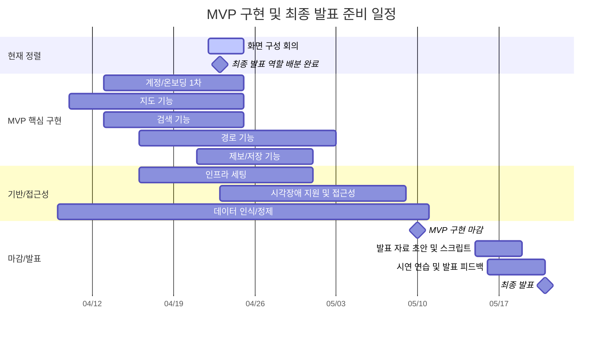

# 📋 개발 일정 공유 문서

> **작성일:** 2026-04-23  
> **작성자:** Codex  
> **최종 수정일:** 2026-04-23

---

## 1. 문서 개요

- **목적:** 팀원 공유용 개발 일정, 마일스톤, 현재 결정 사항 정리
- **기준 자료:** `Docs/기획/archive/schedules/2026-04-20_간트차트_정리.md`
- **일정 기준일:** 2026-04-23
- **MVP 구현 마감:** 2026-05-10
- **최종 발표 준비 기간:** 2026-05-15 ~ 2026-05-21

본 문서는 기존 간트차트의 작업 흐름을 기준으로, 현재 팀에서 새로 확정한 화면 구성 회의 일정과 최종 발표 역할 배분 완료 사항을 반영해 MVP 마감 중심으로 재정리한 공유 문서이다.

---

## 2. 현재 확정 사항

| 구분 | 일정 | 상태 | 공유 내용 |
| --- | --- | --- | --- |
| 화면 구성 회의 | 2026-04-22 ~ 2026-04-24 | 진행 중 | 어제부터 오늘, 내일까지 화면 구성 회의를 진행하며 MVP 화면 흐름과 구현 범위를 확정한다. |
| 최종 발표 역할 배분 | 2026-04-23 | 완료 | 오늘 최종 발표 준비를 위한 역할 배분을 완료했다. |
| MVP 구현 마감 | 2026-05-10 | 확정 | 핵심 기능 구현과 1차 통합 테스트를 5월 10일까지 마감한다. |
| 발표 준비 본격화 | 2026-05-15 ~ 2026-05-21 | 예정 | 장표, 스크립트, 시연 플로우, 리허설을 최종 발표 일정에 맞춰 진행한다. |

---

## 3. 핵심 마일스톤

| 마일스톤 | 날짜 | 완료 기준 |
| --- | --- | --- |
| 화면 구성 확정 | 2026-04-24 | MVP 화면 목록, 진입 흐름, 우선 구현 범위 합의 |
| MVP 핵심 흐름 1차 구현 | 2026-04-30 | 온보딩, 지도, 검색, 경로, 제보, 저장 흐름이 앱에서 연결됨 |
| 접근성 및 데이터 기능 1차 반영 | 2026-05-08 | 설정, 시각장애 모드, 접근성 라벨, 데이터 인식/정제 범위 반영 |
| MVP 구현 마감 | 2026-05-10 | 핵심 기능 통합, 주요 버그 수정, 발표 시연 가능한 MVP 상태 확보 |
| 발표 자료 초안 완성 | 2026-05-18 | 발표 장표 초안, 스크립트, 시연 플로우 초안 완성 |
| 최종 발표 리허설 | 2026-05-20 | 발표 피드백 반영 및 최종 리허설 완료 |
| 최종 발표 | 2026-05-21 | 본선/결선 발표 대응 |

---

## 4. MVP 개발 일정 요약

| 기간 | 주요 작업 | 관련 간트차트 PART | 담당 영역 | 완료 기준 |
| --- | --- | --- | --- | --- |
| 2026-04-22 ~ 2026-04-24 | 화면 구성 회의 및 MVP 범위 재확정 | 화면명세/MVP 범위 | PM, FE, BE, AI, INFRA | 구현 우선순위와 화면 흐름 확정 |
| 2026-04-13 ~ 2026-04-24 | 계정/온보딩 1차, 지도, 검색, 경로, 제보 핵심 흐름 구현 | PART 4, 6, 7, 8, 10 | FE, BE, AI | `약관 -> 지도 -> 검색 -> 경로 -> 제보` 흐름 확인 |
| 2026-04-16 ~ 2026-04-30 | 인프라 및 개발 통합 환경 구축 | PART 9 | INFRA | 개발 서버, DB, Redis, MinIO, GraphHopper, CI/CD 기반 준비 |
| 2026-04-25 ~ 2026-05-02 | 제보 내역, 북마크, 경로 북마크, 접근성 라벨 반영 | PART 8, 10, 11 | FE, BE, AI | 북마크 조회/삭제/길찾기, 기본 접근성 흐름 확인 |
| 2026-05-03 ~ 2026-05-08 | 시각 지원 확장 후보, 경로 브리핑, 접근성 통합 테스트 | PART 11 | FE, AI, PM | TalkBack, 큰 글씨, 터치영역, 음성 안내 점검 |
| 2026-05-06 ~ 2026-05-10 | MVP 마감 전 확장 후보 중 시연 가치 높은 기능 선별 반영 | PART 12 일부 | FE, BE, AI | 저상버스/두리발/LLM 등은 MVP 안정성에 영향 없는 범위만 반영 |
| 2026-05-09 ~ 2026-05-10 | MVP 통합 마감 및 시연 안정화 | 전체 MVP | 전원 | 주요 시나리오 회귀 테스트와 시연 동선 점검 완료 |

---

## 5. 간트차트 기준 일정

---

## 6. 파트별 실행 포인트

### 6.1 FE

- 2026-04-24까지 온보딩, 지도, 검색, 경로, 제보의 기본 화면 연결을 우선한다.
- 2026-04-30까지 제보 내역과 북마크 관리 흐름을 붙인다.
- 2026-05-08까지 시각 지원 확장 후보, 큰 글씨, 접근성 라벨, 읽기 순서를 점검한다.
- 2026-05-10 이전에는 발표 시연 흐름을 깨는 UI 변경을 최소화한다.

### 6.2 BE

- 2026-04-24까지 지도, 검색, 경로, 제보에 필요한 API와 데이터 구조를 우선 정리한다.
- 2026-04-30까지 제보 계정 연결, 북마크, 경로 북마크 등 사용자 데이터 흐름을 연결한다. 내 제보 내역에는 처리 상태를 표시하고, 공개 지도에는 승인된 제보만 마커로 노출한다.
- 로그인/프로필 gate 범위는 MVP 핵심 흐름에 맞춰 우선순위를 조정한다.
- 2026-05-10까지 시연 시나리오에 필요한 API 안정성과 예외 응답을 점검한다.

### 6.3 AI

- 2026-05-10까지 시설 맞춤 데이터 인식 및 정제 가능 범위를 확정한다.
- 음성 검색, TTS 안내, 경로 브리핑은 시연 안정성 기준으로 우선순위를 둔다.
- 인식/생성 결과가 앱 흐름에 직접 반영되는 부분은 2026-05-08 전까지 통합 상태를 확인한다.

### 6.4 INFRA

- 2026-04-30까지 개발 통합 환경과 배포 기반을 준비한다.
- GraphHopper, PostGIS, Redis, MinIO 등 MVP 시연에 필요한 의존 서비스를 우선 연결한다.
- 2026-05-10 전에는 배포 파이프라인과 시연 환경의 재현 가능성을 점검한다.

### 6.5 PM/발표

- 2026-04-23 완료된 최종 발표 역할 배분 결과를 기준으로 발표 준비 책임자를 고정한다.
- 2026-05-10 이후에는 구현 범위 확대보다 장표, 스크립트, 시연 안정화에 집중한다.
- 2026-05-18까지 발표 자료 초안을 만들고, 2026-05-20까지 리허설 피드백을 반영한다.

---

## 7. 최종 발표 준비 체크리스트

| 항목 | 목표일 | 상태 | 비고 |
| --- | --- | --- | --- |
| 발표 역할 배분 | 2026-04-23 | 완료 | 오늘 완료된 역할 배분 기준 |
| 발표 메시지 구조 정리 | 2026-05-13 | 예정 | 문제, 대상 사용자, 해결 방식, 차별점 중심 |
| 시연 시나리오 확정 | 2026-05-15 | 예정 | MVP 핵심 흐름 기준 |
| 장표 초안 제작 | 2026-05-18 | 예정 | 간트차트 PART 13 일정 기준 |
| 스크립트 초안 작성 | 2026-05-18 | 예정 | 발표자별 분량 조정 필요 |
| 팀 피드백 반영 | 2026-05-20 | 예정 | 장표, 시연, 답변 보강 |
| 최종 리허설 | 2026-05-20 | 예정 | 발표 전 마지막 점검 |

---

## 8. 공유 시 강조할 내용

- 2026-04-24까지 화면 구성 회의를 마무리하고, 이후에는 MVP 구현 범위 변경을 최소화한다.
- 2026-05-10은 MVP 구현 마감일이므로, 기능 추가보다 핵심 시연 흐름 완성도를 우선한다.
- 2026-05-11 이후 작업은 발표 완성도, 안정화, 확장 기능 보강으로 분리한다.
- 최종 발표 역할 배분은 2026-04-23 완료되었으므로, 각 담당자는 2026-05-10 이전부터 본인 발표 파트에 필요한 구현/자료 증거를 모아둔다.

---

## 9. 참고 문서

- `Docs/기획/archive/schedules/2026-04-20_간트차트_정리.md`
- `Docs/기획/archive/drafts/2026-04-11_MVP_화면명세서.md`
- `FE/docs/2026-04-13_FE_프론트엔드_마스터_일정표.md`
