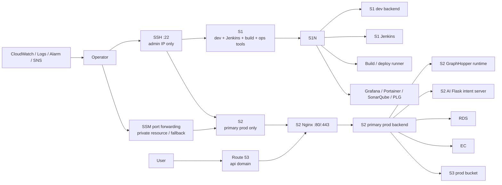
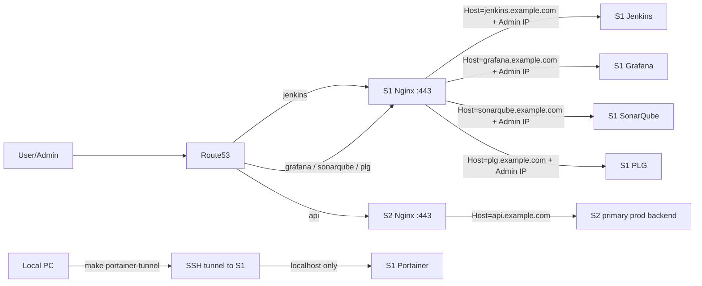

# 📋 AWS 인프라 설계안

> **작성일:** 2026-04-20  
> **작성자:** 유준호
> **최종 수정일:** 2026-05-20

---

## 1. 문서 목적

부산이음길 서비스의 AWS 인프라 구성을 현재 예산과 운영 방식에 맞게 정리한다.  
현재는 **EC2 2대 운영**을 기준으로 설계하고, 이후 **EC2 1대를 추가하여 3대 구조로 확장**하는 방향을 함께 기록한다.

2026-05-20 실서버 확인 기준 최신 런타임 스냅샷은 `Docs/인프라/2026-05-20_인프라_현재상태_및_운영_기준.md`를 기준으로 한다. 현재 운영은 `S1 dev/Jenkins/운영도구 + S2 primary prod` 구조이며, prod GraphHopper blue/green은 EC2 서버 단위가 아니라 S2 내부 runtime slot 전환이다.

---

## 2. 현재 의사결정 요약

- 현재 운영 기준은 **EC2 2대**다.
- `dev`와 `Jenkins`는 **항상 켜져 있어야 한다**.
- 현재 2대 구조에서는 `S2`를 `primary prod`, `S1`을 `dev/Jenkins/build/운영도구` 서버로 둔다.
- `S2`에는 운영 WAS, AI Flask intent server, 관리자 웹, GraphHopper blue/green runtime을 배치한다.
- EC2에 실제로 올라가는 핵심 서비스는 **WAS**, **GraphHopper runtime**, **AI Flask intent server**다.
- `RDS`, `ElastiCache`는 관리형 서비스로 운영하며 EC2 자원을 사용하지 않는다.
- EC2 shell 접속은 **SSH**를 기본으로 사용하되, `22`는 관리자 고정 IP에서만 허용한다.
- `RDS`, `ElastiCache` 같은 private managed resource 접근은 **AWS Systems Manager Session Manager(SSM) port forwarding**을 사용한다.
- `SSM`은 SSH 장애 시 복구 채널로도 유지한다.
- 서비스 API와 필요한 관리자 UI는 각 서버의 **Nginx reverse proxy**를 통해 `80/443`에서 path 또는 host 기반 routing한다.
- `S1`과 `S2`가 같은 VPC/private network가 아니므로 `ALB target group` 기반 Blue/Green은 현재 적용하지 않는다.
- 장애 전환은 초기에는 정식 자동화 대상이 아니며, S2 장애 시 S1 임시 fallback 또는 복구 runbook으로 처리한다.
- EC2에서 외부에 직접 여는 포트는 `80/443`과 `22`만 둔다. 단, `22`는 관리자 고정 IP에서만 허용한다.
- 현재 기본 운영 관측은 **Grafana(서비스 health) + Loki(로그)** 를 우선 사용하고, AWS 관리 자원 고립 여부 확인은 별도 점검으로 본다.

---

## 3. 현재 2대 운영 아키텍처

### 운영 개념

- `S2`는 AWS VPC 안의 prod primary 서버이며 RDS/ElastiCache private endpoint에 직접 접근한다.
- `S1`은 AWS VPC 밖의 SSAFY 제공 서버이므로 prod DB/Redis private endpoint에 상시 연결하는 운영 서버로 사용하지 않는다.
- 평소에는 `Route53 -> S2 Nginx -> S2 prod backend` 경로로 운영한다.
- `S1`은 `dev`, `Jenkins`, build runner, 운영도구, 긴급 수동 운영 보조 역할로 둔다.
- `Jenkins`, `Grafana`, `SonarQube`, `PLG`는 웹 접근이 필요할 수 있으나, 원 포트는 공개하지 않고 각 서버의 `Nginx :443` reverse proxy와 접근 제한을 사용한다.
- `Portainer`는 Docker root 권한에 가까운 고위험 관리 UI이므로 외부 Nginx routing 대상에서 제외하고 SSH 터널로만 접근한다.
- S2 장애 시 S1 fallback은 임시 복구 수단이며, prod DB/Redis 접근 경로를 별도 확보하기 전까지 정식 HA로 보지 않는다.
- `ALB target group` 기반 Blue/Green은 `S1/S2`가 같은 VPC 또는 private routing 가능한 네트워크로 정리된 이후의 확장 옵션으로 둔다.

---

## 4. 서버별 역할

| 서버 | 역할 | 항상 실행 여부 | 비고 |
|---|---|---|---|
| `S1` | `dev`, `Jenkins`, build runner, dev `GraphHopper runtime(serve only)`, `Grafana`, `Portainer`, `SonarQube`, `PLG` | 항상 실행 | AWS VPC 밖의 SSAFY 제공 서버. prod primary로 사용하지 않음 |
| `S2` | `primary prod`, `admin`, `GraphHopper runtime(serve only)`, `AI Flask intent server` | 항상 실행 | AWS VPC 안의 운영 서버. RDS/Redis private 접근 기준 |
| `RDS` | PostgreSQL 운영 DB | 항상 실행 | 초기 Single-AZ, 안정화 후 Multi-AZ 검토 |
| `ElastiCache` | 캐시 | 선택 | 필요 시 replica/Multi-AZ 검토 |

### 현재 S1 반영 상태 (2026-04-25)

- Docker Engine과 Docker Compose 설치 확인 완료
- `/home/ubuntu/e102/repo`에 `develop` 기준 저장소 clone
- `PostGIS`, `Redis`, `MinIO`, `backend` dev stack 실행 완료
- dev stack 포트는 외부 직접 노출 없이 `127.0.0.1` 바인딩
- Jenkins는 `https://jenkins.busaneumgil.com/` 경로로 접근 가능
- S1 dev backend는 `https://api.dev.busaneumgil.com/` host로 접근 가능
- S1 dev AI는 `https://ai.dev.busaneumgil.com/` host로 접근 가능
- PostgreSQL은 외부 공개하지 않으며 `/db` 경로도 만들지 않음
- Jenkins GitLab OAuth와 Matrix 권한 적용
- Jenkins `e102-dev-deploy` 잡에서 `develop` 배포 및 `/v3/api-docs` smoke test 성공
- Jenkins `.env.dev`는 `e102-dev-env-file` credential로 관리
- Jenkins Poll SCM `H/30 * * * *`로 30분마다 `develop` 변경 여부 확인
- Jenkins GitLab Push Hook 수신 endpoint 검증 완료. GitLab 프로젝트 hook 등록은 Maintainer 권한 필요
- Jenkins home volume은 S1 로컬 cron으로 매일 백업
- `Grafana`, `Portainer`, `SonarQube`, `PLG`는 S1 운영도구 stack으로 배치 완료
- `Portainer`는 외부 도메인에서 404를 반환하고 `make portainer-tunnel` SSH 터널로만 접근
- `api.dev.busaneumgil.com`, `ai.dev.busaneumgil.com` Route53 CNAME과 S1 nginx proxy 적용 완료

### 현재 S2/AWS 반영 상태 (2026-05-20)

- Terraform remote state S3 bucket과 DynamoDB lock table 생성 완료
- S2 prod primary EC2, 운영 VPC, public/private subnet, S3 Gateway VPC Endpoint 생성 완료
- RDS PostgreSQL, ElastiCache Redis, S3 prod bucket 생성 완료
- `api.busaneumgil.com`, `ai.busaneumgil.com`, `admin.busaneumgil.com`은 S2 Elastic IP로 연결 완료
- S2 nginx 80/443 routing과 HTTPS 인증서 발급 완료
- backend, AI Flask server, 관리자 웹 prod 배포 경로 구성 완료
- prod GraphHopper runtime은 S2 내부 `graphhopper-blue`/`graphhopper-green` slot으로 실행 중
- 2026-05-20 확인 기준 `https://api.busaneumgil.com/health`, `https://api.busaneumgil.com/health/graphhopper`, `https://ai.busaneumgil.com/health`, `https://admin.busaneumgil.com/health`는 모두 정상 응답

### S1 상세

- `dev` 환경 상시 실행
- `Jenkins` 상시 실행
- build/deploy runner 역할 수행
- dev `GraphHopper runtime(serve only)` 실행
- `GraphHopper import/build` 작업은 포함하지 않음
- `Grafana`, `Portainer`, `SonarQube`, `PLG` 운영도구 실행

### S2 상세

- `primary prod` 애플리케이션 실행
- `GraphHopper runtime(serve only)`은 S2 내부 `blue/green` slot으로 실행
- `AI Flask intent server` 실행
- `GraphHopper import/build` 작업은 포함하지 않음
- prod `docker-compose.prod.yml`의 GraphHopper service는 `graphhopper` profile로 분리되어 있으며, Jenkins prod deploy와 GraphHopper refresh job에서 필요 시 함께 실행한다.
- 일반 app 배포는 `BUILD_GRAPHHOPPER=false`, `DEPLOY_GRAPHHOPPER=true`를 기본 운영값으로 두고, 3시간 주기 refresh job이 inactive slot cache 갱신을 담당한다.
- 운영도구는 S2에 배치하지 않음
- `api.busaneumgil.com`, `ai.busaneumgil.com`, `admin.busaneumgil.com`은 모두 S2 EIP로 향한다.
- AI Flask 원 포트는 Internet에 직접 열지 않고 S2 Nginx 또는 backend 내부 호출로 제어한다.
- HTTPS 인증서는 Terraform apply 이후 DNS 전파와 S2 compose 기동을 확인한 뒤 S2에서 `certbot --nginx`로 발급한다.
- 월 총비용 20만원 상한을 지키기 위해 초기 인스턴스 타입은 `t3.medium`으로 둔다.
- 메모리 부족이나 GraphHopper OOM이 확인되면 `t3.large`로 승급한다.
- `m7i.large`, `r7i.large`는 성능 여유는 있으나 RDS/ElastiCache/S3/Route53 비용까지 합산하면 현재 예산 상한을 넘길 가능성이 높으므로 초기값으로 사용하지 않는다.

---

## 5. 네트워크 구성

### 기본 방향

- 예산과 현재 네트워크 제약을 고려해 **App EC2는 public 영역**에 둔다.
- 대신 보안그룹으로 접근을 강하게 제한한다.
- Terraform은 운영 전용 VPC를 생성하고 public/private subnet을 분리한다.
- `S2`는 public subnet에 배치한다.
- `RDS`, `ElastiCache`는 private subnet group에 배치하고 public endpoint 없이 VPC 내부 접근만 허용한다.
- `S3`는 subnet에 배치되는 리소스가 아니므로 public access block과 S3 Gateway VPC Endpoint로 보호한다.
- S3 Gateway VPC Endpoint는 S2가 위치한 public route table과 RDS/Redis가 위치한 private route table 양쪽에 연결한다.
- EC2 shell 접속은 `SSH`로 진행하되 `22`는 관리자 고정 IP만 허용한다.
- private resource 접근은 `SSM port forwarding`을 사용한다.
- Jenkins, Grafana, SonarQube의 원 포트는 외부에 직접 열지 않고 각 서버의 Nginx를 통해서만 접근한다.
- Portainer는 외부에 공개하지 않고 S1 SSH 터널로만 접근한다.

### 권장 배치

| 구역 | 리소스 |
|---|---|
| Public Subnet | `S2` 및 향후 AWS 관리 대상 App EC2 |
| Private Subnet | `RDS`, `ElastiCache` subnet group |
| VPC Endpoint | `S3 Gateway VPC Endpoint` |

`S1`은 교육기관 제공 서버로 현재 AWS VPC에 속하지 않는다. Terraform은 `S1` 자체를 생성/관리하지 않고, `S1`은 Jenkins/dev/build/운영도구 서버와 S1 도메인 대상 외부 서버로만 취급한다. S1 고정 IP 또는 도메인은 반출 저장소에 직접 기록하지 않고 `<INTERNAL_S1_HOST>` 같은 환경별 값으로 관리한다.

### 보안그룹 원칙

- `App SG`
  - `22`는 관리자 고정 IP에서만 허용
  - WAS, GraphHopper, Jenkins, Grafana, Portainer 원 포트는 Internet에서 직접 허용하지 않음
  - AI Flask server 원 포트는 Internet에서 직접 허용하지 않고 backend container에서만 호출
  - `80/443`은 각 서버의 Nginx에만 허용
  - GraphHopper는 백엔드/운영 대상 SG에서만 허용
- `RDS SG`
  - `5432`는 `App SG`에서만 허용
- `ElastiCache SG`
  - 캐시 포트는 `App SG`에서만 허용
  - Redis AUTH token을 사용하고 transit encryption을 활성화한다.

### 비고

- App EC2를 private subnet과 ALB 뒤로 옮기면 구조는 더 깔끔해진다.
- 현재 운영 WAS는 AWS VPC 안의 `S2`에서 실행하므로 RDS/ElastiCache private 접근 원칙을 유지한다.
- 운영 안정화 후 관리자 UI는 VPN 또는 SSM/SSH 터널 뒤로 이동하는 것을 검토한다.

---

## 6. 애플리케이션 배치 원칙

### EC2에 올리는 것

- `WAS`
- `GraphHopper runtime`
- `AI Flask intent server`
- `dev`(S1)
- `Jenkins`(S1)
- `Grafana`, `Portainer`, `SonarQube`, `PLG`(S1 운영도구)

### EC2에 올리지 않는 것

- 모바일 앱
- 운영 DB
- 운영 캐시
- Graph build/import 무거운 작업

### GraphHopper 운영 원칙

- `GraphHopper import/build` 작업은 prod 서버에서 직접 수행하지 않는다.
- 그래프 생성은 PostgreSQL LineString 원천 데이터를 입력으로 `Jenkins` 또는 별도 배치 작업에서 수행한다.
- 생성 결과는 GraphHopper graph-cache 아티팩트로 패키징해 prod 서버에 배포한다.
- prod 서버는 **GraphHopper runtime 조회만 담당**한다.
- AI Flask server는 LLM 직접 추론 서버가 아니라 intent/파라미터 파싱 로직과 프롬프트 관리를 분리하는 내부 서비스로 둔다.
- backend는 compose 내부 DNS인 `http://ai:5000`으로 AI server를 호출하며, EC2 보안그룹에 AI용 public port를 추가하지 않는다.

이 원칙을 지키면 EC2 자원 사용량을 `WAS + GraphHopper serve` 수준으로 제한할 수 있다.

---

## 7. 배포 전략

### 현재 2대 기준

1. Jenkins가 `S2` primary prod에 신규 버전을 배포한다.
2. `S2` prod health check 및 smoke test를 수행한다.
3. 실패 시 이전 image tag 또는 compose 상태로 rollback한다.
4. `S2` 장애나 장기 복구가 필요하면 `S1` 임시 fallback 가능 여부를 판단한다.
5. S1 fallback은 prod DB/Redis 접근 경로가 준비된 경우에만 수행한다.

### 주의사항

- 현재 구조는 `blue/green`이 아니라 **Single Primary + Standby**다.
- 운영도구는 S1에 두어 S2 prod 자원을 압박하지 않게 한다.
- `S1`은 AWS VPC 밖에 있으므로 private RDS/Redis에 직접 접근할 수 없다.
- 장애 전환 절차는 `Jenkins`에만 의존하면 안 된다. `S1` 장애 시 Jenkins도 같이 죽기 때문이다.
- 초기 운영에서는 S2 rollback runbook을 정식 절차로 두고, S1 fallback은 별도 네트워크 접근 경로가 있을 때만 사용한다.
- 향후 `S1/S2`가 같은 AWS VPC 또는 private routing 가능한 네트워크로 정리되면 ALB target group 기반 Blue/Green을 다시 검토한다.

---

## 8. 모니터링 전략

### 1차 모니터링

운영 핵심 알람은 **CloudWatch + CloudWatch Logs + Alarm + SNS/Slack** 으로 둔다.

이유:

- EC2 바깥 AWS 관리 평면에서 동작하므로 서버 장애 시에도 알람이 살아 있다.
- `S1`이나 `S2`가 죽어도 `RDS`, `EC2`, `ElastiCache`, `Route53` 상태를 볼 수 있다.

### 2차 모니터링

`Grafana`, `Portainer`, `SonarQube`, `PLG` 스택은 `S1`에 둔다. S2는 prod runtime 전용으로 유지한다.

전제:

- 운영도구는 보조 시각화/조회/품질관리 용도다.
- `S1` 장애 시 운영도구와 Jenkins/dev가 함께 중단될 수 있으므로 1차 알람은 CloudWatch에 둔다.
- 운영도구는 컨테이너로 올리고 CPU/메모리 제한을 둔다.
- `S1` Prometheus는 `S1 dev backend`의 내부 관리 포트 `18080`에 노출된 `/actuator/prometheus`와 `dev redis-exporter`를 scrape 한다.
- `S2 prod backend`도 같은 관리 포트 규칙으로 actuator endpoint를 내부 관측용으로만 노출한다.
- `S2 prod log`는 `S2 promtail -> S1 Loki` 경로를 기본안으로 사용한다.
- `prod` 서비스 상태는 `api/ai/admin` 공개 health와 backend가 공개하는 `db/redis` health endpoint를 `S1 blackbox-exporter`가 점검한다.
- `prod`의 상세 JVM/Hikari metric은 private scrape 또는 agent forwarding 설계가 준비되면 추가한다.

### 우선 모니터링 대상

- `Route53`
  - record 변경 이력
  - health check 사용 시 health 상태
- `Nginx`
  - 4xx/5xx count
  - upstream response time
  - access/error log
- `EC2`
  - CPU
  - Memory
  - Disk usage
  - Network
- `WAS/JVM`
  - Heap usage
  - GC pause
  - Thread pool
- `GraphHopper`
  - 응답 지연
  - OOM 여부
  - 프로세스 상태
- `AI Flask`
  - `/health` 응답
  - intent parse 실패율
  - upstream LLM/API 호출 실패율
- `RDS`
  - CPU
  - Connections
  - Free storage
  - Latency
- `ElastiCache`
  - Memory
  - CPU
  - Evictions
- `Jenkins`
  - Queue length
  - Build failure
  - Disk usage
- `Portainer`
  - 컨테이너 상태
  - 관리 UI 접근 로그
  - Docker host disk usage

---

## 9. 도메인 및 라우팅 정책

초기 구조에서는 각 서버의 `Nginx`가 `서비스 API`와 필요한 `관리자 UI`를 라우팅한다.
같은 도메인 경로 기반(`service-domain/jenkins`, `service-domain/grafana`)보다 **서브도메인 기반 host routing**을 우선 채택한다.

관리자 UI는 웹 접근 편의를 위해 `443`으로 노출하지만, 원 포트는 열지 않는다.
따라서 `jenkins.example.com`, `grafana.example.com`, `sonarqube.example.com`은 반드시 Nginx source IP 제한, SSO/OAuth, 또는 Basic Auth 같은 접근 제한을 전제로 한다.
`Portainer`는 예외적으로 외부 host routing을 제공하지 않고 SSH 터널 전용으로 둔다.

### 권장 도메인 구조

| 용도 | 권장 도메인 | 대상 |
|---|---|---|
| 서비스 API | `api.example.com` | `Route53 -> S2 Nginx -> primary prod backend` |
| Jenkins | `jenkins.example.com` | `Route53 -> S1 Nginx -> Jenkins` |
| Grafana | `grafana.example.com` | `Route53 -> S1 Nginx -> Grafana` |
| Portainer | 없음 | `local -> SSH tunnel -> S1 localhost -> Portainer` |
| SonarQube | `sonarqube.example.com` | `Route53 -> S1 Nginx -> SonarQube` |
| PLG | `plg.example.com` | `Route53 -> S1 Nginx -> PLG stack` |

### 권장 이유

- `Nginx`의 server_name 또는 location rule로 단순하게 분리 가능하다.
- `Jenkins`, `Grafana`, `Portainer`를 경로 기반(`/jenkins`, `/grafana`, `/portainer`)으로 둘 때 필요한 context path 설정 복잡도를 피할 수 있다.
- 관리 UI 원 포트를 외부에 직접 노출하지 않고 `443` 하나로 접근할 수 있다.
- 이후 VPN 또는 별도 관리 서버를 도입하더라도 DNS와 Nginx upstream만 조정하면 된다.

### Nginx 라우팅 예시

### 운영 주의사항

- `Jenkins`, `Grafana`, `SonarQube`, `PLG`는 일반 사용자 공개 서비스가 아니므로 관리자 접근만 허용한다.
- `Portainer`는 외부 공개하지 않고 SSH 터널 접근만 허용한다.
- 관리자 UI는 `Nginx :443`으로 웹 접근이 가능하더라도 public service가 아니라 admin service로 취급한다.
- `Jenkins`, `Grafana`, `SonarQube`, `PLG`, `Portainer` 원 포트는 Internet에서 직접 접근할 수 없어야 한다.
- `S1`이 dev/Jenkins/운영도구를 함께 운영하므로 운영도구는 CPU/메모리 제한을 둔다.
- `S1` 자원이 부족하면 `PLG`는 중지 또는 제한 가능해야 한다.
- 장기적으로는 관리자 UI를 VPN 또는 SSM/SSH 터널 뒤로 이동하는 것을 검토한다.

### 비권장 대안

아래 방식도 기술적으로는 가능하지만 현재는 우선 채택하지 않는다.

- `example.com/jenkins/*`
- `example.com/grafana/*`
- `example.com/portainer/*`

비권장 이유:

- Jenkins, Grafana, Portainer의 context path 설정이 필요하다.
- 로그인 리다이렉트, 정적 파일 경로, 쿠키 경로 이슈가 생길 수 있다.
- 운영 난이도가 host-based routing보다 높다.

---

## 10. 장애 시나리오

### 9.1 `S1` 장애

- 영향
- `dev/Jenkins/운영도구` 중단
- 대응
  - prod 서비스는 `S2`에서 계속 운영
  - Jenkins 복구 전까지 수동 배포 runbook 사용
  - dev 환경은 복구 후 재개

### 9.2 `S2` 장애

- 영향
  - `prod primary` 중단
- 대응
  - 이전 image tag 또는 compose 상태로 rollback
  - 장기 장애 시 S1 fallback 가능 여부 판단
  - S1 fallback은 prod DB/Redis 접근 경로가 준비된 경우에만 수행

### 9.3 DB 장애

- 초기 Single-AZ 구성에서는 RDS 자체 장애 시 수동 복구가 필요하다.
- 운영 안정화 후 Multi-AZ를 활성화하면 RDS failover에 의존할 수 있다.

### 9.4 캐시 장애

- 캐시가 replica 없이 단일 노드라면 캐시는 SPOF가 될 수 있다.
- 캐시가 운영 필수 요소라면 replica/Multi-AZ를 검토한다.

---

## 11. 현재 구조의 장점과 한계

### 장점

- 2대만으로 시작 가능
- `dev`와 `Jenkins`를 항상 켜둘 수 있음
- `S2`를 AWS managed data layer에 붙은 prod primary로 활용할 수 있음
- `Nginx`로 `Jenkins`, `Grafana`, `SonarQube`, `PLG`를 웹에서 접근 가능하게 만들 수 있음
- `Portainer`는 SSH 터널 전용으로 두어 Docker 관리면의 외부 공격면을 줄일 수 있음
- `RDS`, `ElastiCache`는 외부 노출 없이 `SSM port forwarding`으로 접근 가능
- 이후 3대 구조로 확장하기 쉬움

### 한계

- S1 fallback은 private RDS/Redis 접근 경로 없이는 바로 사용할 수 없다.
- `S1` 장애 시 `dev + Jenkins + 운영도구`가 함께 영향을 받는다.
- `S1`에 있는 Jenkins는 `S1` 장애 시 사용할 수 없다.
- 관리자 UI를 `443`으로 접근 가능하게 두는 것은 편의성이 높지만, VPN/터널 방식보다 공격면이 넓다.
- `PLG`는 S1 자원 부족 시 희생 가능한 보조 시스템이어야 한다.

---

## 12. 향후 3대 확장 계획

향후 EC2를 1대 더 추가하면 아래 구조로 확장한다.

### 목표 구조

- `S1`: `dev + Jenkins + build runner`
- `S2`: `blue(prod)`
- `S3`: `green(prod) + PLG`

### 기대 효과

- `prod`와 운영도구/non-prod 완전 분리
- `blue/green` 자원 대칭성 개선
- `Jenkins`가 prod 노드 자원을 건드리지 않음
- `PLG`는 green 유휴 시 보조로 운영하되 green 활성화 시 중지 가능
- 운영 안정성 상승

### 비고

- 이 문서에서 `S3`는 **AWS S3 버킷이 아니라 서버 3번**을 의미한다.

---

## 13. 추후 검증 항목

- `GraphHopper runtime`의 실제 메모리 사용량 측정
- `S2`에서 `primary prod + GraphHopper` 동시 운영 시 자원 상한값 결정
- `PLG` 스택의 최소 사양 산정
- `S2` rollback 및 S1 fallback 조건 runbook 문서화
- CloudWatch 필수 알람 세트 정의
- Nginx routing, 관리자 IP 제한, TLS 인증서 발급/갱신 절차 정의
- Jenkins, Grafana, Portainer 관리자 계정/2FA/비밀번호 정책 정의
- `RDS`, `ElastiCache` 접속용 SSM port forwarding runbook 작성
- RDS/ElastiCache private subnet과 S3 Gateway VPC Endpoint 적용 상태 검증
- 향후 VPN 도입 시 관리자 UI 공개 범위 축소 검토

---

## 14. 최종 결론

현재는 아래 구조로 시작한다.

- `S1 = dev/Jenkins/build + Grafana/Portainer/SonarQube/PLG`
- `S2 = primary prod + AI Flask intent server + admin + GraphHopper blue/green runtime`
- `RDS = 초기 Single-AZ, 안정화 후 Multi-AZ 검토`
- `ElastiCache = 필요 시 운영`
- `EC2 shell 접속 = SSH` 단, `22`는 관리자 고정 IP만 허용
- `private resource 접근 = S2 app SG, 운영자 수동 접근은 SSM port forwarding`
- `Ingress = Route53 + 각 서버 Nginx`
- `외부 직접 노출 포트 = Nginx 80/443, EC2 22` 단, `22`는 관리자 고정 IP만 허용
- `모니터링 1차 = CloudWatch`
- `모니터링 2차 = S1의 Grafana/PLG`
- `Jenkins`, `Grafana`, `SonarQube`, `PLG`는 각 서버 Nginx의 **host/path routing**으로 웹 접근을 허용하되, 원 포트는 외부에 공개하지 않는다.
- `Portainer`는 외부 host routing을 제공하지 않고 `make portainer-tunnel`을 통한 SSH 터널 접근만 허용한다.

그리고 이후 서버 1대를 추가해 아래 구조로 확장한다.

- `S1 = dev + Jenkins + build runner`
- `S2 = blue(prod)`
- `S3 = green(prod) + PLG`

즉, **현재는 S2 primary prod 전용 + S1 dev/Jenkins/운영도구 기반 현실형 운영안**, **향후는 같은 VPC/LB 또는 VPN을 포함한 3대 기반 정식 분리 구조**를 목표로 한다.
