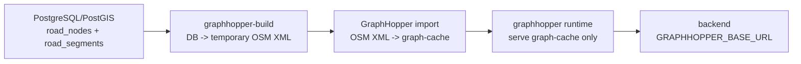

# GraphHopper DB LineString build/deploy runbook

> 작성일: 2026-05-06
> 최종 수정일: 2026-05-20
> 기준 이슈: `S14P31E102-547`
> 기준 문서: `Docs/ERD/ERD_v4.md`, `Docs/API/길안내_도메인/2026-05-06_경로_API_명세.md`

## 1. 운영 원칙

GraphHopper의 운영 원천은 파일이 아니라 PostgreSQL/PostGIS의 보행 네트워크 테이블이다.

- 원천 DB: `road_nodes`, `road_segments`
- 핵심 geometry: `road_segments.geom GEOMETRY(LINESTRING, 4326)`
- 배포 산출물: GraphHopper `graph-cache`
- runtime 역할: 생성된 `graph-cache` serve only

`busan.osm.pbf`, `GRAPHHOPPER_DATA_FILE`, `GRAPHHOPPER_DATA_DIR`는 운영 필수 입력으로 사용하지 않는다. build job 내부에서 임시 OSM XML을 만들 수 있지만, 이 파일은 graph-cache 생성을 위한 중간 산출물일 뿐이다.

## 2. 데이터 흐름



### Runtime overlay current-state

- 원본 truth는 계속 `road_segments`이며 GraphHopper build/export도 `road_segments`와 custom model JSON을 source of truth로 사용한다.
- `routing_segment_overrides`는 runtime current-state overlay 전용 단일 테이블이다. 컬럼은 `edge_id`, nullable `walk_access`, `stairs_state`, `width_state`, `braille_block_state`다.
- Admin 즉시 반영은 요청에 포함된 overlay 대상 필드만 current-state row에 patch한다. overlay 대상 필드가 없으면 기존 overlay를 유지하고 reload를 생략하며, admin reload 중 overlay 컬럼 스키마가 맞지 않으면 성공이 아니라 실패로 드러나야 한다.
- migration은 신규 create뿐 아니라 기존 테이블에 대해 `walk_access DROP NOT NULL`, `ADD COLUMN IF NOT EXISTS stairs_state`, `width_state`, `braille_block_state`를 수행한다.
- Runtime route 계산은 final weight를 사후 보정하지 않는다. `OverlayAwareWeighting`이 delegate/custom model 호출 전에 effective `EdgeIteratorState` wrapper를 넘겨 custom model이 overlay EV를 읽게 한다.
- Overlay profile policy follows the custom model EV contract: `pedestrian_*`, `visual_*`, and `wheelchair_*` read `walk_access`, `stairs_state`, and `width_state`; `visual_*` additionally reads `braille_block_state`.
- Route calculation smoke는 route shape / route availability 반영을 검증한다. GraphHopper response details/guidance는 base graph EV를 읽을 수 있으므로 앱 배지/안내 문구까지 overlay와 일치해야 하면 별도 설계가 필요하다.

## 3. build job

local:

```bash
make graphhopper-local-build
make local-up
```

dev:

```bash
make graphhopper-dev-build
make dev-up
```

prod:

```bash
make graphhopper-prod-build
make prod-up-graphhopper
```

직접 실행:

```bash
docker compose --env-file .env.prod \
  -f docker-compose.prod.yml \
  --profile graphhopper-build \
  run --rm graphhopper-build
```

### cache 호환성 규칙

- `graph-cache` 볼륨이 비어있지 않더라도, 현재 코드/설정 fingerprint와 다르면 재사용하지 않는다.
- 아래 입력이 바뀌면 fingerprint가 달라지고 dev/prod 배포는 graph-cache를 다시 생성한다.
  - `INF/graphhopper/Dockerfile`
  - `INF/graphhopper/config-build.yml`
  - `INF/graphhopper/config-runtime.yml`
  - `INF/graphhopper/custom_models/`
  - `INF/graphhopper/plugin/src/`
  - `scripts/graphhopper/export_postgis_to_osm.py`
- build 완료 후 runtime 볼륨 루트에 다음 메타 파일을 기록한다.
  - `.ieum-graphhopper-cache-fingerprint`
  - `.ieum-graphhopper-cache-built-at`
- 오래된 cache가 남아 있어도 fingerprint mismatch면 자동 rebuild가 우선이다.

## 4. 입력 변수

| 변수 | 설명 |
|---|---|
| `DB_URL` | `jdbc:postgresql://...` 형식의 DB URL |
| `DB_USERNAME` | DB 사용자 |
| `DB_PASSWORD` | DB 비밀번호 |
| `DB_SSLMODE` | prod RDS는 `require`, local/dev는 `prefer` 권장 |
| `GRAPHHOPPER_GRAPH_LOCATION` | runtime이 읽을 graph-cache 위치. 기본값 `/graphhopper/data` |
| `GRAPHHOPPER_IMPORT_TIMEOUT_SECONDS` | import 최대 대기 시간. 기본값 `1800` |
| `GRAPHHOPPER_ROAD_NODES_SQL` | 기본 `road_nodes` 조회 SQL override |
| `GRAPHHOPPER_ROAD_SEGMENTS_SQL` | 기본 `road_segments` 조회 SQL override |

기본 SQL은 ERD v3/v4의 snake_case 물리 컬럼명을 기준으로 한다. Java/API 필드명은 camelCase를 유지하지만, GraphHopper export SQL과 운영 DB 스키마는 `vertex_id`, `source_node_key`, `from_node_id`, `length_meter` 같은 snake_case 컬럼을 사용한다.

2026-05-06 develop 기준 ERD는 `Docs/ERD` 하위가 canonical이다. `route_sessions` 추가는 선택 경로 복구용 DB 계약이며, GraphHopper graph-cache build 입력은 여전히 `road_nodes`, `road_segments`다.

## 5. 실패 기준

build job은 아래 조건에서 실패해야 한다.

- DB 연결 실패
- `road_nodes` 조회 결과 0건
- `road_segments` 조회 결과 0건
- segment가 존재하지 않는 node를 참조
- GraphHopper import process가 health 상태에 도달하지 못함
- graph-cache 디렉터리가 비어 있음

runtime은 graph-cache가 비어 있으면 시작하지 않는다. 이 동작이 정상이다.

## 6. prod 배포

Jenkins prod pipeline은 `INF/jenkins/pipelines/e102-prod-deploy.Jenkinsfile`을 기준으로 한다.

- `BUILD_GRAPHHOPPER=true`: PostgreSQL에서 graph-cache를 새로 생성
- `DEPLOY_GRAPHHOPPER=true`: GraphHopper runtime까지 기동
- `ROLLBACK=true`: 이전 app image tag와 이전 graph-cache로 rollback

2026-05-20 운영 기준 일반 app 배포는 `BUILD_GRAPHHOPPER=false`, `DEPLOY_GRAPHHOPPER=true`를 기본값으로 둔다. backend/AI/admin은 매 배포마다 갱신하지만, GraphHopper graph-cache를 매번 새로 만들지는 않는다.

GraphHopper cache 갱신은 Jenkins `e102-graphhopper-refresh`가 3시간마다 S2의 inactive slot에서 수행한다. 최근 성공 여부는 S2 `.deploy-state/graphhopper-refresh-reports/*.json` report와 `https://api.busaneumgil.com/health/graphhopper`를 함께 확인한다.

## 7. smoke test

prod smoke test:

```bash
bash scripts/deploy/prod-smoke.sh
```

확인 대상:

- backend: `http://127.0.0.1:8080/v3/api-docs`
- AI: `http://127.0.0.1:5000/health`
- GraphHopper active: `http://127.0.0.1:8080/health/graphhopper`
- GraphHopper blue raw: `http://127.0.0.1:18990/healthcheck`
- GraphHopper green raw: `http://127.0.0.1:18992/healthcheck`

GraphHopper smoke는 `DEPLOY_GRAPHHOPPER=true`일 때만 실행한다.

public ingress 기준으로는 아래를 확인한다.

```bash
curl -fsS https://api.busaneumgil.com/health/graphhopper
curl -fsS https://api.busaneumgil.com/graphhopper-blue/healthcheck
curl -fsS https://api.busaneumgil.com/graphhopper-green/healthcheck
```

길안내 API의 실제 route smoke는 `Docs/API/길안내_도메인/2026-05-06_경로_API_명세.md`의 `POST /routes/search/walk`, `POST /routes/search/transit` 구현이 완료된 뒤 추가한다.

## 8. route search Redis cache cleanup

`routeSearch:{searchId}` cache 구조가 바뀌는 배포에서는 기존 owner-less cache를 선택 가능한 정상 후보로 취급하지 않는다. Redis miss나 owner 없는 legacy cache는 `POST /routes/{routeId}/select`에서 `RT4041`로 재검색을 유도한다.

배포 직후 애매한 owner 검증 상태를 없애려면 Redis 전체를 flush하지 말고 경로 검색 임시 key만 삭제한다.

```bash
redis-cli --scan --pattern 'routeSearch:*' | xargs -r redis-cli del
redis-cli --scan --pattern 'routeSearchMeta:*' | xargs -r redis-cli del
```

주의:

- 공용 BIMS TTL cache, auth/session cache, 다른 도메인 cache는 삭제하지 않는다.
- 삭제 대상은 search 이후 select 전까지 쓰는 임시 후보 묶음이며, 사용자는 `RT4041`을 받으면 재검색하면 된다.
