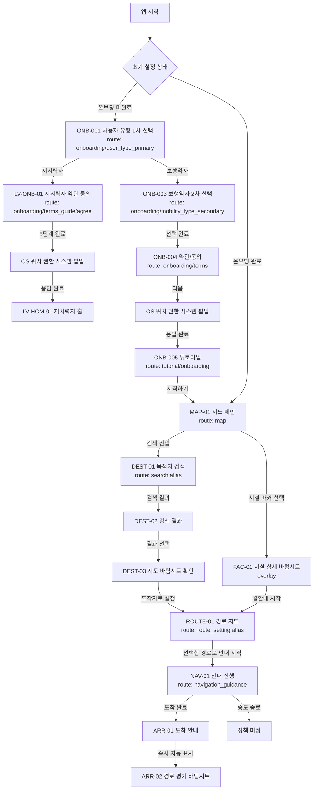
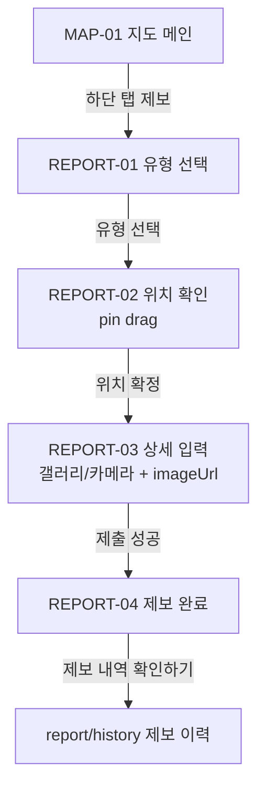
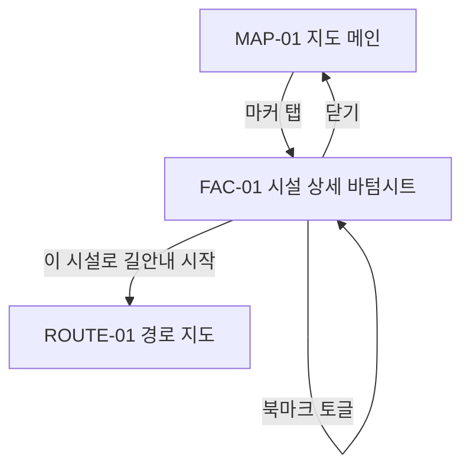
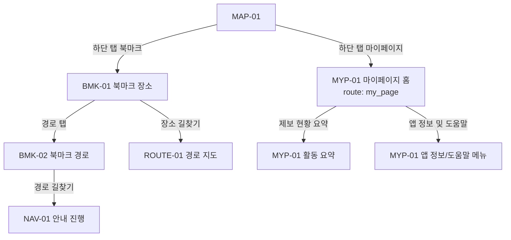
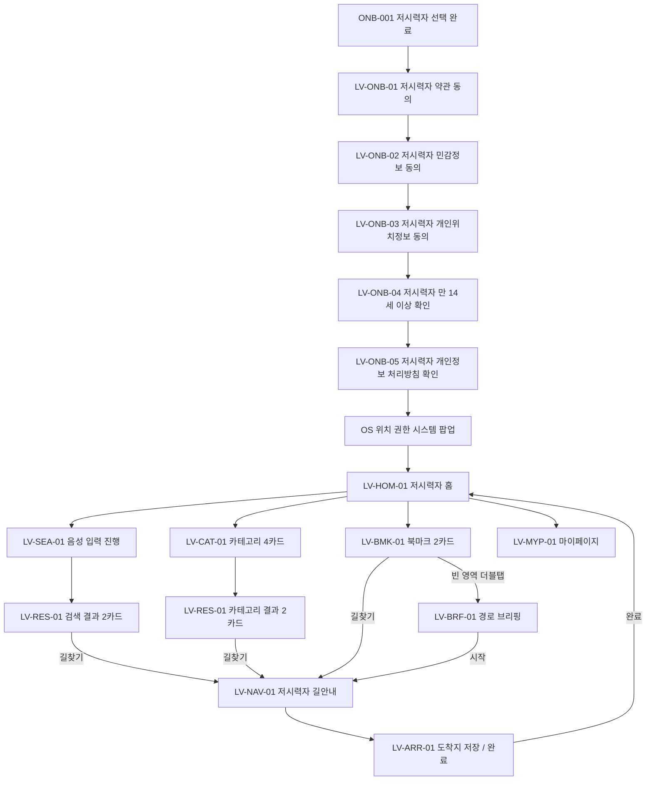

# 부산이음길 FE 화면 인벤토리 및 라우트 맵

- 작성일: 2026-04-22
- 최종 개정일: 2026-05-20
- 기준 문서: 실제 `FE/app` navigation/screen 코드, `Docs/PRD/2026-05-20_요구사항명세서.md`, `Docs/PRD/2026-04-14_기능명세서.md`, `FE/mockup/`, `FE/docs/2026-04-21_S14P31E102-211_공통_UI_접근성_Figma_handoff.md`, `Docs/기획/2026-04-09_화면명세서.md`, `Docs/기획/archive/drafts/2026-04-11_MVP_화면명세서.md`
- 보조 정합성 참고: `FE/docs/debug-report/2026-04-27_로그인_필수_전환_FE_정합성_및_구현_영향.md`, `FE/docs/archive/2026-04-27_온보딩_디자인_화면_구성_분석.md`, `FE/docs/debug-report/2026-04-27_FE_Docs_문서_정합성_재검토.md`
- 대상: 부산이음길 Android FE 구현 / route 설계 / 화면 범위 고정
- 범위: 현재 워크스페이스의 `FE/app`, `FE/docs`, `FE/mockup`에서 확인 가능한 화면만 정리
- 정합성 원칙: 이 문서는 FE 화면/route의 1차 계약 문서다. 화면명, IA, 사용자 노출 용어, route 목표 구조는 이 문서와 동급 1차 FE 문서를 우선한다. 현재 구현 사실 확인은 `FE/app` 코드가 우선하며, 2차 정리 문서는 이 문서를 덮어쓰지 않는다. production 기준 정책은 `AUTH-001` 필수 로그인, `AUTH-002` 프로필 설정 gate, 보행약자 `ONB-001~ONB-005` 플로우, 저시력자 `LV-ONB-01~LV-ONB-05` 순차 동의, 서버 기준 데이터 책임을 따른다. 보행약자 공통 화면은 `홈/북마크/제보/마이페이지` 탭을 사용하고, 저시력자 전용 UI는 공통 화면의 모드 예외가 아니라 별도 `LV-*` 화면군으로 분리한다.

## 1. 문서 개요

### 문서 목적

- FE 개발팀이 현재 기준에서 실제로 존재하는 화면 단위를 빠르게 파악할 수 있게 한다.
- `route`, `진입/이탈`, `상태`, `파라미터`, `공통 컴포넌트`를 기준으로 구현 착수용 IA를 고정한다.
- 바이브 코딩이나 AI 보조 구현 시 문서에 없는 화면을 임의로 만들지 않도록 화면 경계를 명시한다.

### 분석 기준

- 이 문서는 `목표 화면 계약`과 `현재 구현 사실`을 분리해 정리한다.
  - 1순위: 현재 구현 사실 확인용 `FE/app`의 `screen / route / viewmodel / nav graph`
  - 2순위: 직접 디자인 산출물인 `FE/mockup`과 `FE/docs/2026-04-21_S14P31E102-211_공통_UI_접근성_Figma_handoff.md`
  - 3순위: 화면명세서 같은 제품 배경 문서
  - 4순위: `FE/docs/debug-report/2026-04-27_로그인_필수_전환_FE_정합성_및_구현_영향.md`, `FE/docs/archive/2026-04-27_온보딩_디자인_화면_구성_분석.md`, `FE/docs/debug-report/2026-04-27_FE_Docs_문서_정합성_재검토.md` 같은 2차 정리 문서
- `FE/mockup`은 화면 존재 여부, 화면 명칭, 단계 흐름, CTA를 보강하는 용도로 사용했다.
- 공공서비스형 지도 앱이라는 맥락을 반영해 `권한`, `오프라인`, `경로 실패`, `상태 전달`은 보수적으로 정리했다.
- 문서와 코드가 충돌하면 `목표 계약`과 `현재 구현`을 분리해 기록한다. 화면명, IA, 사용자 노출 용어의 목표 계약은 이 문서와 동급 1차 FE 문서를 우선하고, 현재 구현 상태와 alias 확인은 `FE/app` 코드를 우선한다. 2차 정리 문서는 둘 중 어느 것도 단독으로 덮어쓰지 않는다.

### 참고 자료

#### 코드 기준

- `FE/app/src/main/java/com/ssafy/e102/eumgil/app/navigation/Route.kt`
- `FE/app/src/main/java/com/ssafy/e102/eumgil/app/navigation/AppStartDestination.kt`
- `FE/app/src/main/java/com/ssafy/e102/eumgil/app/navigation/AppNavHost.kt`
- `FE/app/src/main/java/com/ssafy/e102/eumgil/app/navigation/OnboardingNavGraph.kt`
- `FE/app/src/main/java/com/ssafy/e102/eumgil/app/navigation/MainNavGraph.kt`
- `FE/app/src/main/java/com/ssafy/e102/eumgil/app/navigation/TopLevelDestination.kt`
- `FE/app/src/main/java/com/ssafy/e102/eumgil/feature/onboarding/*`
- `FE/app/src/main/java/com/ssafy/e102/eumgil/feature/map/*`
- `FE/app/src/main/java/com/ssafy/e102/eumgil/feature/search/*`
- `FE/app/src/main/java/com/ssafy/e102/eumgil/feature/route/*`
- `FE/app/src/main/java/com/ssafy/e102/eumgil/feature/navigation/*`
- `FE/app/src/main/java/com/ssafy/e102/eumgil/feature/report/*`
- `FE/app/src/main/java/com/ssafy/e102/eumgil/feature/mypage/*`
- `FE/app/src/main/java/com/ssafy/e102/eumgil/feature/savedroute/*`

#### 문서 기준

- 1차 계약 문서: `FE/docs/2026-04-22_부산이음길_FE_디자인_컨벤션.md`, `FE/docs/2026-04-24_부산이음길_FE_접근성_정보_라벨_가이드.md`, `FE/docs/2026-04-13_부산이음길_FE_컴포넌트_가이드.md`, `FE/docs/2026-04-13_부산이음길_FE_코드_컨벤션.md`
- 직접 산출물: `FE/docs/2026-04-21_S14P31E102-211_공통_UI_접근성_Figma_handoff.md`, `Docs/기획/2026-04-09_화면명세서.md`, `Docs/기획/archive/drafts/2026-04-11_MVP_화면명세서.md`
- 2차 정리 문서: `FE/docs/debug-report/2026-04-27_로그인_필수_전환_FE_정합성_및_구현_영향.md`, `FE/docs/archive/2026-04-27_온보딩_디자인_화면_구성_분석.md`, `FE/docs/debug-report/2026-04-27_FE_Docs_문서_정합성_재검토.md`, `FE/docs/sprint_backlog/archive/2026-04-20_week3/2026-04-21_S14P31E102-204_제보_작성_폼_state_spec.md`

#### 목업 기준

- `FE/mockup/E102_MVP_목업.html`
- `FE/mockup/E102_MVP_목업_scr006_접근성맵.html`
- `FE/mockup/E102_MVP_목업(길찾기).html`
- `FE/mockup/E102_MVP_목업(시각장애ui).html`
- `FE/mockup/E102_MVP_목업_scr010_장애물발견_제보플로우.html`
- `FE/mockup/E102_MVP_목업_scr010_장애물_우회안내.html`

### 표기 원칙

| 표기 | 의미 | 사용 기준 |
| --- | --- | --- |
| `관찰 사실` | 목업/문서에서 직접 확인 가능한 정보 | 화면명, CTA, visible flow, layout pattern |
| `코드 기준 확인` | 실제 코드에 존재하는 route, screen, state, event, parameter | `Route.kt`, `NavGraph`, `Contract`, `ViewModel`, `Screen` |
| `추정` | FE 구현상 필요하나 코드/목업에 직접 명시되지 않은 해석 | offline 상태, fallback 처리, 일부 데이터 타입 |
| `추가 결정 필요` | 현재 자료만으로 확정할 수 없는 항목 | 미구현 route, 구조 충돌, screen placement conflict |

### 2026-05-11 런타임 동기화 메모

- 앱 시작 gate의 현재 우선순위는 `pending signup -> ONB-001`, `세션 없음 -> AUTH-001`, `세션 있음 + profile 미완료 -> AUTH-002(ProfileSetup)`, `온보딩 완료 + LOW_VISION -> LV-HOM-01`, `온보딩 완료 + MOBILITY_IMPAIRED -> MAP-01`이다.
- 저시력자 신규 가입 기본 플로우는 `ONB-001 -> LV-ONB-01~05(TermsGuide route) -> OS 권한 요청 -> LV-HOM-01`이다. `ONB-002 low_vision_followup` route는 현재 기본 회원가입 진입 경로가 아니다.
- 보행약자 튜토리얼의 실제 route는 `tutorial/onboarding`이며, 저시력자 기본 플로우는 `ONB-005`를 거치지 않는다.
- 사용자 유형 변경은 신규 가입용 `ONB-001`이 아니라 `onboarding/profile_user_type_primary` 분기를 사용한다.

## 2. 전체 화면 목록 요약

- 최신 기준 화면군은 `AUTH`, `ONB`, `MAP`, `DEST`, `ROUTE`, `NAV`, `ARR`, `BMK`, `REPORT`, `MYP`로 정리한다.
- 기존 코드 route와 다른 화면 ID는 최신 화면 ID를 우선하고, 코드 route key는 구현 alias로만 병기한다.
- 화면 ID 규칙 기준
  - 인증: `AUTH-001`, `AUTH-002`
  - 온보딩: `ONB-001`~`ONB-005`
  - 지도/시설: `MAP-01`, `FAC-01`
  - 목적지 설정: `DEST-01`~`DEST-03` (`DEST-04`는 후순위 후보)
  - 경로/길안내: `ROUTE-01`, `ROUTE-02`, `NAV-01`
  - 도착/평가: `ARR-01`, `ARR-02`
  - 북마크: `BMK-01`, `BMK-02`
  - 제보: `REPORT-01`~`REPORT-04`
  - 마이페이지: `MYP-01` 중심 (`MYP-02`는 `report/history` 제보 이력 역할, `MYP-03`은 앱 정보/도움말 기능 묶음)
  - 저시력자 전용 분기: `LV-ONB-01`~`LV-ONB-05` (`ONB-002`는 레거시 route)

| 화면 ID | 화면명 | 화면 유형 | 주요 목적 | 진입 방식 | 하단 탭 여부 | 주요 CTA | 구현 우선순위 | 비고 |
| --- | --- | --- | --- | --- | --- | --- | --- | --- |
| `AUTH-001` | 로그인 | 인증 | 소셜 로그인과 서비스 세션 생성 | 앱 실행 시 세션 없음 / 로그아웃 후 | N | 소셜 로그인 | `P0` | 로그인 성공 후 gate 결과에 따라 `AUTH-002`/`ONB-001`/홈으로 분기 |
| `AUTH-002` | 프로필 설정 | 인증/프로필 | 닉네임과 기본 사용자 유형을 확정해 다음 gate로 연결 | 로그인 성공 후 `profileCompleted=false` | N | 완료 | `P0` | route `auth/profile_setup` |
| `ONB-001` | 사용자 유형 1차 선택 | 온보딩 | `저시력자 / 보행약자` 1차 분기 선택 | 로그인 직후 온보딩 진입 | N | 선택 완료 후 다음 단계 | `P0` | 온보딩 첫 화면 |
| `ONB-002` | 저시력자 전용 후속 화면(레거시 route) | 온보딩 | 과거 저시력 후속 단계 route | 현재 기본 회원가입 플로우 미사용 | N | `다음` | `P2` | 기본 진입 경로는 `LV-ONB-01` |
| `ONB-003` | 보행약자 2차 선택 | 온보딩 | 보행약자 세부 이동 특성 선택 | `ONB-001`에서 `보행약자` 선택 | N | 선택 완료 후 다음 단계 | `P0` | `전동휠체어 사용자 / 수동휠체어 사용자 / 기타 보행약자` |
| `ONB-004` | 약관/동의 | 설정/약관 | 보행약자 기본 플로우의 필수 동의 수집 후 OS 위치 권한 요청으로 연결 | `ONB-003` 완료 | N | `다음` | `P0` | 저시력자는 `LV-ONB-01`~`05` 순차 동의 사용 |
| `ONB-005` | 튜토리얼(보행약자) | 온보딩 | 위치 권한 응답 이후 보행약자 핵심 사용 흐름 안내 후 메인 진입 | `ONB-004` 다음 + OS 위치 권한 응답 완료 | N | `다음`, `시작하기` | `P0` | 실제 route는 `tutorial/onboarding` |
| `LV-ONB-01` | 저시력자 약관 동의 | 저시력자 전용 온보딩 | 1번째 순차 동의 화면 | `ONB-001`에서 `저시력자` 선택 | N | 중앙 대형 버튼 더블탭 | `P0` | `약관 동의` |
| `LV-ONB-02` | 저시력자 민감정보 동의 | 저시력자 전용 온보딩 | 2번째 순차 동의 화면 | `LV-ONB-01` | N | 중앙 대형 버튼 더블탭 | `P0` | `민감정보` |
| `LV-ONB-03` | 저시력자 개인위치정보 동의 | 저시력자 전용 온보딩 | 3번째 순차 동의 화면 | `LV-ONB-02` | N | 중앙 대형 버튼 더블탭 | `P0` | 법적 위치정보 동의 |
| `LV-ONB-04` | 저시력자 만 14세 이상 확인 | 저시력자 전용 온보딩 | 4번째 순차 동의 화면 | `LV-ONB-03` | N | 중앙 대형 버튼 더블탭 | `P0` | `만 14세 이상` 확인 |
| `LV-ONB-05` | 저시력자 개인정보 처리방침 확인 | 저시력자 전용 온보딩 | 5번째 순차 동의 화면 | `LV-ONB-04` | N | 중앙 대형 버튼 더블탭 | `P0` | 완료 후 OS 위치 권한 요청 |
| `LV-HOM-01` | 저시력자 홈 | 저시력자 전용 메인 | 음성 입력과 현재 위치 중심 홈 | `LV-ONB-05` 완료 후 OS 권한 응답 | Y | 음성 입력, 현재 위치 | `P0` | 하단 탭 `홈/북마크/카테고리/마이페이지` |
| `LV-SEA-01` | 저시력자 음성 입력 진행 | 저시력자 전용 검색 | 음성 입력 대기/진행 | `LV-HOM-01` | N | 음성 중지, 재시도 | `P0` | 결과는 `LV-RES-01` |
| `LV-RES-01` | 저시력자 장소 결과 목록 | 저시력자 전용 결과 | 검색/카테고리 공통 2카드 결과 | `LV-SEA-01`, `LV-CAT-01` | Y | 북마크, 길찾기 | `P0` | 길찾기는 `LV-NAV-01` 직접 진입 |
| `LV-CAT-01` | 저시력자 카테고리 | 저시력자 전용 탐색 | 4개 카테고리 카드 선택 | `LV-HOM-01` | Y | 카테고리 선택 | `P1` | `화장실/음식점/숙박시설/병원` |
| `LV-BMK-01` | 저시력자 북마크 | 저시력자 전용 북마크 | 2카드 북마크 목록 | `LV-HOM-01` | Y | 북마크 해제, 길찾기 | `P1` | 빈 영역 더블탭 -> `LV-BRF-01` |
| `LV-BRF-01` | 저시력자 경로 브리핑 | 저시력자 전용 경로 | 단계 요약과 음성 재생 | `LV-BMK-01` | N | 시작, 중지, 음성 재생 | `P1` | 브리핑 전용 화면 |
| `LV-NAV-01` | 저시력자 길안내 진행 | 저시력자 전용 길안내 | 남은 거리/시간 중심 안내 | `LV-RES-01`, `LV-BRF-01`, `LV-BMK-01` | N | 현재 위치, 안내 종료 | `P0` | 검색/카테고리/북마크에서 직접 진입 |
| `LV-ARR-01` | 저시력자 도착 완료 | 저시력자 전용 도착 | 도착지 저장과 홈 복귀 | `LV-NAV-01` | Y | 도착지 저장, 완료 | `P1` | `완료`는 `LV-HOM-01` |
| `LV-MYP-01` | 저시력자 마이페이지 | 저시력자 전용 마이페이지 | 3버튼 단순 메뉴 | `LV-HOM-01` | Y | 모드변경, 로그아웃, 앱정보 | `P1` | `모드변경`은 `ONB-001` 재진입 |
| `MAP-01` | 지도 메인 | 검색/목적지 설정 | 탐색, 검색 진입, 시설 선택 | 인증/온보딩 완료 후 / 루트 탭 | Y | 검색 진입, 위치 권한 허용 | `P0` | 코드 기준 메인 landing, start gate 개정 필요 |
| `FAC-01` | 시설 상세 바텀시트 | 시설 | 시설 정보 확인, 북마크, 경로 진입 | `MAP-01` 마커 탭 | N | `이 시설로 길안내 시작` | `P1` | route 없음, overlay |
| `DEST-01` | 목적지 검색 및 최근 방문지 | 목적지 설정 | 검색어 입력, 최근 방문지 확인 | `MAP-01` 검색바 | Y | 검색 실행, 최근 방문지 선택 | `P0` | code route `search` alias |
| `DEST-02` | 검색 결과 선택 | 목적지 설정 | 장소 결과 비교와 후보 선택 | `DEST-01` 검색 실행 | Y | 결과 카드 선택 | `P0` | 결과 선택 후 항상 `DEST-03` |
| `DEST-03` | 지도 선택 / 목적지 상세 바텀시트 | 목적지 설정 | 선택 장소 확인 후 도착지 확정 | `DEST-02` 결과 선택 / 지도 선택 | Y | `도착지로 설정` | `P0` | 바로 경로 설정으로 가지 않음 |
| `DEST-04` | 사용자 상태 설문 | 목적지 설정 | 경로 추천용 세부 이동 특성 선택 | 후순위 후보 | Y | 상태 선택 | `P2` | 현재 FE 구현에는 포함하지 않음 |
| `ROUTE-01` | 경로 지도 / 경로 탐색 결과 | 경로 탐색 | 도보/대중교통 탭과 경로 옵션 선택 | `DEST-03`, `FAC-01` | N | `길 안내 시작` | `P0` | route `route_setting` alias |
| `ROUTE-02` | 경로 상세 정보 | 경로 탐색 | 선택 경로의 단계별 상세 확인 | `ROUTE-01` 화살표 버튼 | N | `길 안내 시작` | `P0` | 상세 진입은 옵션 카드 우측 상단 화살표 |
| `NAV-01` | 안내 진행 | 길 안내 | 진행 중 경로 안내와 종료 | `ROUTE-01` 시작 | N | `내비게이션 종료` | `P0` | route `navigation_guidance` |
| `ARR-01` | 도착 안내 / 경로 완료 | 도착 | 도착 완료와 후속 CTA 제공 | `NAV-01` 도착 완료 | Y | 홈, 새 경로 탐색 | `P0` | 진입 즉시 `ARR-02` 자동 표시 |
| `ARR-02` | 경로 평가 바텀시트 | 평가 | 별점 평가와 경로 저장 | `ARR-01` 자동 표시 | overlay | 평가 등록, X 닫기 | `P0` | 평가 저장 API 예정 |
| `BMK-01` | 북마크 / 장소 탭 | 북마크 | 북마크 장소 조회, 상세/길찾기/정렬/삭제 | 하단 탭 `북마크` | Y | 상세, 길찾기, 정렬, 삭제 | `P1` | 편집 모드 선택 삭제 |
| `BMK-02` | 북마크 / 경로 탭 | 북마크 | 북마크 경로 조회, 상세/NAV-01 진입/정렬/삭제 | `BMK-01` 경로 탭 | Y | 상세, 길찾기, 정렬, 삭제 | `P1` | 길찾기는 `NAV-01` 즉시 진입 |
| `REPORT-01` | 장애물 유형 선택 | 제보 | 6개 유형 중 선택 | 하단 탭 `제보` | Y | 유형 선택 | `P1` | API enum 후보 6개 |
| `REPORT-02` | 제보 위치 확인 | 제보 | pin drag로 위치 확정 | `REPORT-01` | Y | `다음` | `P1` | 사용자 계정 연결 |
| `REPORT-03` | 제보 상세 입력 | 제보 | 설명, 갤러리/카메라 사진 첨부 | `REPORT-02` | Y | `다음` | `P1` | presigned upload 후 `imageObjectKeys` 제출 |
| `REPORT-04` | 제보 완료 | 제보 | 완료 안내와 이력 연결 | `REPORT-03` | Y | `제보 내역 확인하기` | `P1` | `report/history` 연결, 완료 화면은 접수 성공 안내 |
| `MYP-01` | 마이페이지 홈 | 마이페이지 | 프로필, 배지, 메뉴, 계정 액션 | 하단 탭 `마이페이지` | Y | 사용자 유형 변경, 로그아웃 | `P1` | 사용자 유형 변경은 `onboarding/profile_user_type_primary` |
| `MYP-02` | 제보 이력 | 제보/마이페이지 기능 역할 | 내 제보 목록과 상세 확인 | `REPORT-04`, 제보 화면 이력 버튼 | Y | 목록 선택 | `P1` | 실제 route는 `report/history` |
| `MYP-03` | 앱 정보 및 도움말 | 마이페이지 기능 묶음 | 이용 가이드, 텍스트 크기, 정책 링크, 계정 탈퇴 | `MYP-01` | Y | 가이드, 외부 링크, 회원탈퇴 | `P1` | 별도 route가 아니라 `MYP-01` 메뉴/액션으로 제공 |

### 2.1 화면군별 아이콘 리소스 기준

| 화면군 | 적용 아이콘 리소스 | 구현/접근성 메모 |
| --- | --- | --- |
| `AUTH` | `app_logo`, provider별 소셜 로그인 로고는 별도 provider 자산 | 소셜 로그인 버튼은 provider명과 로그인 동작을 텍스트로 전달한다. |
| `ONB` | `ic_user_selected`, `ic_user_check`, `ic_permission_location`, `ic_permission_mic`, `ic_permission_notification`, 사용자 유형 아이콘 리소스(`세부명 TBD`) | 선택 카드와 권한 카드는 아이콘 의미를 제목/설명으로 반복 제공한다. |
| `MAP` / `FAC` | `ic_nav_search`, `ic_permission_location`, `ic_status_refresh`, `ic_nav_facility`, `ic_direction_destination`, `ic_action_close`, `ic_action_favorite` | 검색, 현재 위치, 시설 선택, 바텀시트 닫기, 북마크 액션은 icon-only이면 라벨 필수다. |
| 지도 필터 | `ic_place_restaurant`, `ic_nav_facility`, `ic_place_restroom`, `ic_route_elevator`, `ic_place_charging`, `ic_route_tactile_blocks` | 실제 코드의 `FacilityCategory` 매핑을 우선한다. `OTHER`와 관광/시설 범주는 `ic_nav_facility`를 공통 사용한다. |
| `DEST` | `ic_action_back`, `ic_nav_search`, `ic_action_close`, `ic_action_dropdown`, `ic_direction_destination` | 검색 입력의 아이콘은 입력 목적을 보조하고, 결과 row 이동은 텍스트/주소와 함께 전달한다. |
| `ROUTE` | `ic_route_time`, `ic_route_distance`, `ic_route_slope`, `ic_route_stairs`, `ic_route_ramp`, `ic_route_elevator`, `ic_route_crosswalk`, `ic_route_tactile_blocks`, `ic_status_safe_info`, `ic_status_warning` | 경로 옵션과 주의 구간은 색만으로 구분하지 않고 라벨/배지/아이콘을 함께 쓴다. |
| `NAV` | `ic_direction_straight`, `ic_direction_turn_left`, `ic_direction_turn_right`, `ic_direction_slight_left`, `ic_direction_slight_right`, `ic_direction_u_turn`, `ic_control_voice`, `ic_control_pause`, `ic_control_stop` | 방향 아이콘은 단계 안내 문구와 거리 정보를 항상 병행한다. |
| `ARR` / `BMK` | `ic_status_check`, `ic_action_close`, `ic_action_favorite`, `ic_nav_route`, `ic_direction_destination`, `ic_status_cancel` | 평가 닫기, 저장/삭제, 경로 재진입은 액션 라벨과 상태 설명을 분리한다. |
| `REPORT` | `ic_report_stairs`, `ic_report_tactile_damage`, `ic_route_sidewalk`, `ic_report_ramp`, `ic_route_roadway`, `ic_report_other`, `ic_permission_camera`, `ic_status_check` | 제보 유형 6개와 리소스명은 API enum과 1:1로 유지한다. |
| `MYP` | `ic_nav_mypage`, `ic_action_more`, `ic_action_dropdown`, `ic_status_neutral`, `ic_status_cancel` | 메뉴 row는 아이콘만으로 의미를 전달하지 않고 메뉴명과 보조 설명을 우선한다. |
| `VIS` | `ic_control_voice`, `ic_control_play`, `ic_control_pause`, `ic_control_stop`, `ic_control_previous`, `ic_control_next`, `ic_user_visual_impairment` | P2 확장 후보지만 음성/제어 아이콘은 `NAV`와 동일한 의미 체계를 유지한다. |

## 3. 화면 인벤토리 상세

### `AUTH-001` 로그인

| 항목 | 내용 |
| --- | --- |
| 화면 ID | `AUTH-001` |
| 화면명 | 로그인 |
| route / route key | `auth/login` (`AuthRoute.Login`) |
| 목적 | 소셜 로그인으로 서비스 accessToken/refreshToken을 발급받고 인증 세션을 만든다. |
| 사용자가 이 화면에서 하는 일 | 제공자별 로그인 버튼 선택 |
| 진입 조건 | 저장된 인증 세션이 없거나 refreshToken 재발급 실패 |
| 진입 경로 | 앱 실행, 로그아웃 완료, 세션 만료 |
| 이탈 경로 | 기존 회원 로그인 성공 + `profileCompleted=false` -> `AUTH-002` 기존 회원 로그인 성공 + `profileCompleted=true` + `selectedPrimaryUserType=LOW_VISION` -> `LV-HOM-01` 기존 회원 로그인 성공 + `profileCompleted=true` + `selectedPrimaryUserType=MOBILITY_IMPAIRED` -> `MAP-01` 신규 사용자 `signupToken` 발급 -> `ONB-001` |
| 상단 구조(App Bar 패턴) | 디자인 추가 필요 |
| 하단 구조 | 디자인 추가 필요. `비로그인으로 계속` CTA는 두지 않는다. |
| 핵심 컴포넌트 | `AuthSocialLoginButton`, `AuthErrorMessage`, `EumButton` 또는 provider 전용 버튼 |
| 필요한 데이터 | `socialProvider`, `socialAccessToken`, `authSession`, `signupToken`, `selectedPrimaryUserType` |
| 필요한 파라미터 | 없음 |
| 주요 상태 | `idle`, `loading`, `success`, `providerError`, `serverError`, `networkError` |
| 접근성/모드 차이 | 소셜 제공자명과 로그인 동작을 버튼 라벨로 명확히 전달한다. |
| 구현 메모 | 현재 code는 `AuthRoute`, `AuthNavGraph`, `feature/auth`, token store와 `auth/profile_setup` gate를 포함한다. |
| 근거 수준 | `팀 회의 로그인 필수 정책 + 인증 API 기준` |

### `AUTH-002` 프로필 설정

| 항목 | 내용 |
| --- | --- |
| 화면 ID | `AUTH-002` |
| 화면명 | 프로필 설정 |
| route / route key | `auth/profile_setup` (`AuthRoute.ProfileSetup`) |
| 목적 | 로그인 후 프로필 완료 여부가 false인 사용자의 닉네임과 기본 사용자 유형을 확정한 뒤 다음 gate로 연결한다. |
| 사용자가 이 화면에서 하는 일 | 닉네임 입력, 기본 사용자 유형 선택, 완료 |
| 진입 조건 | 인증 세션은 있으나 `profileCompleted=false` |
| 진입 경로 | `AUTH-001` 로그인 성공 후 gate 분기 |
| 이탈 경로 | 완료 후 현재 gate 결과에 따라 `ONB-001`, `LV-HOM-01`, `MAP-01` |
| 상단 구조(App Bar 패턴) | 단일 진입형 입력 화면 |
| 하단 구조 | 완료 CTA, Bottom Navigation 없음 |
| 핵심 컴포넌트 | `ProfileSetupScreen`, 닉네임 입력, 사용자 유형 선택 |
| 필요한 데이터 | `authSession`, `nickname`, `selectedPrimaryUserType`, `profileCompleted` |
| 필요한 파라미터 | 없음 |
| 주요 상태 | `initialLoading`, `editing`, `submitting`, `completed`, `failure` |
| 접근성/모드 차이 | 입력 오류와 선택 상태를 텍스트/semantics로 함께 전달한다. |
| 구현 메모 | 공용 화면명세서와 기능명세서에는 누락되어 있었으나 current runtime gate에 포함된다. |
| 근거 수준 | `코드 기준 확인` |

### `ONB-001` 사용자 유형 1차 선택

| 항목 | 내용 |
| --- | --- |
| 화면 ID | `ONB-001` |
| 화면명 | 사용자 유형 1차 선택 |
| route / route key | `onboarding/user_type_primary` (`OnboardingRoute.UserTypePrimary`) |
| 목적 | 로그인 성공 직후 사용자의 1차 유형을 `저시력자` 또는 `보행약자`로 선택한다. |
| 사용자가 이 화면에서 하는 일 | 1차 사용자 유형 선택 |
| 진입 조건 | 신규 사용자 `signupToken` 존재 |
| 진입 경로 | 앱 최초 실행 gate 통과 후 또는 온보딩 미완료 상태 |
| 이탈 경로 | `저시력자` 선택 -> `LV-ONB-01` (`onboarding/terms_guide/agree`) `보행약자` 선택 -> `ONB-003` |
| 상단 구조(App Bar 패턴) | 진행률 + 제목 + 설명 |
| 하단 구조 | 하단 CTA 또는 선택 완료 동작, Bottom Navigation 없음 |
| 핵심 컴포넌트 | `OnboardingStepScaffold`, `OnboardingPrimaryUserTypeCard` |
| 필요한 데이터 | `selectedPrimaryUserType` |
| 필요한 파라미터 | 없음 |
| 주요 상태 | `default`: 미선택 `completed`: 1차 유형 선택 저장 |
| 접근성/모드 차이 | 카드 라벨은 `저시력자`, `보행약자` 두 유형을 명확히 읽고 선택 상태를 함께 전달한다. |
| 구현 메모 | 기존 스플래시/서비스 소개 시작 구조는 현재 기준선에서 사용하지 않는다. |
| 근거 수준 | `제품 기준선` + `최신 목업 관찰` |

### `ONB-002` 저시력자 전용 후속 화면(레거시 route)

| 항목 | 내용 |
| --- | --- |
| 화면 ID | `ONB-002` |
| 화면명 | 저시력자 전용 후속 화면 |
| route / route key | `onboarding/low_vision_followup` (`OnboardingRoute.LowVisionFollowUp`) |
| 목적 | 과거 저시력 후속 단계 route를 보관한다. |
| 사용자가 이 화면에서 하는 일 | 현재 기본 회원가입 플로우에서는 사용하지 않는다. |
| 진입 조건 | current runtime 기본 플로우 미사용 |
| 진입 경로 | 별도 legacy route 진입 시에만 해당 |
| 이탈 경로 | legacy 실험/복구 시에만 정의 |
| 상단 구조(App Bar 패턴) | 진행률 + 제목 + 설명 |
| 하단 구조 | 고정 Primary CTA `다음` |
| 핵심 컴포넌트 | `OnboardingStepScaffold`, `LowVisionFollowUpContent`, `EumButton` |
| 필요한 데이터 | `selectedPrimaryUserType` |
| 필요한 파라미터 | 없음 |
| 주요 상태 | `default`: 전용 후속 화면 표시 `completed`: 단계 확인 완료 |
| 접근성/모드 차이 | 저시력자 분기 전용 단계이지만 세부 옵션은 현재 문서 기준선에서 확정하지 않는다. |
| 구현 메모 | current signup flow는 `OnboardingRoute.TermsGuide` 기반 `LV-ONB-01`~`05`를 사용한다. `LowVisionFollowUp` composable/route는 남아 있으나 기본 경로가 아니다. |
| 근거 수준 | `제품 기준선` |

### `ONB-003` 보행약자 2차 선택

| 항목 | 내용 |
| --- | --- |
| 화면 ID | `ONB-003` |
| 화면명 | 보행약자 2차 선택 |
| route / route key | `onboarding/mobility_type_secondary` (`OnboardingRoute.MobilityTypeSecondary`) |
| 목적 | `보행약자` 분기 사용자의 세부 이동 유형을 선택한다. |
| 사용자가 이 화면에서 하는 일 | `전동휠체어 사용자`, `수동휠체어 사용자`, `기타 보행약자` 중 1개 선택 |
| 진입 조건 | `ONB-001`에서 `보행약자` 선택 |
| 진입 경로 | `ONB-001` -> `ONB-003` |
| 이탈 경로 | 선택 완료 -> `ONB-004` |
| 상단 구조(App Bar 패턴) | 진행률 + 제목 + 설명 |
| 하단 구조 | 하단 CTA 또는 선택 완료 동작 |
| 핵심 컴포넌트 | `OnboardingStepScaffold`, `MobilitySubtypeCard` |
| 필요한 데이터 | `selectedMobilitySubtype` |
| 필요한 파라미터 | 없음 |
| 주요 상태 | `default`: 미선택 `completed`: 2차 유형 선택 저장 |
| 접근성/모드 차이 | 카드 라벨은 3개 세부 유형을 그대로 읽고 선택 상태를 함께 전달한다. |
| 구현 메모 | 과거 `권한 안내` 화면 위치는 현재 기준선과 불일치한다. |
| 근거 수준 | `제품 기준선` + `최신 목업 관찰` |

### `ONB-004` 약관/동의

| 항목 | 내용 |
| --- | --- |
| 화면 ID | `ONB-004` |
| 화면명 | 약관/동의 |
| route / route key | `onboarding/terms` (`OnboardingRoute.Terms`) |
| 목적 | 보행약자 기본 플로우에서 필수 법적 동의를 수집하고 OS 위치 권한 요청으로 연결한다. |
| 사용자가 이 화면에서 하는 일 | 필수 항목 확인 및 동의 후 `다음` 선택 |
| 진입 조건 | `ONB-003` 완료 |
| 진입 경로 | `ONB-003` -> `ONB-004` |
| 이탈 경로 | `다음` -> OS 위치 권한 시스템 팝업 -> `ONB-005` |
| 상단 구조(App Bar 패턴) | 진행률 + 제목 |
| 하단 구조 | 고정 Primary CTA `다음`, 필수 항목 미동의 시 disabled |
| 핵심 컴포넌트 | `TermsAgreementSection`, `ConsentCheckboxRow`, `EumButton` |
| 필요한 데이터 | 필수 약관 동의 상태, `locationPermissionStatus` |
| 필요한 파라미터 | 없음 |
| 주요 상태 | `default`: 미동의 `completed`: 필수 약관 동의 완료 |
| 접근성/모드 차이 | 각 항목의 필수 여부와 현재 체크 상태를 항목별로 읽을 수 있어야 한다. |
| 구현 메모 | `개인위치정보 수집·이용 동의`는 법적 동의 항목이고, OS 위치 권한 요청은 `다음` 이후 시스템 팝업이다. 저시력자 기본 플로우는 이 route 대신 `onboarding/terms_guide/{step}` 기반 `LV-ONB-01`~`05`를 사용한다. |
| 근거 수준 | `제품 기준선` |

### `ONB-005` 튜토리얼

| 항목 | 내용 |
| --- | --- |
| 화면 ID | `ONB-005` |
| 화면명 | 튜토리얼 |
| route / route key | `tutorial/onboarding` (`TutorialRoute.Onboarding`) |
| 목적 | 위치 권한 응답 이후 보행약자 핵심 기능을 짧게 안내하고 메인으로 진입시킨다. |
| 사용자가 이 화면에서 하는 일 | 튜토리얼 카드 확인 후 `다음` 또는 `시작하기` 선택 |
| 진입 조건 | `ONB-004` 다음 선택 후 OS 위치 권한 응답 완료 + `selectedPrimaryUserType=MOBILITY_IMPAIRED` |
| 진입 경로 | `ONB-004` -> 시스템 팝업 -> `ONB-005` |
| 이탈 경로 | 마지막 페이지 `시작하기` -> `MAP-01` |
| 상단 구조(App Bar 패턴) | 진행률 또는 page indicator |
| 하단 구조 | 고정 Primary CTA, 마지막 페이지에서 `시작하기` |
| 핵심 컴포넌트 | `TutorialFeatureCard`, `PageIndicator`, `EumButton` |
| 필요한 데이터 | `tutorialPage`, `signupToken`, `selectedPrimaryUserType`, 조건부 `selectedMobilitySubtype` |
| 필요한 파라미터 | 없음 |
| 주요 상태 | `default`: 소개 페이지 표시 `completed`: 온보딩 완료 저장 후 메인 이동 |
| 접근성/모드 차이 | 기능 카드의 아이콘 의미는 텍스트 제목과 설명으로 중복 제공한다. |
| 구현 메모 | 서비스 소개는 3페이지 이상으로 구성한다. current runtime에서 `ONB-005`는 보행약자 전용 튜토리얼이며, 저시력자 기본 플로우는 OS 권한 응답 직후 `LV-HOM-01`로 이동한다. |
| 근거 수준 | `신규 디자인 기준` |

### `MAP-01` 지도 메인

| 항목 | 내용 |
| --- | --- |
| 화면 ID | `MAP-01` |
| 화면명 | 지도 메인 |
| route / route key | `map` (`TopLevelRoute.Map.route`) |
| 목적 | 지도 탐색, DEST-01 진입, 위치 상태 확인, 시설 선택의 루트 화면 |
| 사용자가 이 화면에서 하는 일 | 검색바 탭, 접근성 필터 변경, 음성 장소 검색, 위치 권한/재중심 액션, 마커 선택, 하단 4탭 이동 |
| 진입 조건 | 온보딩 완료 또는 루트 탭 진입 |
| 진입 경로 | 앱 시작 후 기본 landing, 하단 탭 `홈`, 길안내 종료 후 도착/복귀 흐름 |
| 이탈 경로 | `DEST-01`, `FAC-01`, `BMK-01`, `REPORT-01`, `MYP-01`, `ROUTE-01(시설 상세 경유)` |
| 상단 구조(App Bar 패턴) | 일반 App Bar 없음. `MapTopSearchBar` + `MapCategoryFilterBar` + `MapLocationStatusCard` 상단 overlay |
| 하단 구조 | 루트 탭 표시 시 `EumTopLevelTabBar`; 조건부 `FacilityDetailBottomSheetShell` bottom overlay |
| 핵심 컴포넌트 | `MapShellScaffold`, `MapViewport`, `MapTopSearchBar`, `MapCategoryFilterBar`, `MapLocationStatusCard`, `FacilityDetailBottomSheetShell` |
| 필요한 데이터 | `cameraTarget`, `selectedDestination`, `locationStatus`, `recenterButtonState`, `markerOverlayState`, `markerFilterState`, `facilityDetailSheetState` |
| 필요한 파라미터 | route param 없음. 대신 `selectedDestination: PlaceDestination?`를 `DestinationSelectionRepository`에서 구독 |
| 주요 상태 | `default`: 부산 중심 지도 shell `loading`: 위치 확인 중, 마커/필터 준비 중 `empty`: 마커 없음 / 필터 결과 없음 `error`: 마커 상태 오류 메시지 `permission denied`: 위치 권한 미허용 `completed`: 해당 없음 |
| 접근성/모드 차이 | 검색바와 위치 상태 카드에 a11y label이 따로 있음. 위치 제한/실패는 색상 외 텍스트로 구분됨. |
| 구현 메모 | `MAP-01`은 보행약자 공통 홈으로 유지한다. 마이크 진입은 FE STT -> `POST /voice/analyze` -> `GET /places/search` 흐름을 따른다. 저시력자 전용 홈/카테고리/결과는 `LV-HOM-01`, `LV-CAT-01`, `LV-RES-01` 별도 화면군으로 분리한다. 현재 코드의 과거 탭 구조는 구현 alias로만 본다. |
| 근거 수준 | `코드 기준 확인` + `관찰 사실` |

### `FAC-01` 시설 상세 바텀시트

| 항목 | 내용 |
| --- | --- |
| 화면 ID | `FAC-01` |
| 화면명 | 시설 상세 바텀시트 |
| route / route key | 별도 route 없음. `MAP-01` 내부 overlay |
| 목적 | 선택한 시설의 기본 정보, 접근성 태그, 북마크 상태, 길안내 진입 CTA 제공 |
| 사용자가 이 화면에서 하는 일 | 시설 정보 확인, 북마크 토글, 닫기, 길안내 시작 |
| 진입 조건 | 지도 마커 선택 |
| 진입 경로 | `MAP-01` marker tap |
| 이탈 경로 | 닫기 -> `MAP-01` 길안내 시작 -> `ROUTE-01` |
| 상단 구조(App Bar 패턴) | 별도 App Bar 없음. 바텀시트 shell 내부 제목/닫기 액션 |
| 하단 구조 | 시트 내부 bookmark 영역 + Primary CTA `이 시설로 길안내 시작` |
| 핵심 컴포넌트 | `FacilityDetailBottomSheetShell`, `FacilityDetailAccessibilityTagSection`, `FacilityDetailBookmarkSection`, 정보 카드 슬롯 |
| 필요한 데이터 | `MapFacilityDetailSheetState(detail, isBookmarked, isBookmarkUpdating, bookmarkErrorMessage)` |
| 필요한 파라미터 | 외부 route param 없음. 내부적으로 `selectedMarkerId` -> `FacilityDetailSeed` -> `PlaceDestination` 변환 |
| 주요 상태 | `default`: 상세 표시 `loading`: 북마크 업데이트 중 `empty`: 접근성 태그/보조 멘트 미노출 `error`: 북마크 오류 snackbar 메시지 `permission denied`: 해당 없음 `completed`: 길안내 handoff 후 시트 닫힘 |
| 접근성/모드 차이 | 태그와 CTA가 모두 텍스트 기반으로 제공돼 색상 단독 의존이 적다. |
| 구현 메모 | 상세 화면이 독립 route인지, 지도 전용 overlay로 고정할지는 현재 코드 기준 overlay 우선이다. |
| 근거 수준 | `코드 기준 확인` + `관찰 사실` |

### `DEST-01`~`DEST-03` 목적지 검색/선택

| 항목 | 내용 |
| --- | --- |
| 화면 ID | `DEST-01`, `DEST-02`, `DEST-03` |
| 화면명 | 목적지 검색 및 선택 |
| route / route key | `search` (`SearchRoute.Search.route`) |
| 목적 | 목적지를 검색하고, 결과 카드 선택 후 지도 바텀시트에서 최종 확인한다. |
| 사용자가 이 화면에서 하는 일 | 검색어 입력, 음성 장소 검색, 최근 방문지 선택, 결과 목록 선택, 지도 바텀시트 확인. 저시력자 전용 UI에서는 2개 대형 카드 결과와 카드별 `북마크`, `길찾기`를 우선 사용한다. |
| 진입 조건 | 지도 검색 진입 클릭 |
| 진입 경로 | `MAP-01` 검색바 |
| 이탈 경로 | 뒤로가기 -> 이전 화면(`MAP-01`) 검색 결과 선택 -> `DEST-03` 도착지 확정 -> `ROUTE-01` |
| 상단 구조(App Bar 패턴) | Text back button + 화면 제목 `목적지 설정` 또는 검색 입력 |
| 하단 구조 | 최신 디자인 기준 하단 4탭 유지 |
| 핵심 컴포넌트 | `SearchTopBar`, `OutlinedTextField`, 검색/지우기 버튼, 최근 검색 버튼 목록, 검색 결과 카드 목록 |
| 필요한 데이터 | `query`, `hasEditedQuery`, `recentSearches`, `resultState`, `selectedPlaceForBottomSheet` |
| 필요한 파라미터 | route param 없음. `DEST-03` 도착지 확정 시 `PlaceDestination` 객체를 `DestinationSelectionRepository`에 저장 |
| 주요 상태 | `default`: 초기 안내 `loading`: 검색 중 `empty`: 빈 검색어 / 결과 없음 `error`: 검색 실패 또는 invalid coordinate handoff `permission denied`: 마이크 STT 사용 시 권한 미허용 가능 `completed`: `DEST-03` 확인 후 route handoff |
| 접근성/모드 차이 | 결과 row는 `Role.Button`, `stateDescription`, 주소 포함/미포함 a11y label을 다르게 제공 |
| 구현 메모 | 현재 구현 목적지 설정 화면군은 `DEST-01`~`DEST-03`이며, `DEST-04`는 후순위 후보로 둔다. 보행약자 음성 검색은 `voice/analyze` 응답의 `placeName`으로 바로 검색하고, 저시력자 음성 검색은 `confirmationMessage`를 TTS로 확인한 뒤 `confirmed=true`일 때 검색한다. 현재 code route `search`는 `DEST-01/02` 구현 alias다. 저시력자 전용 검색/카테고리 결과는 `LV-RES-01`을 사용하고 `길찾기` CTA는 `LV-NAV-01`로 직접 진입한다. |
| 근거 수준 | `코드 기준 확인` + `관찰 사실` |

### `ROUTE-01` 경로 지도 / 경로 탐색 결과

| 항목 | 내용 |
| --- | --- |
| 화면 ID | `ROUTE-01` |
| 화면명 | 경로 지도 / 경로 탐색 결과 |
| route / route key | `route_setting` (`RouteSettingRoute.Setting.route`) |
| 목적 | 목적지 기준 도보/대중교통 경로 옵션을 비교하고, 선택한 경로로 길안내를 시작한다. |
| 사용자가 이 화면에서 하는 일 | 목적지/출발지 확인, 도보/대중교통 탭 전환, 옵션 선택, 상세 화살표 선택, 안내 시작 |
| 진입 조건 | `DEST-03` 도착지 확정 또는 시설 상세에서 목적지 handoff 완료. handoff 실패 시 fallback 목적지로 진입 |
| 진입 경로 | `DEST-03` 도착지 확정, `FAC-01` 길안내 시작 |
| 이탈 경로 | 뒤로가기 -> 이전 화면 안내 시작 -> `NAV-01` |
| 상단 구조(App Bar 패턴) | Text back button + 제목 `경로 지도` |
| 하단 구조 | 경로 옵션 바텀시트 + Primary CTA |
| 핵심 컴포넌트 | 목적지 카드, 출발/도착 waypoint 섹션, 도보/대중교통 탭, `RouteOptionCard` 2개 세로 목록, route summary 카드, CTA bar |
| 필요한 데이터 | `RouteSettingUiState` 전체, 특히 `destinationHandoffState`, `optionCards`, `selectedRoute`, `cta` |
| 필요한 파라미터 | route param 없음. inbound는 `DestinationSelectionRepository.selectedDestination: PlaceDestination?` |
| 주요 상태 | `default`: 목적지/옵션 표시 `loading`: route fixture/API 로딩 `empty`: 목적지 없음 또는 summary 없음 `error`: route load 실패 `permission denied`: 해당 없음 `completed`: CTA acknowledged 후 navigation request emit |
| 접근성/모드 차이 | 옵션 카드가 선택 여부/위험도/요약을 텍스트와 badge로 같이 노출. 옵션 카드 선택은 선택 상태 변경이며 상세 이동은 우측 상단 화살표 버튼이다. |
| 구현 메모 | handoff가 비정상일 때도 route를 깨지 않고 fallback 목적지로 유지한다. `DIRECT / EMPTY / INVALID_COORDINATE` 분기 고정 필요. 대중교통 탭은 MVP 포함이다. 초기 기본 탭과 첫 search API는 GraphHopper `SAFE` 도보 `distanceMeter` 750m 기준으로 정한다. `<= 750m`는 도보 탭과 `POST /routes/search/walk`, `> 750m`는 대중교통 탭과 `POST /routes/search/transit`을 우선한다. 사용자가 탭을 직접 바꾸면 선택한 탭의 API를 호출한다. |
| 근거 수준 | `코드 기준 확인` + `관찰 사실` |

### `NAV-01` 안내 진행

| 항목 | 내용 |
| --- | --- |
| 화면 ID | `NAV-01` |
| 화면명 | 안내 진행 |
| route / route key | `navigation_guidance` (`NavigationRoute.Guidance.route`) |
| 목적 | route setting에서 선택한 경로를 안내 진행 shell로 표시하고 종료 액션을 제공한다. |
| 사용자가 이 화면에서 하는 일 | 현재 안내 확인, 거리/ETA 확인, 내비 종료 |
| 진입 조건 | `ROUTE-01`에서 `StartNavigationRequested` 발생 |
| 진입 경로 | `ROUTE-01` -> `NavigationViewModel.bindNavigationRequest(request)` -> route 이동 |
| 이탈 경로 | 도착 완료 -> `ARR-01` 중도 종료 -> 정책 미정 |
| 상단 구조(App Bar 패턴) | Text back button + 제목 `안내 진행` |
| 하단 구조 | `NavigationBottomBar`의 종료 CTA. Bottom Navigation 없음 |
| 핵심 컴포넌트 | `NavigationShellHeader`, `NavigationProgressOverview`, `NavigationMapShell`, `NavigationStepCard`, `NavigationBottomBar` |
| 필요한 데이터 | `screenState`, `mapPlaceholderDescription`, `stepCard`, `exitCta` |
| 필요한 파라미터 | route path param 없음. inbound는 `RouteNavigationRequest(origin, destination, selectedRoute, source)` |
| 주요 상태 | `default`: route bind 후 ready shell `loading`: `NavigationScreenState.Loading` `empty`: route segment 없음 `error`: 코드상 명시 없음, handoff 문서상 필요 `permission denied`: 해당 없음 `rerouting`: 경로 이탈 시 재검색/재탐색 `completed`: `ARR-01` 이동 |
| 접근성/모드 차이 | 진행 개요 카드와 step card가 텍스트 요약을 제공한다. 길안내는 공공 서비스 특성상 `audio/TTS/live announcement` 연결이 후속 작업이다. |
| 구현 메모 | 코드 상태는 `Loading / Ready / Empty`만 있고, 최신 문서 기준 도착 완료는 `ARR-01`로 이동한다. 경로 이탈은 재검색/재탐색 상태로 정리한다. 저시력자 전용 길안내는 `NAV-01`의 모드 예외가 아니라 별도 `LV-NAV-01` 화면으로 분리한다. |
| 근거 수준 | `코드 기준 확인` + `관찰 사실` + `추정` |

### `REPORT-01`~`REPORT-04` 장애물 제보

| 항목 | 내용 |
| --- | --- |
| 화면 ID | `REPORT-01`, `REPORT-02`, `REPORT-03`, `REPORT-04` |
| 화면명 | 장애물 제보 플로우 |
| route / route key | `report` (`ReportRoute.Report.route`) |
| 목적 | 사용자 계정과 연결된 제보를 유형 선택, 위치 확인, 상세 입력, 완료 단계로 제출한다. |
| 사용자가 이 화면에서 하는 일 | 6개 유형 중 선택, pin drag로 위치 확정, 갤러리/카메라 사진 첨부, 설명 입력, 제출, 제보 내역 확인 |
| 진입 조건 | 하단 탭 `제보` 선택 |
| 진입 경로 | `MAP-01` 또는 하단 탭 `제보` |
| 이탈 경로 | 뒤로가기 -> 이전 단계 제출 완료 -> `REPORT-04` `제보 내역 확인하기` -> `report/history` |
| 상단 구조(App Bar 패턴) | 단계별 Text back button + 제목 |
| 하단 구조 | 단계별 Primary CTA, 하단 4탭 유지 |
| 핵심 컴포넌트 | 제보 유형 카드, 지도 + pin drag, 위치 카드, 설명 textarea, 갤러리/카메라 첨부, 완료 요약 |
| 필요한 데이터 | `ReportUiState` 전체. 특히 `draftId`, `reportType`, `location`, `imageUrl`, `description`, `draftSaveState`, `outboxState`, `submitState` |
| 필요한 파라미터 | route param 없음. 내부 상태 식별자로 `draftId: String?`, 완료 event payload로 `outboxId: String?`, `reportId: Long?` 사용 |
| 주요 상태 | `default`: Editing `loading`: InitialLoading / Submitting `empty`: 해당 없음 `error`: Failure, 필드별 validation error `permission denied`: `LocationPermissionDenied` reason 존재 `completed`: `ReportScreenState.Completed` |
| 접근성/모드 차이 | 첫 오류 스크롤 이벤트, 접근성 안내 이벤트, 필드별 helper/error text 유지 |
| 구현 메모 | 제보 유형은 `계단·단차 있음`, `점자블록 문제`, `인도 없음`, `경사로 문제`, `인도폭 문제`, `기타 장애물` 6개를 API enum 후보로 둔다. 각 카드에는 제목과 보조 설명을 함께 표시한다. 사진은 presigned upload URL로 먼저 업로드하고, 제출 시 `imageObjectKeys`를 전달한다. 내 제보 내역에는 처리 상태를 표시하고, 지도에는 승인된 공개 제보만 마커로 노출한다. |
| 근거 수준 | `코드 기준 확인` + `관찰 사실` |

### `MYP-01` 마이페이지 홈

| 항목 | 내용 |
| --- | --- |
| 화면 ID | `MYP-01` |
| 화면명 | 마이페이지 홈 |
| route / route key | `my_page` (`TopLevelRoute.MyPage.route`) |
| 목적 | 프로필, 활동 요약, 사용자 유형 변경, 앱 도움말, 텍스트 크기, 정책 링크, 로그아웃, 회원탈퇴를 제공한다. 알림 설정은 MVP 제외 또는 후순위다. |
| 사용자가 이 화면에서 하는 일 | 사용자 유형 변경, 앱 도움말 확인, 텍스트 크기 설정, 약관/개인정보 확인, 로그아웃, 회원탈퇴 |
| 진입 조건 | 하단 탭 `마이페이지` 선택 |
| 진입 경로 | 하단 탭 `마이페이지` |
| 이탈 경로 | 사용자 유형 변경 -> `onboarding/profile_user_type_primary` 앱 도움말 -> 튜토리얼/가이드 화면 텍스트 크기 -> 텍스트 크기 설정 정책 링크 -> 외부 문서 로그아웃/회원탈퇴 -> `AUTH-001` |
| 상단 구조(App Bar 패턴) | 코드: `EumPlaceholderScaffold` 제목/설명 구조 목업: profile header 중심 |
| 하단 구조 | 하단 4탭 표시 |
| 핵심 컴포넌트 | 프로필 카드, 활동 배지, 메뉴 리스트, 계정 CTA |
| 필요한 데이터 | `MyPageUiState(userMode, mobilitySubtype, isLogoutLoading)` |
| 필요한 파라미터 | 없음 |
| 주요 상태 | `default`: placeholder 또는 profile menu `loading`: 해당 없음 `empty`: 해당 없음 `error`: 해당 없음 `permission denied`: 해당 없음 `completed`: 해당 없음 |
| 접근성/모드 차이 | 현재 코드에는 실제 접근성 설정 목록이나 debug 토글 영역이 없고, 사용자 유형 변경과 로그아웃 중심의 계정 허브만 제공한다. |
| 구현 메모 | `이용권 사용자`, `보행약자 모드` 데이터 매핑은 미정이다. 활동 배지 산정 기준도 미정이다. 로그아웃의 확인 다이얼로그, 토큰 삭제 범위, 온보딩/프로필 상태 유지 여부는 미정이다. 저시력자 전용 UI에서는 `모드변경`, `로그아웃`, `앱정보` 3개 버튼 중심 단순 구조를 우선한다. |
| 근거 수준 | `코드 기준 확인` + `관찰 사실` |

### `BMK-01`/`BMK-02` 북마크

| 항목 | 내용 |
| --- | --- |
| 화면 ID | `BMK-01`, `BMK-02` |
| 화면명 | 북마크 / 장소 탭, 북마크 / 경로 탭 |
| route / route key | 현재 코드의 과거 북마크 route key는 구현 alias로만 취급 |
| 목적 | 북마크 장소 또는 북마크 경로 목록을 관리하고, 상세/길찾기 재진입 경로를 제공한다. |
| 사용자가 이 화면에서 하는 일 | 북마크 장소/경로 목록 확인, 카드 본문으로 상세 이동, `길찾기`, 편집 삭제 |
| 진입 조건 | 하단 탭 `북마크` 선택 |
| 진입 경로 | 하단 탭 `북마크` 또는 `ARR-02` 경로 저장 후 진입 |
| 이탈 경로 | 장소 길찾기 -> `ROUTE-01` 경로 길찾기 -> `NAV-01` 하단 탭 이동 |
| 상단 구조(App Bar 패턴) | back button + `북마크` title + `편집` |
| 하단 구조 | 하단 4탭 유지 |
| 핵심 컴포넌트 | 북마크 장소 카드, 북마크 경로 카드, `장소/경로` segmented control, 삭제 편집 모드 |
| 필요한 데이터 | 북마크 장소 목록 또는 북마크 경로 목록 |
| 필요한 파라미터 | 개별 항목 action에는 `placeId`, `routeId` 또는 북마크 row id 필요 |
| 주요 상태 | `default`: placeholder 또는 목록 표시 `loading`: `추정` 필요 `empty`: `추정` 필요 `error`: `추정` 필요 `permission denied`: 해당 없음 `completed`: 해당 없음 |
| 접근성/모드 차이 | 북마크 리스트는 장소명/경로명 + 주소/경로 메타 + 태그 + 액션의 텍스트 조합이 필요하다. |
| 구현 메모 | 장소/경로 탭, 최근순/가까운순 정렬, 편집 모드 선택 삭제를 제공한다. 저시력자 전용 북마크는 `BMK-01`의 모드 예외가 아니라 `LV-BMK-01` 별도 화면으로 분리하고, 카드의 빈 영역 더블탭은 `LV-BRF-01`로 연결한다. |
| 근거 수준 | `코드 기준 확인` + `관찰 사실` |

### 저시력자 관련 레거시 목업 메모

- 과거 목업의 `VIS-01`~`VIS-04`는 현재 MVP 메인 route ID가 아니다.
- 현재 기준선에서 저시력자 관련 메인 온보딩 흐름은 `ONB-001` 1차 선택의 `저시력자` 분기 후 `LV-ONB-01`~`LV-ONB-05` 순차 동의로 연결된다.
- 별도 `VIS-*` route 재도입 여부는 후속 접근성 확장 이슈로만 남기고, 이번 문서의 정식 라우트 맵에서는 사용하지 않는다.
- 현재 작업에서 사용한 시각장애인 목업은 공통 화면의 예외 규칙 근거가 아니라 `LV-ONB-01`~`LV-MYP-01` 별도 화면군 정의 근거로 사용한다.

## 4. 라우트 맵

### 4.1 라우트 맵 표

| 출발 화면 | 이벤트/액션 | 도착 화면 | 조건 | 전달 파라미터 | 비고 |
| --- | --- | --- | --- | --- | --- |
| 앱 시작 | 초기 설정 검사 | `ONB-001` | `pending signup` 존재 | 없음 | 신규 사용자 온보딩 재개 |
| 앱 시작 | 초기 설정 검사 | `AUTH-001` | 인증 세션 없음 | 없음 | 로그인 필수 |
| 앱 시작 | 초기 설정 검사 | `AUTH-002` | 인증 세션 있음 + `profileCompleted == false` | 없음 | 프로필 설정 gate |
| 앱 시작 | 초기 설정 검사 | `LV-HOM-01` | 인증 세션 있음 + `profileCompleted == true` + 온보딩 완료 + `selectedPrimaryUserType == LOW_VISION` | 없음 | 저시력자 start destination |
| 앱 시작 | 초기 설정 검사 | `MAP-01` | 인증 세션 있음 + `profileCompleted == true` + 온보딩 완료 + `selectedPrimaryUserType == MOBILITY_IMPAIRED` | 없음 | 보행약자 start destination |
| 소셜 로그인 | gate 분기 | `AUTH-002` | 기존 회원 + `profileCompleted == false` | 없음 | 프로필 설정 필요 |
| 소셜 로그인 | 신규 사용자 판정 | `ONB-001` | `signupToken` 발급 | `signupToken` | 회원가입 완료 전 온보딩 |
| `ONB-001` | `저시력자` 선택 완료 | `LV-ONB-01` | `selectedPrimaryUserType == LOW_VISION` | `selectedPrimaryUserType` | route `onboarding/terms_guide/agree` |
| `ONB-001` | `보행약자` 선택 완료 | `ONB-003` | `selectedPrimaryUserType == MOBILITY_IMPAIRED` | `selectedPrimaryUserType` | 1차 분기 저장 |
| `ONB-003` | 세부 유형 선택 완료 | `ONB-004` | `selectedMobilitySubtype` 저장 | `selectedMobilitySubtype` | 보행약자 2차 유형 저장 |
| `ONB-004` | `다음` | OS 위치 권한 시스템 팝업 | 필수 약관 동의 완료 | 필수 약관 동의 상태 | `개인위치정보 수집·이용 동의`와 시스템 권한 요청 분리 |
| OS 위치 권한 시스템 팝업 | 허용 또는 거부 응답 | `ONB-005` | 응답 완료 | `locationPermissionStatus` | 응답 이후 튜토리얼 진입 |
| `LV-ONB-05` | 중앙 대형 버튼 더블탭 완료 | OS 권한 요청 후 `LV-HOM-01` | 저시력자 순차 동의 5단계 완료 | step route 값 | runtime에서는 별도 튜토리얼 없이 홈 진입 |
| `ONB-005` | `시작하기` | `MAP-01` | 마지막 튜토리얼 페이지 완료 | 없음 | 보행약자 튜토리얼 완료 |
| `MAP-01` | 검색바 클릭 | `DEST-01` | 항상 | 없음 | code route `search` alias |
| `MAP-01` | 마커 탭 | `FAC-01` | 해당 marker detail 존재 | 내부 `markerId` | overlay |
| `FAC-01` | 닫기 | `MAP-01` | 항상 | 없음 | overlay dismiss |
| `FAC-01` | `이 시설로 길안내 시작` | `ROUTE-01` | detail -> `PlaceDestination` 변환 성공 | `PlaceDestination` | repository handoff |
| `DEST-01` | 뒤로가기 | 이전 화면 | 항상 | 없음 | 현재 사용상 `MAP-01` |
| `DEST-01` | 검색어 입력 또는 검색 실행 | `DEST-02` | 검색어 존재 | query | 검색 결과 표시 |
| `DEST-02` | 검색 결과 선택 | `DEST-03` | 좌표 유효 | `PlaceDestination` | 지도 바텀시트 확인 |
| `DEST-02` | `길찾기` | `NAV-01` | 저시력자 전용 UI에서 기본 추천 경로 즉시 시작 | `RouteNavigationRequest` 또는 `PlaceDestination` | 직접 길안내 예외 경로 |
| `DEST-02` | 검색 결과 선택 | `DEST-02` 오류 상태 | 좌표 무효 | 없음 | invalid handoff error |
| `DEST-03` | 도착지로 설정 | `ROUTE-01` | 항상 | `PlaceDestination` | `DEST-04` 설문은 후순위 후보 |
| `ROUTE-01` | 뒤로가기 | 이전 화면 | 항상 | 없음 | `popBackStack()` |
| `ROUTE-01` | `선택한 경로로 안내 시작` | `NAV-01` | `destinationHandoffState == DIRECT` and selectedRoute 존재 | `RouteNavigationRequest` | shared ViewModel handoff |
| `NAV-01` | 뒤로가기 | 이전 화면 | 항상 | 없음 | 현재 구조상 `popBackStack()` |
| `NAV-01` | `내비게이션 종료` | `MAP-01` | exit CTA enabled | 없음 | code route |
| `NAV-01` | 도착 완료 | `ARR-01` | 목적지 도착 | route 상태 값 | `ARR-02` 즉시 자동 표시 |
| `MAP-01` | 하단 탭 `북마크` | `BMK-01` | 항상 | 없음 | 마지막 선택 탭 유지 가능 |
| `LV-HOM-01` | 하단 탭 `카테고리` | `LV-CAT-01` | 저시력자 전용 UI | category id | `화장실/음식점/숙박시설/병원` 4개 카드 |
| `MAP-01` | 하단 탭 `마이페이지` | `MYP-01` | 항상 | 없음 | top-level route |
| `BMK-01` | 경로 탭 선택 | `BMK-02` | 항상 | 없음 | segmented control |
| `BMK-01` | 장소 `길찾기` | `ROUTE-01` | 장소 데이터 존재 | `PlaceDestination` | 장소 상세 확인 후 경로 탐색 |
| `BMK-01` | 카드 빈 영역 더블탭 | `ROUTE-02` | 저시력자 전용 UI, 경로 브리핑 정보 존재 | `placeId` 또는 route summary payload | 음성 재생 가능한 경로 브리핑 |
| `BMK-02` | 경로 `길찾기` | `NAV-01` | 경로 데이터 존재 | `RouteNavigationRequest` | 즉시 길안내 진입 |
| `MAP-01` | 하단 탭 `제보` | `REPORT-01` | 인증 완료 | 없음 또는 현재 위치 context | 사용자 계정 연결 |
| `REPORT-01` | 장애물 유형 선택 | `REPORT-02` | 유형 선택 | `reportType` | 6개 enum 후보 |
| `REPORT-02` | 위치 확정 | `REPORT-03` | pin drag 위치 확정 | coordinate/address | pin drag 제공 |
| `REPORT-03` | `다음` | `REPORT-04` | validation 통과, presigned upload와 outbox 저장 성공 | `outboxId`, `reportId?`, `imageObjectKeys` | 업로드 실패 시 제출 실패/재시도 상태 |
| `REPORT-04` | `제보 내역 확인하기` | `report/history` | 항상 | 없음 | 처리 상태는 제보 이력 화면에서 확인 |

### 4.2 메인 이동 플로우

### 4.3 제보 플로우

### 4.4 시설 탐색 플로우

### 4.5 마이페이지 플로우

### 4.6 저시력자 전용 별도 화면군 플로우

### 4.7 저시력자 분기 메모

- 저시력자 관련 현재 메인 온보딩 분기는 `ONB-001 -> LV-ONB-01 -> LV-ONB-02 -> LV-ONB-03 -> LV-ONB-04 -> LV-ONB-05 -> OS 위치 권한 시스템 팝업 -> LV-HOM-01`이다.
- 과거 `VIS-*` 목업은 참고 자료로만 남기고, 본 문서의 정식 라우트 맵은 `LV-*` 별도 화면 ID를 사용한다.

## 5. Bottom Navigation / 전역 진입 구조

### 5.1 루트 레벨 탭 목록

| 구분 | 현재 구조 | 근거 수준 | 메모 |
| --- | --- | --- | --- |
| 보행약자 공통 하단 탭 | `홈` / `북마크` / `제보` / `마이페이지` | `2026-04-27 확정` | `MAP-01` 계열 공통 화면군 |
| 저시력자 전용 하단 탭 | `홈` / `북마크` / `카테고리` / `마이페이지` | `2026-04-28 사용자 확정` | `LV-*` 별도 화면군 전용 |
| 기존 구현 탭 | 과거 3탭 구조 | `코드 기준 확인` | 최신 기준에 맞춰 개정 필요 |

### 5.2 각 탭의 랜딩 화면

| 사용자군 | 탭 | 랜딩 화면 | route |
| --- | --- | --- | --- |
| 보행약자 공통 | 홈 | `MAP-01` | `map` |
| 보행약자 공통 | 북마크 | `BMK-01` 또는 마지막 선택 북마크 탭 | 현재 구현 alias 개정 필요 |
| 보행약자 공통 | 제보 | `REPORT-01` | `report` |
| 보행약자 공통 | 마이페이지 | `MYP-01` | `my_page` |
| 저시력자 전용 | 홈 | `LV-HOM-01` | 저시력자 전용 route 필요 |
| 저시력자 전용 | 북마크 | `LV-BMK-01` | 저시력자 전용 route 필요 |
| 저시력자 전용 | 카테고리 | `LV-CAT-01` | 저시력자 전용 route 필요 |
| 저시력자 전용 | 마이페이지 | `LV-MYP-01` | 저시력자 전용 route 필요 |

### 5.3 탭 간 이동 규칙

- 보행약자 공통 화면군은 `TopLevelDestination.entries` 기반 4탭을 유지한다.
- 저시력자 전용 화면군은 공통 탭의 모드 예외가 아니라 `LV-HOM-01`, `LV-BMK-01`, `LV-CAT-01`, `LV-MYP-01` 별도 탭 집합으로 분리한다.
- `navigateToTopLevel()` 기반 공통 구현은 보행약자 공통 화면군 기준으로 보고, 저시력자 전용 탭 집합은 별도 route key 또는 alias 설계가 필요하다.
- `ROUTE-01`, `ROUTE-02`, `NAV-01`, `LV-SEA-01`, `LV-BRF-01`, `LV-NAV-01`, onboarding route에서는 탭을 숨긴다.

### 5.4 탭 표시 여부

| 화면 | 탭 표시 여부 | 근거 |
| --- | --- | --- |
| `ONB-001` ~ `ONB-005` | 숨김 | `신규 디자인 기준` |
| `LV-ONB-01` ~ `LV-ONB-05` | 숨김 | 저시력자 전용 순차 동의 화면 |
| `MAP-01`, `DEST-01`~`DEST-03`, `ARR-01`, `BMK-01`~`BMK-02`, `REPORT-01`~`REPORT-04`, `MYP-01`, `report/history` | 표시 | 보행약자 공통 화면군 |
| `LV-HOM-01`, `LV-RES-01`, `LV-CAT-01`, `LV-BMK-01`, `LV-ARR-01`, `LV-MYP-01` | 표시 | 저시력자 전용 탭 화면군 |
| `ROUTE-01`, `ROUTE-02`, `NAV-01`, `LV-SEA-01`, `LV-BRF-01`, `LV-NAV-01` | 숨김 | 집중형 진행 화면 |
| `ARR-02` | overlay | 평가 바텀시트 |
| `FAC-01` | 숨김 | `MAP-01` 내부 overlay |

### 5.5 글로벌 진입점 정리

| 사용자군/진입점 | 현재 확인 구조 | 근거 수준 |
| --- | --- | --- |
| 보행약자 홈/메인 | `MAP-01` | `코드 기준 확인` |
| 저시력자 홈/메인 | `LV-HOM-01` | `2026-04-28 사용자 확정` |
| 보행약자 북마크 | `BMK-01` 또는 마지막 선택 북마크 탭 | `2026-04-27 확정` |
| 저시력자 북마크 | `LV-BMK-01` | `2026-04-28 사용자 확정` |
| 보행약자 제보 | `REPORT-01` | `2026-04-27 확정` |
| 저시력자 카테고리 | `LV-CAT-01` | `2026-04-28 사용자 확정` |
| 보행약자 마이페이지 | `MYP-01` | `코드 기준 확인` |
| 저시력자 마이페이지 | `LV-MYP-01` | `2026-04-28 사용자 확정` |
| 시설 | 지도 내 marker -> `FAC-01` 바텀시트 | `코드 기준 확인` |

## 6. 파라미터 / 데이터 전달 규칙

| 대상 화면 | 식별자/데이터 | 필수/선택 | 타입 추정 | 전달 방식 | 누락 시 fallback 처리 | 근거 수준 |
| --- | --- | --- | --- | --- | --- | --- |
| `ONB-001` | `selectedPrimaryUserType` | 필수 | `Enum` (`LOW_VISION`, `MOBILITY_IMPAIRED`) | DataStore 저장, 서버 전송 시에도 `selectedPrimaryUserType` 사용 | 누락 시 `ONB-001` 유지 | `제품 기준선` |
| `ONB-002` | 저시력자 전용 후속 단계 완료 여부 | 필수 | `Boolean` | 화면 state 또는 DataStore 후보 | 누락 시 `ONB-002` 유지 | `제품 기준선` + `추정` |
| `ONB-003` | `selectedMobilitySubtype` | `selectedPrimaryUserType=MOBILITY_IMPAIRED`일 때 필수 | `Enum` (`POWER_WHEELCHAIR`, `MANUAL_WHEELCHAIR`, `OTHER_MOBILITY`) | DataStore 저장, 서버 전송 시에도 `selectedMobilitySubtype` 사용 | 누락 시 `ONB-003` 유지 | `제품 기준선` |
| `ONB-004` | 필수 약관 동의 상태, `locationPermissionStatus` | 필수 | `Boolean`, permission status enum | 가입 완료 요청 검증값 + 시스템 팝업 응답 반영 | 필수 항목 미동의 시 CTA disabled | `제품 기준선` + `추정` |
| 앱 시작 분기 | `authSession`, `selectedPrimaryUserType`, 조건부 `selectedMobilitySubtype`, `signupToken` | 필수 | 서버 인증 응답과 FE 온보딩 상태로 매핑 | 초기 설정 조회 | 세션 없음은 `AUTH-001`, 신규 `signupToken`은 `ONB-001`, 기존 세션은 사용자 유형별 홈으로 분기 | `제품 기준선` |
| `DEST-03`/`ROUTE-01` | `PlaceDestination` | 사실상 필수 | `data class PlaceDestination(placeId, name, address?, latitude, longitude, category?)` | `DestinationSelectionRepository` | 누락 시 fixture 목적지 사용, invalid coordinate 시 fallback | `코드 기준 확인` |
| `ROUTE-01` | `destinationId` | 별도 key 없음 | `String`으로 추정 가능 | 현재 코드 미사용 | `PlaceDestination.placeId`로 대체 | `코드 기준 확인` + `추정` |
| `ROUTE-01` | `facilityId` | 별도 key 없음 | `String` | 현재 코드 미사용 | `PlaceDestination.placeId`로 대체 | `코드 기준 확인` + `추정` |
| `NAV-01` | `RouteNavigationRequest` | 필수 | `origin`, `destination`, `selectedRoute`, `source` 포함 객체 | activity-scoped `NavigationViewModel.bindNavigationRequest()` | 요청이 없으면 loading shell 유지 | `코드 기준 확인` |
| `NAV-01` | `routeId` | 현재 없음 | `String` 추정 | 현재 코드 미사용 | `selectedRoute` 객체 직접 전달 | `코드 기준 확인` + `추정` |
| `REPORT-01` | `reportDraftId` | 선택 | `String` | 화면 내부 state / repository draft 로드 | 없으면 새 제보 작성 | `코드 기준 확인` |
| `REPORT-01` 완료 이벤트 | `outboxId`, `reportId` | 선택 | `String?`, `Long?` | `ReportUiEvent.NavigateToReportComplete` | route 대상 미구현 -> same-screen completed 유지 | `코드 기준 확인` |
| `REPORT-02` | 제보 위치 | 필수 | `GeoCoordinate` + address | pin drag | 주소 변환 실패 시 좌표 표시 또는 재선택 안내 | `관찰 사실` |
| `REPORT-03` | `imageObjectKeys` | 선택 | `List<String>` | 갤러리/카메라 -> presigned upload -> object key 보존 | 업로드 실패 시 재시도/삭제 | `2026-05-20 현재 구현/API 명세 반영` |
| `BMK-01`/`BMK-02` | 북마크 항목 식별자 | 필수로 보임 | `placeId`, `routeId` 또는 bookmark row id | 구조 미정 | 항목 선택 불가 시 CTA 비활성 필요 | `관찰 사실` + `추정` |

## 7. 화면 상태 매핑 요약

| 화면 ID | default | loading | empty | error | permission | offline | success / completed | 비고 |
| --- | --- | --- | --- | --- | --- | --- | --- | --- |
| `ONB-001` | 있음 (`제품 기준선`) | 해당 없음 | 해당 없음 | 해당 없음 | 해당 없음 | 해당 없음 | 1차 유형 선택 완료 | `저시력자 / 보행약자` 분기 |
| `ONB-002` | 있음 (`제품 기준선`) | 해당 없음 | 해당 없음 | 해당 없음 | 해당 없음 | 해당 없음 | 전용 후속 단계 완료 | 세부 UI 추후 확정 |
| `ONB-003` | 있음 (`제품 기준선`) | 해당 없음 | 해당 없음 | 해당 없음 | 해당 없음 | 해당 없음 | 2차 유형 선택 완료 | `전동휠체어 사용자 / 수동휠체어 사용자 / 기타 보행약자` |
| `ONB-004` | 있음 (`제품 기준선`) | 해당 없음 | 해당 없음 | 해당 없음 | 위치 시스템 팝업 연계 | 해당 없음 | 필수 약관 동의 | 약관/동의와 OS 위치 권한 분리 |
| `ONB-005` | 있음 (`제품 기준선`) | 해당 없음 | 해당 없음 | 해당 없음 | 해당 없음 | 해당 없음 | 온보딩 완료 | 튜토리얼 단계 |
| `MAP-01` | 있음 (`코드`) | 있음 (`코드`) | 있음 (`코드`) | 있음 (`코드`) | 있음 (`코드`) | 필요 (`추정`) | 해당 없음 | 위치/마커 상태가 분리됨 |
| `FAC-01` | 있음 (`코드`) | 북마크 갱신 중 (`코드`) | 접근성 정보 준비 중 (`코드`) | bookmark 오류 (`코드`) | 해당 없음 | 필요 (`추정`) | handoff 후 dismiss (`코드`) | 별도 route 없음 |
| `DEST-01`~`DEST-03` | 있음 (`코드/디자인`) | 있음 (`코드`) | 있음 (`코드`) | 있음 (`코드`) | 마이크 STT 사용 시 필요 | 필요 (`추정`) | `DEST-03` 확인 후 handoff | code route `search` alias |
| `ROUTE-01` | 있음 (`코드`) | 있음 (`코드`) | 있음 (`코드`) | 있음 (`코드`) | 해당 없음 | 필요 (`추정`) | CTA 가능 / navigation emit (`코드`) | 목적지 fallback 상태 포함 |
| `NAV-01` | 있음 (`코드`) | 있음 (`코드`) | 있음 (`코드`) | 필요 (`추정`) | 해당 없음 | 필요 (`추정`) | `ARR-01` 이동 | 코드 enum은 `Loading / Ready / Empty` |
| `ARR-01` | 있음 (`신규 디자인`) | 해당 없음 | 해당 없음 | 필요 (`추정`) | 해당 없음 | 필요 (`추정`) | `ARR-02` 자동 표시 | 도착 완료 |
| `ARR-02` | 있음 (`신규 디자인`) | 평가 제출 중 | 해당 없음 | 평가 실패 | 해당 없음 | 필요 (`추정`) | X 닫기/평가 등록 | 평가 API 예정 |
| `REPORT-01`~`REPORT-04` | 있음 (`코드/디자인`) | 있음 (`코드`) | 해당 없음 | 있음 (`코드`) | 있음 (`코드`) | 있음 (`코드`) | `report/history` 연결 | draft/outbox/submit 상태 분리 |
| `MYP-01` | 있음 (`코드`) | 해당 없음 | 해당 없음 | 해당 없음 | 해당 없음 | 해당 없음 | 로그아웃/탈퇴 완료 후 `AUTH-001` | 프로필, 활동 요약, 메뉴, 계정 액션 |
| `BMK-01`~`BMK-02` | 있음 (`코드`) | 필요 (`추정`) | 필요 (`추정`) | 필요 (`추정`) | 해당 없음 | 필요 (`추정`) | 상세/길찾기/정렬/선택 삭제 | 장소/경로 탭 분리 |

## 8. 구현 우선순위 제안

| 우선순위 | 화면 | 이유 |
| --- | --- | --- |
| `P0` | `AUTH-001` | 로그인 필수 정책에 따라 앱 진입 gate와 인증 세션 분기가 먼저 고정돼야 한다. |
| `P0` | `ONB-001` ~ `ONB-005` | 앱 시작 분기, 사용자 유형, 권한/약관, 온보딩 완료 처리가 route graph의 출발점이다. |
| `P0` | `MAP-01` | 메인 landing, 검색 진입, 시설 선택의 중심 화면이다. |
| `P0` | `DEST-01`~`DEST-03` | 목적지 handoff 없이 route setting을 구현할 수 없다. `DEST-04`는 후순위 후보다. |
| `P0` | `ROUTE-01` | 경로 옵션, route summary, navigation request의 허브다. |
| `P0` | `NAV-01` | 길 안내 핵심 플로우의 종착점이며 route handoff 검증 지점이다. |
| `P1` | `FAC-01` | 시설 상세와 경로 진입이 map 경험의 핵심 보강 영역이다. |
| `P1` | `REPORT-01` | 제보는 별도 도메인이지만 상태 모델과 폼 구조가 이미 정리돼 있다. |
| `P1` | `ARR-01`, `ARR-02` | 도착 완료와 평가 표시 시점이 길안내 종료 경험에 직접 연결된다. |
| `P1` | `BMK-01`, `BMK-02`, `MYP-01`, `report/history` | 하단 4탭 구조와 북마크/마이페이지/제보 이력 정책을 맞춰야 전체 IA가 닫힌다. |
| `P2` | `NAV-01`의 우회 안내/경로 이탈 재검색 상태 | 이탈 시 재검색/재탐색 기준은 잡되 세부 UI는 후속 확장 가능하다. |
| `P2` | 평가 저장 API 상세 | API는 신규 예정이며 URL/request/response는 추후 구현이다. |

## 9. 바로 개발에 쓸 수 있는 요약

### 9.1 반드시 구현 범위에 포함해야 하는 핵심 화면

- `AUTH-001`
- `ONB-001` ~ `ONB-005`
- `LV-ONB-01` ~ `LV-ONB-05`
- `LV-HOM-01`
- `LV-SEA-01`
- `LV-RES-01`
- `LV-CAT-01`
- `LV-BMK-01`
- `LV-BRF-01`
- `LV-NAV-01`
- `LV-ARR-01`
- `LV-MYP-01`
- `MAP-01`
- `DEST-01` ~ `DEST-03`
- `ROUTE-01`
- `ROUTE-02`
- `NAV-01`
- `ARR-01` ~ `ARR-02`
- `FAC-01`
- `BMK-01` ~ `BMK-02`
- `REPORT-01` ~ `REPORT-04`
- `MYP-01`
- `report/history` 제보 이력
- `MYP-03` 성격의 앱 정보/도움말 메뉴 기능

### 9.2 현재 코드 기준 route 매핑

| route key | 화면 ID | 화면명 | 상태 |
| --- | --- | --- | --- |
| `auth/login` | `AUTH-001` | 로그인 | 코드 기준 확인 |
| `auth/profile_setup` | `AUTH-002` | 프로필 설정 | 코드 기준 확인 |
| `onboarding/user_type_primary` | `ONB-001` | 사용자 유형 1차 선택 | 코드 기준 확인 |
| `onboarding/profile_user_type_primary` | 프로필 사용자 유형 변경 | 사용자 유형 변경 | 코드 기준 확인 |
| `onboarding/low_vision_followup` | `ONB-002` | 저시력자 전용 후속 화면 | 레거시 route, 기본 가입 플로우 미사용 |
| `onboarding/mobility_type_secondary` | `ONB-003` | 보행약자 2차 선택 | 코드 기준 확인 |
| `onboarding/terms` | `ONB-004` | 약관 동의 | 코드 기준 확인 |
| `onboarding/terms_guide/{step}` | `LV-ONB-01`~`LV-ONB-05` | 저시력자 순차 동의 | 코드 기준 확인 |
| `onboarding/permission/{next_route}` | OS 권한 요청 | 위치 권한 요청 | 코드 기준 확인 |
| `tutorial/onboarding` | `ONB-005` | 튜토리얼 | 코드 기준 확인 |
| `low_vision/home` | `LV-HOM-01` | 저시력자 홈 | 코드 기준 확인 |
| `low_vision/voice_input` | `LV-SEA-01` | 저시력자 음성 입력 진행 | 코드 기준 확인 |
| `low_vision/search`, `low_vision/voice_search/{query}` | `LV-RES-01` | 저시력자 장소 결과 목록 | 코드 기준 확인 |
| `low_vision/category_search`, `low_vision/category_result/{category}` | `LV-CAT-01`/`LV-RES-01` | 저시력자 카테고리/결과 | 코드 기준 확인 |
| `low_vision/bookmark` | `LV-BMK-01` | 저시력자 북마크 | 코드 기준 확인 |
| `low_vision/route_briefing` | `LV-BRF-01` | 저시력자 경로 브리핑 | 코드 기준 확인 |
| `low_vision/guidance` | `LV-NAV-01` | 저시력자 길안내 진행 | 코드 기준 확인 |
| `low_vision/navigation_complete` | `LV-ARR-01` | 저시력자 도착 완료 | 코드 기준 확인 |
| `low_vision/my_page` | `LV-MYP-01` | 저시력자 마이페이지 | 코드 기준 확인 |
| `low_vision/app_info`, `low_vision/text_size` | 저시력자 앱 정보/설정 | 앱 정보/텍스트 크기 | 코드 기준 확인 |
| `map` | `MAP-01` | 지도 메인 | 확정 (`코드 기준 확인`) |
| `search` | `DEST-01`~`DEST-02` | 목적지 검색/결과 | 구현 alias (`코드 기준 확인`) |
| `route_setting` | `ROUTE-01` | 경로 지도 / 경로 탐색 결과 | 구현 alias (`코드 기준 확인`) |
| `navigation_guidance` | `NAV-01` | 안내 진행 | 확정 (`코드 기준 확인`) |
| `report`, `report/navigation_guidance` | `REPORT-01`~`REPORT-04` | 장애물 제보 | 코드 기준 확인 |
| `report/history` | `MYP-02` 기능 역할 | 제보 이력 | 코드 기준 확인 |
| `saved_route` | `BMK-01`~`BMK-02` | 북마크 | 코드 기준 확인 |
| `my_page` | `MYP-01` | 마이페이지 홈 | 코드 기준 확인 |

### 9.3 추가 디자인/기획 결정이 필요한 화면/분기

- 앱 진입 gate는 `pending signup`, 세션 없음, 프로필 미완료, 사용자 유형별 홈 분기로 고정한다.
- 로그인 제공자는 Kakao/Naver/Google 3개로 고정한다.
- 온보딩과 마이페이지에서 사용할 프로필 필드 데이터 매핑은 닉네임, 1차 사용자 유형, 보행약자 세부 유형 중심으로 정리한다.
- API 사용자 유형 필드는 `selectedPrimaryUserType`, `selectedMobilitySubtype` 기준으로 정리한다.
- 세션 만료 또는 refreshToken 재발급 실패 시 재로그인 안내 방식
- debug build 전용 우회 진입을 둘지 여부
- `saved_route` route는 하단 탭 `북마크`의 `BMK-01`/`BMK-02` 구현 alias로 본다.
- `ONB-002` 저시력자 전용 후속 route는 기본 가입 플로우 미사용 legacy route로 두며, 최종 삭제 여부만 추가 확인한다.
- `REPORT-01`의 글로벌 진입점은 하단 탭 `제보`로 고정한다.
- `REPORT-01` 제출 완료 후에는 same-screen 완료 상태와 `report/history` 제보 이력 진입을 사용한다.
- `NAV-01`의 경로 이탈 재검색/재탐색 UI를 동일 route state로 유지할지
- 길안내 중 제보 shortcut은 `report/navigation_guidance` 진입으로 연결한다.

### 9.4 AI / 바이브 코딩 시 임의 생성하면 안 되는 화면 목록

- `비로그인으로 계속` 화면 또는 게스트 모드 진입 화면
- 로그인 없이 지도 메인으로 우회 진입하는 화면/CTA
- 알림함 / 공지함 / 메시지 inbox 화면
- 별도 `시설 목록 전체 화면`
- 별도 `경로 히스토리 / 이용 내역` 화면
- 별도 `제보 검토 전용 화면`
- `REPORT-04` 외 별도 제보 완료 route
- `ARR-01` 외 별도 도착 완료 route
- 온보딩 `ONB-003` 외 별도 `권한 요청 전용 full-screen`
- 별도 `설정 상세 트리` 화면군
- 별도 `VIS-*` route

### 9.5 FE가 먼저 고정해야 하는 네비게이션 결정 5~10개

1. 앱 시작 gate를 기존 회원 기준 `authSession -> selectedPrimaryUserType 홈 분기`로 고정하고, 신규 사용자는 `signupToken -> 온보딩 -> POST /auth/signup` 흐름으로 분리한다.
2. 로그인 화면을 온보딩 앞/뒤 어디에 둘지는 시각적 첫 노출 순서만 결정하면 된다.
3. 보행약자 공통 루트 탭은 `홈/북마크/제보/마이페이지` 4탭으로 고정하고, 저시력자 전용 UI는 `LV-*` 별도 화면군에서 `홈/북마크/카테고리/마이페이지`를 사용한다.
4. 북마크 화면은 `BMK-01` 장소 탭과 `BMK-02` 경로 탭으로 고정한다.
5. `REPORT-01` 진입점은 하단 탭 `제보`로 고정한다.
6. `FAC-01`을 계속 지도 바텀시트로 유지할지, 독립 route로 승격할지 정해야 한다.
7. 목적지 handoff 표준을 `PlaceDestination` 저장소 공유 방식으로 계속 갈지, route param 기반으로 바꿀지 정해야 한다.
8. `ROUTE-01` -> `NAV-01` handoff를 shared ViewModel로 유지할지, serializable route payload로 바꿀지 정해야 한다.
9. `NAV-01` 도착 완료는 `ARR-01` 이동으로 고정하고, 중도 종료 정책은 미정으로 둔다.
10. `REPORT-04` 완료 CTA는 `report/history` 제보 이력 화면으로 고정한다.
11. 저시력자 분기는 `ONB-001`의 메인 분기 뒤 `LV-ONB-01`~`LV-MYP-01` 별도 화면군으로 고정하고, 별도 `VIS-*` route는 현재 기준선에서 사용하지 않는다.
12. 위치 선택기와 사진 선택기를 system flow로 볼지, 앱 내부 화면으로 확장할지 결정해야 한다.

## 잔여 확인 필요 항목

1. **`DEST-04` 사용자 상태 설문**
   - 현재 FE 구현에는 포함하지 않는 후순위 후보 화면이다.
   - 노출 조건, 저장 위치, 온보딩 사용자 유형과의 우선순위가 확정되면 route와 화면을 별도 추가한다.

2. **시설 상세의 route 성격**
   - 현재 코드는 `MAP-01` 내부 overlay로 처리한다.
   - 독립 route 승격이 필요하면 `FAC-01` route key와 전달 파라미터를 별도 결정한다.

3. **길안내 완료/이탈 상태**
   - 도착 완료는 `ARR-01` 이동으로 정리한다.
   - 중도 종료 후 `MAP-01`, `ROUTE-01`, 이전 화면 중 어디로 이동할지는 UX 정책 확인이 필요하다.

4. **제보 이력의 화면 ID와 route 표기**
   - 사용자 기능명은 `제보 이력` 또는 `제보 내역`이다.
   - 현재 실제 route는 `report/history`이며, 문서상 `MYP-02`는 마이페이지 하위 route가 아니라 제보 이력 기능 역할로만 사용한다.

5. **마이페이지 앱 정보/도움말**
   - 현재 `MYP-03` 독립 route는 없고 `MYP-01` 메뉴, 가이드, 텍스트 크기, 정책 외부 링크, 회원탈퇴 액션으로 제공한다.
   - 독립 앱 정보 route가 필요하면 별도 route 설계가 필요하다.

6. **대중교통/이동지원 연동**
   - FE는 도보/대중교통 탭, 저상버스 정보, 저상버스 예약 후보, 두리발 전화 연결 UI를 제공한다.
   - 외부 데이터 최신성, 예약 성공/실패 정책, 경로 알고리즘 품질은 백엔드 확인이 필요하다.

7. **AI/데이터 파이프라인**
   - `voice/analyze` 호출과 음성 목적지 흐름은 FE에 연결되어 있다.
   - LLM/TTS 품질, Gemini 점자블록 판별, PostGIS/OSM 데이터 구축 상태는 AI/백엔드 확인이 필요하다.
