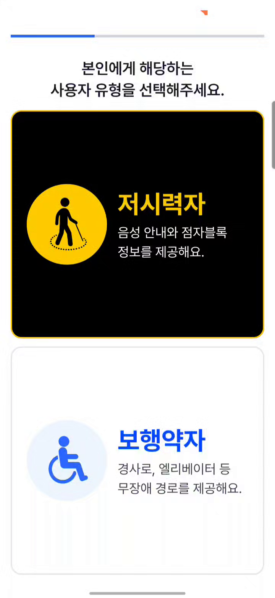
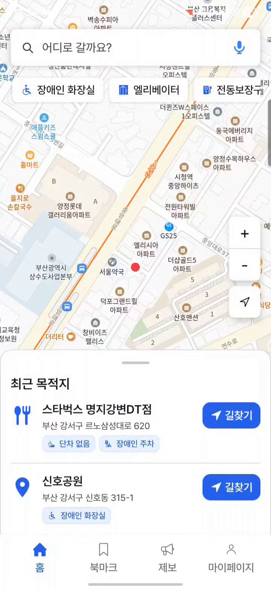
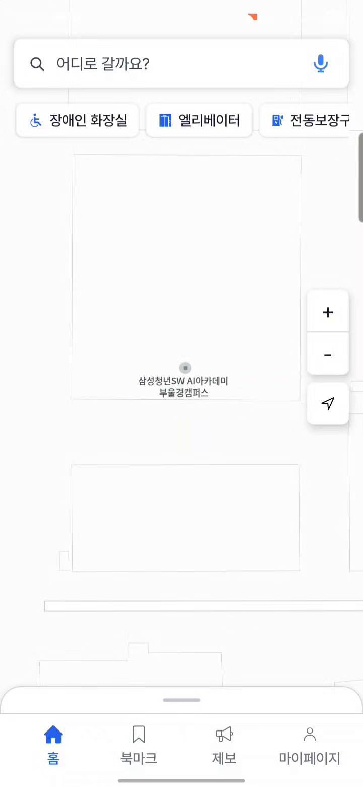
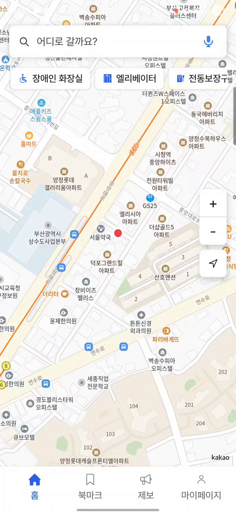

<div align="center">

<br/>


<br/><br/>

> **부산의 경사, 계단, 단차, 보도 폭, 장애물 정보를 함께 보고**
> **이동 약자가 실제로 지나갈 수 있는 길을 찾도록 돕는 인클루시브 무장애 길찾기 서비스**

<br/>

[](https://developer.android.com)
[](https://kotlinlang.org)
[](https://spring.io/projects/spring-boot)
[](https://postgis.net)
[](https://www.docker.com)
[](https://aws.amazon.com)

<br/>

</div>

---

<br/>

## 🗺 서비스 소개

부산은 산복도로, 언덕, 계단, 좁은 보도, 보도 단절 구간이 많은 도시입니다.  
일반 보행자에게는 돌아가면 되는 길도 휠체어 사용자에게는 막힌 길이 되고, 저시력자에게는 위험한 길이 될 수 있습니다.

**부산이음길**은 최단거리보다 실제 이동 가능성과 안전성을 우선합니다.  
사용자 유형에 따라 다른 화면 흐름과 안내 방식을 제공합니다.

<br/>

<table>
  <tr>
    <td align="center" width="25%">
    <b>인클루시브 디자인</b><br/>
      <br/><br/>
      <sub>서비스가 사용자의 이동 조건과 정보 접근 방식에 맞춰집니다.</sub>
    </td>
    <td align="center" width="25%">
    <b>배리어프리 경로</b><br/>
      <br/><br/>
      <sub>경사, 계단, 보도 폭, 노면, 접근성 시설을 경로 판단에 반영합니다.</sub>
    </td>
    <td align="center" width="25%">
    <b>참여형 보강 구조</b><br/>
      <br/><br/>
      <sub>공사, 장애물, 점자블록 손상 등 현장 변화를 시민 제보로 보강합니다.</sub>
    </td>
    <td align="center" width="25%">
    <b>부산 특화</b><br/>
      <br/><br/>
      <sub>부산의 지형과 생활권 특성을 고려한 지역 특화 길찾기를 목표로 합니다.</sub>
    </td>
  </tr>
</table>

<br/>

---

## 팀 소개 — 이길,지도

<br/>

<table>
  <tr>
    <td align="center" width="14%">
      <b>김지윤</b><br/>
      <sub>팀장</sub><br/><br/>
      <br/>
      <br/>
      <br/>
      
    </td>
    <td align="center" width="14%">
      <b>김응서</b><br/>
      <sub>팀원</sub><br/><br/>
      <br/>
      
    </td>
    <td align="center" width="14%">
      <b>박세홍</b><br/>
      <sub>팀원</sub><br/><br/>
      
    </td>
    <td align="center" width="14%">
      <b>백수연</b><br/>
      <sub>팀원</sub><br/><br/>
      <br/>
      
    </td>
    <td align="center" width="14%">
      <b>유준호</b><br/>
      <sub>팀원</sub><br/><br/>
      <br/>
      
    </td>
    <td align="center" width="14%">
      <b>이재호</b><br/>
      <sub>팀원</sub><br/><br/>
      <br/>
      
    </td>
    <td align="center" width="14%">
      <b>장주윤</b><br/>
      <sub>팀원</sub><br/><br/>
      <br/>
      
    </td>
  </tr>
</table>

<br/>
---

## 주요 기능

<table>
  <tr>
    <td align="center" width="33%" valign="top">
      <a href="Docs/media/onboarding.mp4">
        <br/>
        
      </a>
      <br/><br/>
      <strong>사용자 유형 온보딩</strong><br/><br/>
      <sub>저시력자와 보행약자를 구분하고<br/>이동 특성에 맞는 앱 흐름으로 진입합니다.</sub>
    </td>
    <td align="center" width="33%" valign="top">
      <a href="Docs/media/low-vision.mp4">
        <br/>
        
      </a>
      <br/><br/>
      <strong>저시력자 전용 흐름</strong><br/><br/>
      <sub>큰 버튼, 단순한 선택지, 음성 중심 안내로<br/>저시력자에게 맞는 흐름을 제공합니다.</sub>
    </td>
    <td align="center" width="33%" valign="top">
      <a href="Docs/media/font-size.mp4">
        <br/>
        
      </a>
      <br/><br/>
      <strong>글씨 크기 설정</strong><br/><br/>
      <sub>사용자의 시야와 읽기 편의에 맞춰<br/>앱의 텍스트 크기를 조절합니다.</sub>
    </td>
  </tr>
  <tr>
    <td align="center" width="33%" valign="top">
      <a href="Docs/media/route-search.mp4">
        <br/>
        
      </a>
      <br/><br/>
      <strong>무장애 경로 안내</strong><br/><br/>
      <sub>안전한 길과 최단거리를 비교하고<br/>경사, 계단, 방향 안내를 제공합니다.</sub>
    </td>
    <td align="center" width="33%" valign="top">
      <a href="Docs/media/bookmark.mp4">
        <br/>
        
      </a>
      <br/><br/>
      <strong>장소·경로 북마크</strong><br/><br/>
      <sub>자주 가는 장소와 경로를 저장하고<br/>다시 길찾기로 연결합니다.</sub>
    </td>
    <td align="center" width="33%" valign="top">
      <a href="Docs/media/report.mp4">
        <br/>
        
      </a>
      <br/><br/>
      <strong>장애물 제보</strong><br/><br/>
      <sub>공사, 계단, 점자블록 손상 등 현장 정보를<br/>제보하고 검토 후 지도에 반영합니다.</sub>
    </td>
  </tr>
</table>

<br/>

---

<br/>

## 인클루시브 디자인

<table>
  <tr>
    <td align="center" width="25%">
      <h3>처음부터 포함</h3>
      <sub>온보딩에서 저시력자와 보행약자를 분리하고, 보행약자 세부 유형을 선택합니다.</sub>
    </td>
    <td align="center" width="25%">
      <h3>같은 목적, 다른 접근</h3>
      <sub>보행약자는 지도 중심, 저시력자는 큰 버튼과 음성 중심의 별도 화면군을 사용합니다.</sub>
    </td>
    <td align="center" width="25%">
      <h3>여러 감각으로 전달</h3>
      <sub>색상만 쓰지 않고 텍스트, 아이콘, 배지, 음성, TalkBack 라벨로 상태를 전달합니다.</sub>
    </td>
    <td align="center" width="25%">
      <h3>안전 우선</h3>
      <sub>최단거리 외에 경사와 장애물을 고려한 안전한 길을 제공합니다.</sub>
    </td>
  </tr>
</table>

<br/>

---

<br/>

## 시스템 아키텍처

<div align="center">

.png>)

</div>

<br/>

<table>
  <tr>
    <td width="20%"><strong>Android App</strong></td>
    <td>사용자 유형별 홈, 접근성 지도, 경로 탐색, 제보, 북마크 흐름을 제공합니다.</td>
  </tr>
  <tr>
    <td width="20%"><strong>Backend</strong></td>
    <td>인증, 장소, 경로, 제보, 관리자 API를 담당하고 외부 API와 공간 데이터를 조합합니다.</td>
  </tr>
  <tr>
    <td width="20%"><strong>Routing / Data</strong></td>
    <td>PostGIS 공간 데이터와 GraphHopper 라우팅 그래프를 사용해 이동 가능성을 판단합니다.</td>
  </tr>
  <tr>
    <td width="20%"><strong>Admin Web</strong></td>
    <td>도로/시설 편집, 제보 검토, GraphHopper 반영 흐름을 운영합니다.</td>
  </tr>
  <tr>
    <td width="20%"><strong>Infra</strong></td>
    <td>EC2 2대 구조, RDS, ElastiCache, Jenkins, Docker Compose, Nginx 기반으로 운영합니다.</td>
  </tr>
</table>

<br/>

---

<br/>

## 기술 스택

<table>
  <tr>
    <th align="center" width="20%">Category</th>
    <th align="center">Stack</th>
  </tr>
  <tr>
    <td align="center"><strong>Android</strong></td>
    <td>
      
      
      
      
    </td>
  </tr>
  <tr>
    <td align="center"><strong>Backend</strong></td>
    <td>
      
      
      
      
    </td>
  </tr>
  <tr>
    <td align="center"><strong>Data / Routing</strong></td>
    <td>
      
      
      
      
    </td>
  </tr>
  <tr>
    <td align="center"><strong>External</strong></td>
    <td>
      
      
      
      
    </td>
  </tr>
  <tr>
    <td align="center"><strong>Admin / AI</strong></td>
    <td>
      
      
      
      
    </td>
  </tr>
  <tr>
    <td align="center"><strong>Infra</strong></td>
    <td>
      
      
      
      
    </td>
  </tr>
</table>

<br/>


---

<br/>

## 저장소 구조

```text
.
├── FE/                         # Android 앱
│   ├── app/                    # 앱 코드 및 리소스
│   ├── docs/                   # FE 설계, QA, 디버깅 문서
│   └── mockup/                 # 화면 시안 및 목업
├── BE/                         # Spring Boot 백엔드
│   ├── src/main/java/          # 도메인별 API, 서비스, 공통 설정
│   ├── src/main/resources/     # application.yml, profile 설정
│   └── docs/                   # BE 기술 문서
├── ADMIN/                      # React/Vite 관리자 웹
├── AI/                         # Flask intent server와 음성/모델 실험 자산
├── Docs/                       # PRD, 요구사항, API, ERD, 인프라, 기획 문서
├── INF/                        # AWS, Jenkins, monitoring, Terraform 운영 설정
├── exec/                       # 제출/포팅 산출물
├── scripts/                    # 자동화 스크립트
├── docker-compose.*.yml        # local / dev / prod 실행 구성
└── Makefile                    # 실행 진입점
```

<br/>

---

<br/>

## 문서 바로가기

### Overview

| 문서 | 경로 |
|------|------|
| Frontend README | [FE/README.md](FE/README.md) |
| Backend README | [BE/README.md](BE/README.md) |
| Infra README | [INF/README.md](INF/README.md) |
| 포팅 매뉴얼 | [exec/부산이음길__포팅매뉴얼.md](exec/부산이음길__포팅매뉴얼.md) |

### Service

| 문서 | 경로 |
|------|------|
| 프로젝트 기획서 | [Docs/기획/2026-04-10 최종_프로젝트_기획서.md](<Docs/기획/2026-04-10 최종_프로젝트_기획서.md>) |
| PRD | [Docs/PRD/2026-04-09_부산이음길_PRD.md](Docs/PRD/2026-04-09_부산이음길_PRD.md) |
| 요구사항명세서 | [Docs/PRD/2026-05-20_요구사항명세서.md](Docs/PRD/2026-05-20_요구사항명세서.md) |

### Architecture / API

| 문서 | 경로 |
|------|------|
| ERD | [Docs/ERD/ERD_v4.md](Docs/ERD/ERD_v4.md) |
| API 전체 목록 | [Docs/API/2026-04-12_API_전체_목록.md](Docs/API/2026-04-12_API_전체_목록.md) |
| 경로 API 명세 | [Docs/API/길안내_도메인/2026-05-06_경로_API_명세.md](Docs/API/길안내_도메인/2026-05-06_경로_API_명세.md) |

<br/>

---

<br/>

## 실행 및 상세 안내

| 구분 | 안내 | 경로 |
|------|------|------|
| Frontend | Android 앱 실행 및 빌드 가이드 | [FE/README.md](FE/README.md) |
| Backend | 백엔드 실행 및 환경 변수 가이드 | [BE/README.md](BE/README.md) |
| Infra | 운영 설정 자산 기준 | [INF/README.md](INF/README.md) |
| Porting | 제출/포팅 운영 매뉴얼 | [exec/부산이음길__포팅매뉴얼.md](exec/부산이음길__포팅매뉴얼.md) |